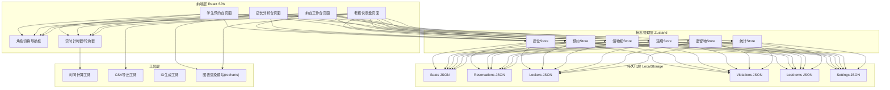
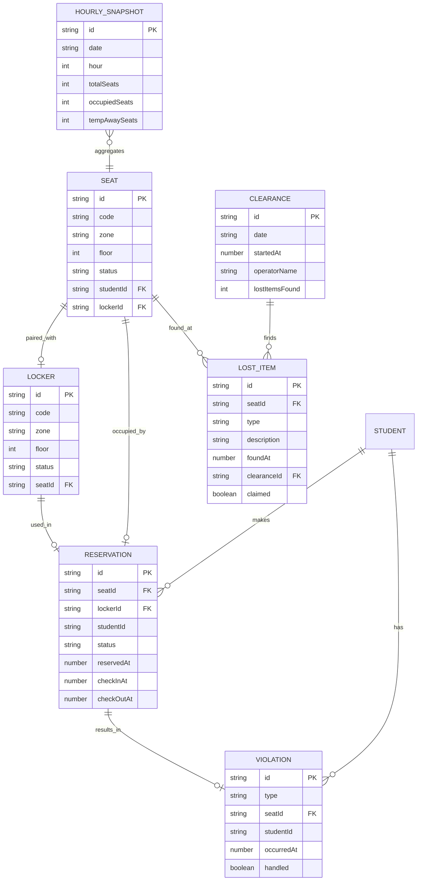

## 1. 架构设计



## 2. 技术选型

- 前端：React@18 + TypeScript + Vite@5
- 样式：TailwindCSS@3.4 + 自定义设计Token
- 状态管理：Zustand@4（轻量、内置persist中间件）
- 图表：Recharts@2（原生React图表库）
- 路由：React Router@6
- 持久化：LocalStorage（Zustand persist中间件自动同步）
- 时间处理：dayjs（moment替代，体积小）
- 工具：uuid、clsx、tailwind-merge

## 3. 路由定义

| 路由 | 页面 | 说明 |
|------|------|------|
| `/` | 角色选择首页 | 默认入口，四角色卡片导航 |
| `/student` | 学生预约台 | 座位图+预约+储物柜+签到离座 |
| `/reception` | 前台工作台 | 实时看板+签到确认+违规+清场 |
| `/manager` | 店长分析台 | 时段分析+套餐建议+保洁安排 |
| `/owner` | 老板仪表盘 | 利用率+违规+柜位+导出 |

## 4. 核心数据类型

```typescript
// 座位
interface Seat {
  id: string;
  code: string;
  zone: 'A' | 'B' | 'C' | 'D';
  floor: 1 | 2;
  status: 'available' | 'reserved' | 'in_use' | 'temporarily_away' | 'violation';
  studentId?: string;
  studentName?: string;
  lockerId?: string;
  reservationExpireAt?: number;
  checkInAt?: number;
  tempAwayAt?: number;
  tempAwayExpireAt?: number;
  tempAwayExtensionsLeft?: number;
}

// 储物柜
interface Locker {
  id: string;
  code: string;
  zone: 'A' | 'B' | 'C' | 'D';
  floor: 1 | 2;
  status: 'available' | 'in_use' | 'maintenance';
  seatId?: string;
  studentId?: string;
}

// 预约记录
interface Reservation {
  id: string;
  seatId: string;
  seatCode: string;
  lockerId: string;
  lockerCode: string;
  studentId: string;
  studentName: string;
  studentPhone: string;
  status: 'pending_checkin' | 'checked_in' | 'completed' | 'cancelled' | 'violation';
  reservedAt: number;
  reservationExpireAt: number;
  checkInAt?: number;
  checkOutAt?: number;
  tempAwayCount: number;
  totalMinutes: number;
}

// 违规记录
interface Violation {
  id: string;
  type: 'no_show' | 'over_temp_away' | 'multi_seat' | 'unattended';
  seatId: string;
  seatCode: string;
  studentId?: string;
  studentName?: string;
  occurredAt: number;
  description: string;
  handled: boolean;
  handledBy?: string;
  handledAt?: number;
}

// 遗留物
interface LostItem {
  id: string;
  seatId: string;
  seatCode: string;
  type: 'electronics' | 'books' | 'bags' | 'cups' | 'keys' | 'other';
  description: string;
  photoUrl?: string;
  foundAt: number;
  clearanceId: string;
  claimed: boolean;
  claimedBy?: string;
  claimedAt?: number;
}

// 清场记录
interface Clearance {
  id: string;
  date: string;
  startedAt: number;
  completedAt?: number;
  operatorName: string;
  seatsChecked: string[];
  lostItemsFound: number;
  seatsReleased: number;
}

// 统计快照（每小时生成）
interface HourlySnapshot {
  id: string;
  date: string;
  hour: number;
  totalSeats: number;
  occupiedSeats: number;
  tempAwaySeats: number;
  violationCount: number;
  recordedAt: number;
}
```

## 5. 核心业务规则

```
座位状态机:
  available → reserved (学生预约)
  reserved → available (超时未签到释放/取消)
  reserved → violation (超时未签到 + 记录违规)
  reserved → in_use (签到成功)
  in_use → temporarily_away (临时离座)
  temporarily_away → in_use (返回)
  temporarily_away → violation (超时未回 + 前台释放)
  in_use → available (正常离座)
  violation → available (前台处理后释放)

约束检查:
  预约前: 检查studentId是否已有reserved/in_use/temporarily_away状态的座位 → 一人一座
  临时离座: tempAwayExtensionsLeft = 2（初始2次续时机会），每次续时+30分钟
  未签到释放: 预约后30分钟自动释放 + 记录no_show违规
  临时离座超时: 30分钟(可续时)+违规记录+前台预警
```

## 6. 数据模型ER图



## 7. 初始数据（Mock）

- 2层楼，每层2个区（A/B在1楼，C/D在2楼），每区15个座位 = 共60个座位
- 对应每区15个储物柜 = 共60个储物柜
- 预置5条违规记录、3件遗留物、7天历史快照数据用于展示图表
- 预置3个测试学生账号（张三/李四/王五）和3个员工账号
