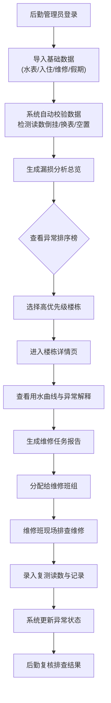

## 1. 产品概述

校园用水漏损图系统，面向高校后勤管理部门和维修班组，通过多维度数据分析定位楼栋夜间用水异常和潜在漏点。系统整合水表读数、宿舍入住、维修记录与假期日历数据，可视化展示各楼栋用水异常程度，辅助后勤高效决策排查优先级，并为维修班提供精准的疑似漏点时间窗口和历史维修关联信息。

## 2. 核心功能

### 2.1 用户角色
| 角色 | 描述 | 核心权限 |
|------|------|----------|
| 后勤管理员 | 负责整体用水监控与排查决策 | 查看所有楼栋数据、异常分析图表、生成排查报告、管理假期日历 |
| 维修班组 | 负责现场维修与复测记录 | 查看分配楼栋的异常详情、记录维修过程、录入复测读数 |

### 2.2 功能模块
1. **数据导入页**：批量导入水表读数、宿舍入住数据、维修记录、假期日历
2. **漏损分析总览**：楼栋异常热力图、夜间用水趋势图、异常排序榜单
3. **楼栋详情页**：单楼栋用水曲线、异常标注、入住情况、关联维修记录
4. **维修报告页**：疑似漏点时间窗口、历史维修对比、复测记录表单
5. **数据管理页**：假期日历配置、楼栋信息维护、水表换表记录

### 2.3 页面详情
| 页面名称 | 模块名称 | 功能描述 |
|----------|----------|----------|
| 数据导入页 | 水表读数导入 | CSV/Excel导入，支持楼栋、日期、时段、读数字段校验，自动检测读数倒挂 |
| 数据导入页 | 宿舍入住导入 | 导入各宿舍入住人数、空置时段，用于异常判断基准 |
| 数据导入页 | 维修记录导入 | 导入历史维修楼栋、时间、类型、处理结果 |
| 数据导入页 | 假期日历导入 | 导入假期时段，支持排除假期关闭楼栋的用水分析 |
| 漏损分析总览 | 异常热力图 | 按楼栋展示夜间异常程度（颜色深浅），点击进入详情 |
| 漏损分析总览 | 夜间趋势图 | 展示近30天全校夜间平均用水趋势，标注异常峰值 |
| 漏损分析总览 | 异常排序榜 | 按夜间异常峰值/持续天数排序，显示TOP楼栋，支持假期排除切换 |
| 楼栋详情页 | 用水曲线图 | 日用水曲线，区分昼/夜间，标注异常点、换表、维修时间线 |
| 楼栋详情页 | 异常解释面板 | 自动标注读数倒挂、换表期间、空置期、维修后仍异常等说明 |
| 楼栋详情页 | 关联维修记录 | 展示该楼栋历史维修列表，含维修时间、类型、结果、复测数据 |
| 维修报告页 | 疑似漏点分析 | 计算疑似漏点时间窗口（连续异常夜间时段），标注概率等级 |
| 维修报告页 | 复测记录表单 | 维修后录入复测水表读数、照片、备注，自动对比前后流量变化 |
| 数据管理页 | 假期日历 | 可视化日历选择假期时段，标记楼栋是否停用 |
| 数据管理页 | 楼栋信息 | 维护楼栋编号、名称、水表编号、总宿舍数等基础信息 |

## 3. 核心流程

## 4. 用户界面设计

### 4.1 设计风格
- **主色调**：深海蓝 (#1e3a5f) — 代表专业、可靠的水务管理
- **辅助色**：水绿 (#2dd4bf) 表示正常、琥珀橙 (#f59e0b) 表示警告、深红 (#dc2626) 表示严重异常
- **中性色**：浅灰底 (#f8fafc)、深灰文字 (#1e293b)
- **按钮风格**：圆角 8px，轻微阴影，hover 时有颜色加深和浮起效果
- **字体**：标题使用 Noto Serif SC（稳重感），正文使用 Noto Sans SC（可读性）
- **布局风格**：侧边导航 + 顶部标题栏 + 卡片式内容区
- **图标风格**：使用 lucide-react 线性图标，颜色与语义匹配（红色=警告，绿色=正常）

### 4.2 页面设计概览
| 页面名称 | 模块名称 | UI 元素 |
|----------|----------|----------|
| 漏损分析总览 | 异常热力图 | 网格状楼栋卡片，背景色按异常等级渐变，hover 显示详情气泡，点击跳转 |
| 漏损分析总览 | 夜间趋势图 | 面积图填充，异常段用红色虚线标注，X轴日期、Y轴用水量 |
| 漏损分析总览 | 异常排序榜 | 列表卡片，左侧排名徽章，右侧用水曲线缩略图，关键数据高亮 |
| 楼栋详情页 | 用水曲线图 | 双区域（昼/夜）背景色区分的折线图，异常点用红色圆点标注，悬浮 Tooltip 显示详细数据和异常原因 |
| 楼栋详情页 | 异常解释面板 | 时间线布局，每个节点带图标（换表🔧、倒挂⚠️、空置🏠、维修后异常🔴），配文字说明 |
| 维修报告页 | 疑似漏点分析 | 时间轴卡片，可疑时段用橙色背景高亮，显示异常等级徽章和建议排查时间 |

### 4.3 响应式
桌面端优先，平板适配（两栏变单栏），移动端保留核心数据列表和图表缩略查看。触控区域 ≥ 44px。

### 4.4 动效设计
- 页面加载时，卡片依次淡入（staggered fade-in，50ms 间隔）
- 异常热力图颜色渐变过渡，hover 时轻微放大 + 阴影加深
- 数据刷新时数字滚动动画
- 时间线节点点击展开详情的平滑折叠动画
