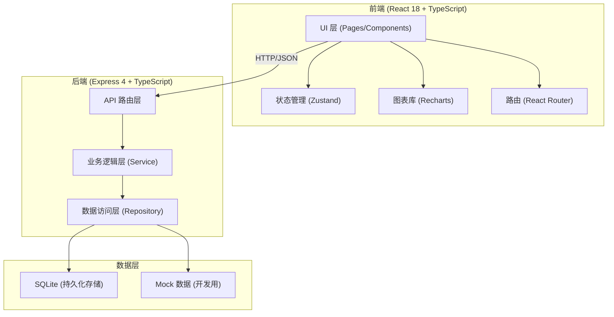
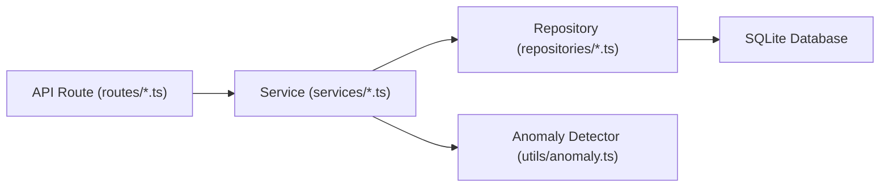

## 1. 架构设计



## 2. 技术描述

- **前端框架**：React@18 + TypeScript + Vite@6
- **状态管理**：Zustand@4
- **路由**：React Router DOM@6
- **样式方案**：TailwindCSS@3
- **图表库**：Recharts@2（React 生态最成熟的图表库，支持折线图、面积图、柱状图、热力图）
- **UI 图标**：Lucide React
- **后端框架**：Express@4 + TypeScript
- **数据库**：SQLite（轻量级、零配置，适合本地工具类应用），通过 better-sqlite3 驱动
- **数据导入**：CSV 解析使用 papaparse，Excel 解析使用 xlsx
- **初始化工具**：vite-init 模板 react-express-ts

## 3. 路由定义

### 前端路由
| 路由 | 页面组件 | 用途 |
|------|----------|------|
| / | DashboardPage | 漏损分析总览（默认首页） |
| /import | DataImportPage | 数据导入 |
| /building/:id | BuildingDetailPage | 楼栋用水详情 |
| /report/:buildingId | RepairReportPage | 维修报告与复测记录 |
| /settings | SettingsPage | 假期日历与楼栋信息管理 |

### 后端 API 路由
| 方法 | 路由 | 用途 |
|------|------|------|
| GET | /api/buildings | 获取所有楼栋列表 |
| GET | /api/buildings/:id | 获取单楼栋详情 |
| POST | /api/buildings | 新增楼栋 |
| PUT | /api/buildings/:id | 更新楼栋信息 |
| GET | /api/water-readings | 获取水表读数（支持楼栋/日期范围筛选） |
| POST | /api/water-readings/import | 批量导入水表读数 |
| GET | /api/occupancy | 获取宿舍入住数据 |
| POST | /api/occupancy/import | 批量导入入住数据 |
| GET | /api/repairs | 获取维修记录（支持楼栋筛选） |
| POST | /api/repairs | 新增维修记录 |
| PUT | /api/repairs/:id | 更新维修记录（含复测数据） |
| POST | /api/repairs/import | 批量导入维修记录 |
| GET | /api/holidays | 获取假期日历 |
| POST | /api/holidays | 新增假期时段 |
| DELETE | /api/holidays/:id | 删除假期 |
| POST | /api/holidays/import | 批量导入假期 |
| GET | /api/anomaly/overview | 获取漏损分析总览数据 |
| GET | /api/anomaly/building/:id | 获取单楼栋异常分析 |

## 4. API 定义（TypeScript 类型）

```typescript
// 共享类型定义 (shared/types.ts)

export interface Building {
  id: number;
  code: string;        // 楼栋编号
  name: string;        // 楼栋名称
  meterCode: string;   // 水表编号
  totalRooms: number;  // 总宿舍数
  floors: number;      // 楼层数
  createdAt: string;
}

export interface WaterReading {
  id: number;
  buildingId: number;
  readingDate: string;       // YYYY-MM-DD
  period: 'day' | 'night';   // 昼/夜间时段
  reading: number;           // 表读数
  consumption: number;       // 本期用水量（计算得出）
  isMeterChange?: boolean;   // 是否换表
  isReversed?: boolean;      // 是否读数倒挂
  createdAt: string;
}

export interface Occupancy {
  id: number;
  buildingId: number;
  date: string;             // YYYY-MM-DD
  occupiedRooms: number;    // 入住宿舍数
  totalPeople: number;      // 入住人数
  isVacant: boolean;        // 是否整体空置
}

export interface RepairRecord {
  id: number;
  buildingId: number;
  reportDate: string;         // 报修日期
  repairDate: string | null;  // 维修日期
  repairType: string;         // 维修类型（管道漏水/水表故障/其他）
  description: string;        // 故障描述
  result: string | null;      // 处理结果
  recheckReading: number | null;   // 复测读数
  recheckDate: string | null;       // 复测日期
  recheckNote: string | null;       // 复测备注
  status: 'pending' | 'repairing' | 'completed' | 'recheck';
}

export interface Holiday {
  id: number;
  name: string;           // 假期名称
  startDate: string;      // YYYY-MM-DD
  endDate: string;        // YYYY-MM-DD
  buildingIds: number[];  // 停用楼栋ID列表，空数组表示全校
}

export interface AnomalyPoint {
  date: string;
  period: 'day' | 'night';
  consumption: number;
  expectedConsumption: number;
  deviation: number;          // 偏差百分比
  anomalyLevel: 'normal' | 'warning' | 'severe';
  reason?: string;            // 异常解释（换表/倒挂/空置/维修后仍异常）
}

export interface BuildingAnomalySummary {
  buildingId: number;
  buildingName: string;
  buildingCode: string;
  anomalyLevel: 'normal' | 'warning' | 'severe';
  nightPeakConsumption: number;   // 夜间异常峰值
  anomalyDays: number;            // 异常天数
  consecutiveAnomalyDays: number; // 连续异常天数
  lastRepairDate: string | null;
  isOnHoliday: boolean;
}
```

## 5. 后端分层架构



- **Route 层**：定义 HTTP 接口，参数校验，返回 JSON 响应
- **Service 层**：业务逻辑，数据转换，异常检测算法
- **Repository 层**：数据库 CRUD 操作，SQL 语句封装
- **Utils**：异常检测算法、日期工具、CSV/Excel 解析

## 6. 数据模型

### 6.1 数据模型定义（ER 图）

```mermaid
erDiagram
    BUILDING ||--o{ WATER_READING : has
    BUILDING ||--o{ OCCUPANCY : has
    BUILDING ||--o{ REPAIR_RECORD : has
    BUILDING }o--o{ HOLIDAY : "closed during"

    BUILDING {
        INTEGER id PK
        TEXT code UNIQUE
        TEXT name
        TEXT meter_code
        INTEGER total_rooms
        INTEGER floors
        TEXT created_at
    }

    WATER_READING {
        INTEGER id PK
        INTEGER building_id FK
        TEXT reading_date
        TEXT period
        REAL reading
        REAL consumption
        INTEGER is_meter_change
        INTEGER is_reversed
        TEXT created_at
    }

    OCCUPANCY {
        INTEGER id PK
        INTEGER building_id FK
        TEXT date
        INTEGER occupied_rooms
        INTEGER total_people
        INTEGER is_vacant
    }

    REPAIR_RECORD {
        INTEGER id PK
        INTEGER building_id FK
        TEXT report_date
        TEXT repair_date
        TEXT repair_type
        TEXT description
        TEXT result
        REAL recheck_reading
        TEXT recheck_date
        TEXT recheck_note
        TEXT status
    }

    HOLIDAY {
        INTEGER id PK
        TEXT name
        TEXT start_date
        TEXT end_date
    }

    HOLIDAY_BUILDING {
        INTEGER holiday_id FK
        INTEGER building_id FK
    }
```

### 6.2 数据定义语言（DDL）

```sql
-- 楼栋表
CREATE TABLE IF NOT EXISTS buildings (
  id INTEGER PRIMARY KEY AUTOINCREMENT,
  code TEXT UNIQUE NOT NULL,
  name TEXT NOT NULL,
  meter_code TEXT,
  total_rooms INTEGER DEFAULT 0,
  floors INTEGER DEFAULT 0,
  created_at TEXT DEFAULT (datetime('now'))
);

-- 水表读数表
CREATE TABLE IF NOT EXISTS water_readings (
  id INTEGER PRIMARY KEY AUTOINCREMENT,
  building_id INTEGER NOT NULL,
  reading_date TEXT NOT NULL,
  period TEXT NOT NULL CHECK (period IN ('day', 'night')),
  reading REAL NOT NULL,
  consumption REAL DEFAULT 0,
  is_meter_change INTEGER DEFAULT 0,
  is_reversed INTEGER DEFAULT 0,
  created_at TEXT DEFAULT (datetime('now')),
  FOREIGN KEY (building_id) REFERENCES buildings(id),
  UNIQUE (building_id, reading_date, period)
);

CREATE INDEX idx_water_readings_building_date ON water_readings(building_id, reading_date);

-- 宿舍入住表
CREATE TABLE IF NOT EXISTS occupancy (
  id INTEGER PRIMARY KEY AUTOINCREMENT,
  building_id INTEGER NOT NULL,
  date TEXT NOT NULL,
  occupied_rooms INTEGER DEFAULT 0,
  total_people INTEGER DEFAULT 0,
  is_vacant INTEGER DEFAULT 0,
  FOREIGN KEY (building_id) REFERENCES buildings(id),
  UNIQUE (building_id, date)
);

-- 维修记录表
CREATE TABLE IF NOT EXISTS repair_records (
  id INTEGER PRIMARY KEY AUTOINCREMENT,
  building_id INTEGER NOT NULL,
  report_date TEXT NOT NULL,
  repair_date TEXT,
  repair_type TEXT NOT NULL,
  description TEXT,
  result TEXT,
  recheck_reading REAL,
  recheck_date TEXT,
  recheck_note TEXT,
  status TEXT NOT NULL DEFAULT 'pending' CHECK (status IN ('pending','repairing','completed','recheck')),
  FOREIGN KEY (building_id) REFERENCES buildings(id)
);

CREATE INDEX idx_repairs_building ON repair_records(building_id);

-- 假期表
CREATE TABLE IF NOT EXISTS holidays (
  id INTEGER PRIMARY KEY AUTOINCREMENT,
  name TEXT NOT NULL,
  start_date TEXT NOT NULL,
  end_date TEXT NOT NULL
);

-- 假期-楼栋关联表（多对多）
CREATE TABLE IF NOT EXISTS holiday_buildings (
  holiday_id INTEGER NOT NULL,
  building_id INTEGER NOT NULL,
  PRIMARY KEY (holiday_id, building_id),
  FOREIGN KEY (holiday_id) REFERENCES holidays(id) ON DELETE CASCADE,
  FOREIGN KEY (building_id) REFERENCES buildings(id) ON DELETE CASCADE
);
```
