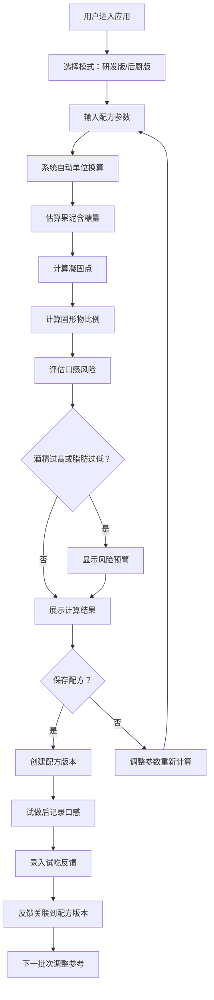

## 1. 产品概述
冰淇淋小店研发新口味的专业凝固点计算工具，解决网上公式不完整、果泥含糖量未知、酒精与脂肪配比风险等问题。支持研发与后厨双模式，内置配方版本管理与试吃反馈闭环。

- **核心问题**：冰淇淋配方中添加果酱和酒精后，凝固点难以估算，容易出现冻不硬或冰渣过多的问题
- **目标用户**：冰淇淋研发人员、后厨师傅、小店老板
- **产品价值**：提供科学的凝固点估算，降低试错成本，记录研发过程，形成配方知识沉淀

## 2. 核心功能

### 2.1 用户角色

| 角色 | 使用场景 | 核心需求 |
|------|----------|----------|
| 研发人员 | 新口味配方研发 | 需要详细计算过程、可调整参数、记录实验数据 |
| 后厨师傅 | 批量试做生产 | 需要简化操作界面、明确的操作指引、观察要点 |
| 老板 | 配方管理与品质把控 | 需要查看配方版本历史、试吃反馈汇总 |

### 2.2 功能模块

1. **凝固点计算器（研发版）**：配方输入、计算过程展示、风险评估、参数敏感性分析
2. **凝固点计算器（后厨版）**：批量换算、操作指引、观察要点记录
3. **配方版本管理**：配方保存、版本对比、历史回溯
4. **试吃反馈系统**：口感评分、反馈记录、反馈回填到配方
5. **智能提醒**：酒精过高预警、脂肪过低预警、配比异常提醒

### 2.3 页面详情

| 页面名称 | 模块名称 | 功能描述 |
|-----------|-------------|---------------------|
| 首页/计算器 | 模式切换 | 研发版/后厨版一键切换 |
| 首页/计算器 | 配方输入区 | 支持克、毫升、百分比混合输入；奶、奶油、糖、果泥、酒精、稳定剂分类输入 |
| 首页/计算器 | 智能计算区 | 实时计算凝固点、固形物比例、口感风险等级 |
| 首页/计算器 | 计算过程展示（研发版） | 展示每一步计算公式、中间结果、参数来源 |
| 首页/计算器 | 操作指引（后厨版） | 试做批量换算、操作步骤、观察时间点、判断标准 |
| 配方管理 | 配方列表 | 所有保存的配方卡片，支持搜索、筛选 |
| 配方管理 | 版本对比 | 同一配方不同版本的参数差异对比 |
| 试吃反馈 | 反馈录入 | 口感维度评分（冰渣感、绵密度、甜度、风味）、文字备注 |
| 试吃反馈 | 反馈汇总 | 同一配方多次试吃的趋势分析、改进建议 |

## 3. 核心流程

用户打开应用，选择使用模式（研发版/后厨版），输入配方参数，系统实时计算并展示结果。用户可保存配方，记录试做口感，后续调整配方时可参考历史数据。试吃反馈会关联到对应配方版本，形成研发闭环。

## 4. 用户界面设计

### 4.1 设计风格

- **主色调**：柔和的奶油色（#FFF8F0）作为背景，冰淇淋粉（#FFB6C1）作为主色，深棕色（#5D4037）作为文字色，薄荷绿（#98D8C8）作为成功/正常状态色，橙红色（#FF6B6B）作为警告色
- **按钮风格**：圆润胶囊形按钮，带有微妙的阴影和hover浮起效果
- **字体**：展示字体使用「Fredoka One」（圆润可爱的冰淇淋风格），正文字体使用「Noto Sans SC」（清晰易读的中文无衬线）
- **布局风格**：卡片式布局，输入区与结果区分区明确，数据可视化使用柔和的渐变图表
- **装饰元素**：微妙的冰淇淋纹理背景、融化效果的进度条、雪花/冰晶图标点缀

### 4.2 页面设计概述

| 页面名称 | 模块名称 | UI元素 |
|-----------|-------------|-------------|
| 计算器首页 | 顶部导航 | Logo、模式切换Tab、配方管理入口 |
| 计算器首页 | 配方输入卡片 | 折叠式分组输入（奶类、奶油类、糖类、果泥类、酒精类、稳定剂类），单位下拉选择（g/ml/%），数字输入框带增减按钮 |
| 计算器首页 | 实时计算结果卡片 | 大号数字展示凝固点（带温度计图标）、固形物比例环形图、风险等级徽章 |
| 计算器首页 | 计算过程面板（研发版） | 可展开的手风琴面板，展示每一步计算公式，变量值高亮 |
| 计算器首页 | 操作指引面板（后厨版） | 时间线式步骤展示，每个步骤配图标、操作说明、观察要点 |
| 配方管理页 | 配方卡片网格 | 每个卡片展示配方名称、版本号、创建时间、核心参数概览、最近试吃评分 |
| 试吃反馈页 | 星级评分组件 | 四个维度的滑动评分条，表情图标随分数变化 |

### 4.3 响应性

- **Desktop-first**设计，主内容区最大宽度1200px，居中展示
- 平板端（768px-1024px）：双列布局改为单列，输入区与结果区上下排列
- 移动端（<768px）：卡片间距缩小，字体自适应，Tab切换改为底部导航
- 所有交互元素确保触摸友好，最小点击区域48x48px

### 4.4 交互与动效

- 页面加载时：卡片依次淡入上浮（staggered animation）
- 输入参数时：结果数字滚动更新，带有平滑过渡
- 风险预警：警告徽章脉冲动画，吸引注意
- 模式切换：平滑的左右滑动过渡效果
- 按钮hover：轻微放大+阴影加深
- 计算过程展开：流畅的高度过渡动画
