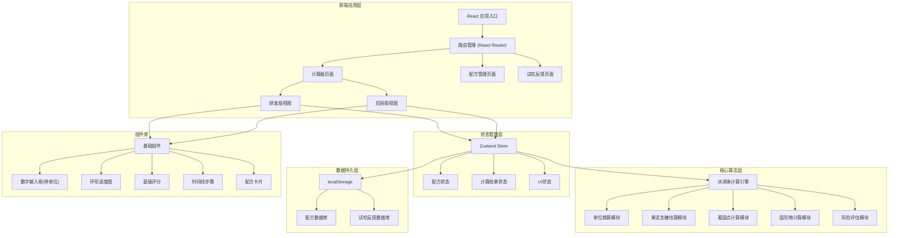
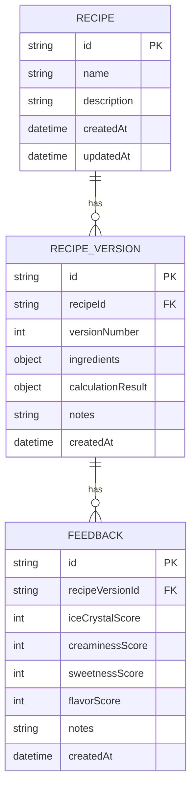

## 1. 架构设计



## 2. 技术描述

- **前端框架**：React@18 + TypeScript@5
- **构建工具**：Vite@5
- **样式方案**：TailwindCSS@3 + CSS Variables
- **路由管理**：React Router@6
- **状态管理**：Zustand@4（轻量级状态管理，适合中小型应用）
- **图表可视化**：Recharts@2（用于固形物比例、口感评分等数据展示）
- **图标库**：Lucide React（现代、轻量的图标库）
- **数据持久化**：localStorage（无需后端，数据保存在浏览器本地）
- **开发规范**：ESLint + Prettier

## 3. 目录结构

```
src/
├── assets/              # 静态资源（字体、图片等）
├── components/          # 可复用组件
│   ├── ui/             # 基础UI组件（Button、Input、Card等）
│   ├── calculator/     # 计算器相关组件
│   ├── recipe/         # 配方管理相关组件
│   └── feedback/       # 试吃反馈相关组件
├── pages/              # 页面组件
│   ├── Calculator.tsx
│   ├── RecipeList.tsx
│   ├── RecipeDetail.tsx
│   └── Feedback.tsx
├── store/              # Zustand状态管理
│   ├── useRecipeStore.ts
│   └── useUIStore.ts
├── engine/             # 核心计算引擎
│   ├── types.ts        # 类型定义
│   ├── constants.ts    # 常量（食材密度、含糖量等）
│   ├── unitConverter.ts
│   ├── sugarEstimator.ts
│   ├── freezingPoint.ts
│   ├── solidsCalculator.ts
│   ├── riskAssessor.ts
│   └── index.ts        # 统一入口
├── utils/              # 工具函数
│   ├── storage.ts      # localStorage封装
│   └── formatters.ts   # 格式化函数
├── hooks/              # 自定义Hooks
│   ├── useCalculator.ts
│   └── useRecipe.ts
├── App.tsx
├── main.tsx
└── index.css
```

## 4. 路由定义

| 路由路径 | 页面名称 | 说明 |
|----------|----------|------|
| `/` | 计算器首页 | 默认页面，包含研发版/后厨版模式切换 |
| `/recipes` | 配方列表 | 展示所有保存的配方，支持搜索筛选 |
| `/recipes/:id` | 配方详情 | 展示配方详情、版本历史、试吃反馈 |
| `/recipes/:id/feedback` | 试吃反馈录入 | 为指定配方版本录入试吃反馈 |

## 5. 核心数据模型

### 5.1 数据模型ER图



### 5.2 TypeScript 类型定义

```typescript
// 食材类型
interface Ingredient {
  milk: { amount: number; unit: 'g' | 'ml' | '%' };
  cream: { amount: number; unit: 'g' | 'ml' | '%' };
  sugar: { amount: number; unit: 'g' | 'ml' | '%' };
  fruitPuree: { 
    amount: number; 
    unit: 'g' | 'ml' | '%';
    sugarContent?: 'low' | 'medium' | 'high'; // 果泥甜度估测
  };
  alcohol: { amount: number; unit: 'g' | 'ml' | '%'; abv: number }; // abv: 酒精度数
  stabilizer: { amount: number; unit: 'g' | 'ml' | '%' };
  targetYield: { amount: number; unit: 'g' | 'ml' };
}

// 计算结果
interface CalculationResult {
  freezingPoint: number; // 凝固点（摄氏度）
  solidsRatio: number; // 固形物比例（百分比）
  fatContent: number; // 脂肪含量（百分比）
  sugarContent: number; // 总糖含量（百分比）
  alcoholContent: number; // 酒精含量（百分比）
  risks: Risk[];
  calculationSteps: CalculationStep[]; // 研发版：计算过程
  kitchenInstructions: KitchenInstruction[]; // 后厨版：操作指引
}

interface Risk {
  type: 'alcohol_high' | 'fat_low' | 'sugar_high' | 'stabilizer_high';
  level: 'warning' | 'danger';
  message: string;
}

interface CalculationStep {
  name: string;
  formula: string;
  variables: Record<string, number>;
  result: number;
}

interface KitchenInstruction {
  step: number;
  title: string;
  description: string;
  observationPoint: string;
  timing?: string;
}
```

## 6. 核心算法说明

### 6.1 凝固点计算公式
基于拉乌尔定律（Raoult's Law）和冰淇淋行业经验公式：
```
凝固点(°C) = -1.86 × (总糖摩尔浓度 + 盐摩尔浓度) - 酒精影响系数
```

### 6.2 果泥含糖量估算
根据果泥类型估算含糖量：
- 低糖水果（草莓、覆盆子等）：8-10%
- 中糖水果（桃子、芒果等）：12-15%
- 高糖水果（葡萄、荔枝等）：18-22%

### 6.3 固形物比例计算
```
固形物比例 = (非水分成分总重量 / 总重量) × 100%
```
理想范围：35%-45%

### 6.4 风险评估阈值
- 酒精过高：酒精含量 > 5% 警告，> 8% 危险（难以凝固）
- 脂肪过低：脂肪含量 < 6% 警告，< 4% 危险（口感差，冰渣多）
- 糖过高：总糖含量 > 25% 警告
- 稳定剂过高：稳定剂 > 0.5% 警告

## 7. 数据持久化方案

使用 localStorage 存储，键名设计：
- `icecream_recipes`：配方基本信息列表
- `icecream_recipe_versions`：配方版本列表（按recipeId分组）
- `icecream_feedbacks`：试吃反馈列表（按recipeVersionId分组）

封装工具函数：
- `getRecipes()` / `saveRecipe(recipe)`
- `getVersions(recipeId)` / `saveVersion(version)`
- `getFeedbacks(versionId)` / `saveFeedback(feedback)`
