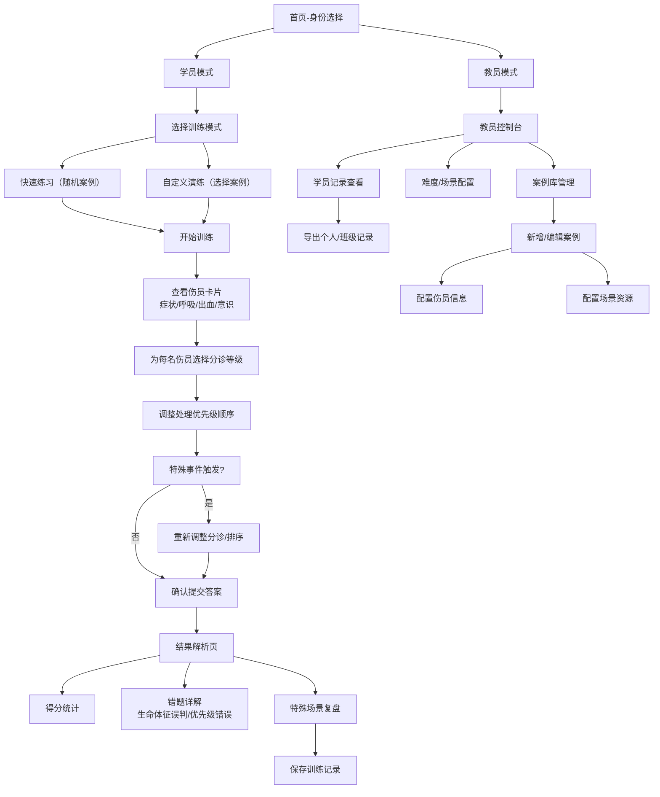

## 1. 产品概述

急救分诊卡片赛是一款面向急救培训场景的互动式训练应用，帮助学员在模拟环境中练习红黄绿黑四级分诊技能，提升在多伤员、有限资源情况下的快速决策能力。教员可配置演练案例、调整难度场景、导出训练记录，实现教学闭环。

- 核心价值：将抽象的分诊标准转化为可交互的卡片游戏，在有限资源约束下训练优先级判断
- 目标用户：急救培训教员、参训学员（医护人员、急救志愿者、企业安全员等）
- 使用场景：急救培训课堂演练、课后自主练习、考核测评

## 2. 核心功能

### 2.1 用户角色

| 角色 | 登录方式 | 核心权限 |
|------|----------|----------|
| 学员 | 本地身份选择 | 参与分诊训练、查看个人成绩与错题解析、查看训练历史 |
| 教员 | 本地身份选择 | 配置演练案例、设置难度场景、管理班级学员、导出个人/班级训练记录 |

### 2.2 功能模块

1. **首页/身份选择**：角色切换入口、训练模式选择、历史记录入口
2. **学员训练模式**：分诊卡片游戏核心玩法、多伤员排序、资源约束挑战
3. **结果解析页**：得分统计、错题详解（生命体征误判点、优先级错误原因）
4. **教员控制台**：案例库管理、难度配置（场景/资源）、学员记录查看
5. **数据导出**：个人训练记录导出（CSV）、班级汇总导出（CSV）

### 2.3 页面详情

| 页面名称 | 模块名称 | 功能描述 |
|----------|----------|----------|
| 首页 | 角色选择区 | 学员/教员身份切换卡片，点击进入对应模式 |
| 首页 | 快速开始区 | 训练模式选择（快速练习/自定义演练）、难度快速选择 |
| 首页 | 历史记录入口 | 查看最近训练记录、个人成绩趋势 |
| 训练页 | 状态栏 | 当前轮次、剩余时间、可用资源（担架数/医护数）、场景提示 |
| 训练页 | 伤员卡片区 | 横向排列伤员卡片，展示症状、呼吸、出血、意识等生命体征 |
| 训练页 | 分诊操作区 | 红黄绿黑四级分诊按钮、排序调整拖拽区、确认提交 |
| 训练页 | 事件弹窗 | 特殊事件触发（资源减少、新伤员到达），需即时应对 |
| 结果页 | 得分总览 | 总分、正确率、用时、分诊准确率分项统计 |
| 结果页 | 错题详解 | 逐人列出：学员判断 vs 正确答案、错误类型（生命体征误判/优先级错误）、解释说明 |
| 结果页 | 特殊场景复盘 | 老人基础病、儿童哭闹、伤员隐瞒伤情等特殊情况的处理复盘 |
| 教员控制台 | 案例管理 | 案例列表、新增/编辑/删除案例、案例详情预览 |
| 教员控制台 | 难度配置 | 场景预设（白天/夜间/雨天）、资源数量调整、特殊事件开关 |
| 教员控制台 | 学员管理 | 学员列表、查看个人训练记录、班级汇总统计 |
| 教员控制台 | 导出功能 | 个人记录导出、班级汇总导出（CSV格式） |
| 案例编辑页 | 伤员配置 | 添加/编辑伤员信息（姓名、年龄、基础病、生命体征、分诊等级） |
| 案例编辑页 | 场景配置 | 场景类型、资源初始值、特殊事件设置 |

## 3. 核心流程

### 3.1 学员训练流程

学员选择训练模式 → 选择难度/案例 → 查看伤员卡片 → 依次为伤员分级（红黄绿黑） → 调整处理顺序 → 确认提交 → 查看结果解析 → 查看错题详解

### 3.2 教员管理流程

教员进入控制台 → 选择案例管理 → 新建/编辑案例（配置伤员、场景、资源） → 保存案例 → 查看学员训练记录 → 导出个人/班级数据

### 3.3 核心流程图

## 4. 用户界面设计

### 4.1 设计风格

- **整体定位**：专业医疗训练工具，兼顾游戏化趣味性
- **主色调**：深蓝色（#1a365d）作为主色，代表专业与信任
- **分诊四色**：红色（#dc2626）- 紧急/立即处理、黄色（#f59e0b）- 延迟/优先、绿色（#10b981）- 轻微、黑色（#1f2937）- 期待/死亡
- **辅助色**：青色（#0ea5e9）用于交互元素、浅灰蓝（#f1f5f9）作为背景
- **按钮风格**：圆角矩形，阴影适度，按压有反馈动画
- **字体**：标题使用 Noto Sans SC Bold，正文使用 Noto Sans SC Regular
- **布局风格**：卡片式布局，清晰分区，信息层级明确
- **图标风格**：线性图标，简洁专业，医疗相关图标使用SVG

### 4.2 页面设计概述

| 页面名称 | 模块名称 | UI元素 |
|----------|----------|--------|
| 首页 | 角色选择区 | 两张大卡片（学员/教员），图标+标题+描述，悬停放大动效 |
| 首页 | 快速开始区 | 难度选择标签（简单/中等/困难），开始按钮渐变色 |
| 训练页 | 状态栏 | 顶部固定栏，深色背景，左侧显示轮次/时间，右侧显示资源图标+数字 |
| 训练页 | 伤员卡片区 | 横向可滚动卡片列表，卡片正面显示伤员头像+姓名+年龄，点击展开详细生命体征 |
| 训练页 | 分诊操作区 | 底部固定操作栏，四色大按钮（红黄绿黑），当前选中伤员高亮 |
| 训练页 | 排序区 | 拖拽排序列表，显示已分诊伤员按优先级排列，可上下拖动调整 |
| 结果页 | 得分总览 | 大数字展示总分，环形进度条显示正确率，分项指标条形图 |
| 结果页 | 错题详解 | 折叠卡片列表，每项展开显示：学员答案、正确答案、错误点标记、文字解析 |
| 教员控制台 | 案例管理 | 表格列表，操作列有编辑/删除/预览按钮，顶部新增按钮 |
| 教员控制台 | 难度配置 | 滑块调节资源数量，开关控制特殊事件，场景预设单选卡 |

### 4.3 响应式设计

- 桌面端优先（1280px+），兼顾平板（768px）和手机（375px）
- 伤员卡片在移动端改为纵向堆叠排列
- 底部操作栏在移动端保持固定，按钮缩小但保持可点击区域≥44px
- 表格在移动端改为卡片式展示

### 4.4 微交互动效

- 伤员卡片展开/收起有平滑过渡动画
- 拖拽排序时有吸附感和位置提示
- 分诊等级选择时有颜色填充动效
- 特殊事件弹窗有震动+闪烁提示
- 页面切换使用淡入淡出过渡
- 错题解析展开有高度变化动画
