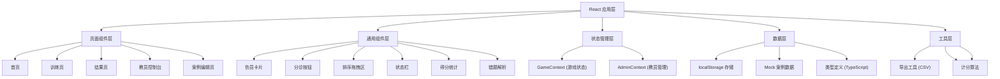

## 1. 架构设计

本应用为纯前端单页应用（SPA），无需后端服务器，所有数据存储在浏览器 localStorage 中。采用 React 组件化开发，状态管理使用 React Context + useReducer，路由使用 React Router。



## 2. 技术描述

- **前端框架**：React@18 + TypeScript@5
- **构建工具**：Vite@5
- **样式方案**：Tailwind CSS@3
- **路由管理**：React Router DOM@6
- **状态管理**：React Context + useReducer
- **拖拽功能**：@dnd-kit/core + @dnd-kit/sortable
- **图表展示**：recharts
- **图标**：lucide-react
- **数据存储**：浏览器 localStorage
- **导出格式**：CSV（逗号分隔值）

## 3. 路由定义

| 路由路径 | 页面组件 | 功能说明 |
|----------|----------|----------|
| `/` | HomePage | 首页-身份选择、快速开始入口 |
| `/training` | TrainingPage | 学员训练页-分诊卡片游戏 |
| `/result/:sessionId` | ResultPage | 训练结果解析页 |
| `/admin` | AdminDashboard | 教员控制台-案例管理、学员记录 |
| `/admin/case/new` | CaseEditorPage | 新建演练案例 |
| `/admin/case/:caseId/edit` | CaseEditorPage | 编辑演练案例 |
| `/student/history` | StudentHistory | 学员训练历史记录 |

## 4. 数据模型

### 4.1 核心数据类型

```typescript
// 分诊等级
type TriageLevel = 'red' | 'yellow' | 'green' | 'black';

// 伤员信息
interface Casualty {
  id: string;
  name: string;
  age: number;
  gender: 'male' | 'female';
  avatar?: string;
  
  // 生命体征
  breathing: 'normal' | 'fast' | 'slow' | 'absent'; // 呼吸
  respiratoryRate?: number; // 呼吸频率
  bleeding: 'none' | 'minor' | 'moderate' | 'severe'; // 出血
  consciousness: 'alert' | 'verbal' | 'pain' | 'unresponsive'; // 意识（AVPU）
  pulse?: 'normal' | 'fast' | 'weak' | 'absent'; // 脉搏
  bloodPressure?: { systolic: number; diastolic: number }; // 血压
  oxygenSaturation?: number; // 血氧饱和度
  
  // 症状描述
  symptoms: string[];
  injuryDescription: string;
  
  // 特殊情况标记
  hasChronicDisease?: boolean; // 基础病（老人）
  chronicDiseaseDesc?: string; // 基础病描述
  isChild?: boolean; // 儿童
  isCrying?: boolean; // 哭闹
  deniesInjury?: boolean; // 否认伤情（说没事但指标异常）
  specialNotes?: string; // 特殊说明
  
  // 正确答案
  correctLevel: TriageLevel;
  correctPriority: number; // 同等级内优先级（1最高）
  explanation: string; // 分诊理由
}

// 演练案例
interface TrainingCase {
  id: string;
  name: string;
  description: string;
  difficulty: 'easy' | 'medium' | 'hard';
  scenario: 'daytime' | 'night' | 'rainy' | 'crowded'; // 场景
  casualties: Casualty[];
  resources: Resources;
  specialEvents?: SpecialEvent[];
  timeLimit?: number; // 时间限制（秒），0表示不限
  createdAt: number;
  updatedAt: number;
}

// 资源配置
interface Resources {
  stretchers: number; // 担架数量
  medics: number; // 医护人数
  ambulances: number; // 救护车数量
}

// 特殊事件
interface SpecialEvent {
  id: string;
  type: 'resource_reduce' | 'new_casualty' | 'condition_worsen' | 'transport_arrive';
  triggerTime: number; // 触发时间（秒）
  description: string;
  resourceChange?: Partial<Resources>;
  newCasualty?: Casualty;
  targetCasualtyId?: string; // 病情恶化的伤员
}

// 学员作答
interface StudentAnswer {
  casualtyId: string;
  selectedLevel: TriageLevel;
  priority: number; // 处理顺序（全局排序，1为第一）
}

// 训练记录
interface TrainingRecord {
  id: string;
  studentName: string;
  caseId: string;
  caseName: string;
  startTime: number;
  endTime: number;
  duration: number; // 用时（秒）
  answers: StudentAnswer[];
  score: number;
  accuracy: number; // 正确率
  levelAccuracy: Record<TriageLevel, number>; // 各等级正确率
  mistakes: MistakeItem[]; // 错题列表
  difficulty: string;
  scenario: string;
}

// 错题项
interface MistakeItem {
  casualtyId: string;
  casualtyName: string;
  correctLevel: TriageLevel;
  studentLevel: TriageLevel;
  correctPriority: number;
  studentPriority: number;
  mistakeType: 'level' | 'priority' | 'both';
  explanation: string;
  misjudgedVitals: string[]; // 误判的生命体征项
}

// 学员信息
interface Student {
  id: string;
  name: string;
  className?: string;
  trainingCount: number;
  averageScore: number;
  lastTrainingTime?: number;
}
```

### 4.2 localStorage 存储键

| 键名 | 数据类型 | 说明 |
|------|----------|------|
| `triage_cases` | TrainingCase[] | 演练案例库 |
| `triage_records` | TrainingRecord[] | 训练记录 |
| `triage_students` | Student[] | 学员列表 |
| `triage_current_user` | { role: 'student' | 'teacher', name: string } | 当前用户 |
| `triage_session` | GameState | 当前训练会话状态 |

## 5. 核心算法

### 5.1 计分算法

- 总分：100分
- 分诊等级正确率：占60分，按正确等级的伤员数/总伤员数计算
- 优先级排序正确率：占30分，使用肯德尔相关系数或相邻逆序数计算
- 特殊场景处理：占10分，正确识别并处理特殊情况加分

### 5.2 分诊校验逻辑

根据学员选择的等级与正确等级对比：
- 完全正确 → 满分
- 相邻等级偏差（如红→黄） → 部分得分
- 跨级错误 → 不得分

### 5.3 CSV导出格式

**个人训练记录导出字段：**
训练日期、学员姓名、案例名称、难度、场景、用时(秒)、总分、正确率、红色正确数、黄色正确数、绿色正确数、黑色正确数、错题数

**班级汇总导出字段：**
学员姓名、训练次数、平均得分、最高得分、最低得分、最近训练日期、正确率平均值
