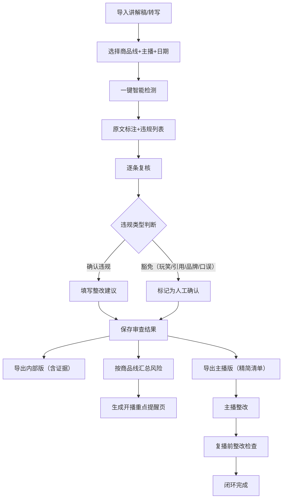

## 1. 产品概述

直播电商商品讲解智能合规审查系统，帮助合规团队高效识别主播讲解中的违规用语（绝对化用语、功效暗示、最低价承诺、医疗暗示、抽奖规则不清等），支持人工复核豁免场景、整改编辑、多版本导出、风险汇总及开播提醒，大幅提升合规审查效率。

- 目标用户：合规审核员、合规负责人、主播团队
- 核心价值：将完整场回放审查从数小时缩短至分钟级，建立标准化合规整改闭环

## 2. 核心功能

### 2.1 用户角色

| 角色 | 使用场景 | 核心权限 |
|------|----------|----------|
| 合规审核员 | 日常逐场审查讲解稿 | 导入文本、运行检测、标记豁免、编辑整改、保存、导出主播清单 |
| 合规负责人 | 管理汇总与风险把控 | 按商品线汇总风险、生成开播重点提醒、查看整改完成率、复播检查 |
| 主播 | 查看整改要求 | 查看个人整改清单（精简版） |

### 2.2 功能模块

1. **审查工作台**：文本导入区、智能检测、原文标注展示、违规详情面板、整改编辑区
2. **项目管理**：直播场次列表（商品线/主播/日期筛选）、审查状态跟踪、复播检查
3. **规则库管理**：禁用词/短语维护、豁免模式微调（可视化）
4. **风险汇总中心**：按商品线统计违规热力、趋势图表、TOP问题排行
5. **开播提醒页**：单页重点提醒（按商品线+主播）、可打印/分享
6. **整改与导出**：内部版（含证据、原句位置）、主播版（精简整改清单）

### 2.3 页面详情

| 页面名称 | 模块名称 | 功能描述 |
|----------|----------|----------|
| 审查工作台 | 文本导入 | 支持粘贴纯文本、上传 .txt/.docx/.srt，选择商品线+主播+场次日期 |
| 审查工作台 | 智能检测引擎 | 一键检测：禁用功效、绝对化用语、最低价承诺、医疗暗示、抽奖规则不清，返回原句位置（行号/字符偏移）、违规类别、严重等级、建议整改方向 |
| 审查工作台 | 原文标注视图 | 左侧原文按句高亮，颜色区分违规类型，悬停显示违规详情；点击跳转右侧面板 |
| 审查工作台 | 违规详情与整改 | 每条违规：原句引用、违规说明、规则依据、整改建议输入框、豁免标记（玩笑话/引用评价/品牌文案/口误）、严重程度调整 |
| 审查工作台 | 进度与操作栏 | 检测进度、未处理违规计数、保存草稿、重新检测、导出（内部版/主播版） |
| 项目列表 | 场次卡片 | 商品线+主播+日期缩略信息卡片，显示违规数、待整改数、状态（待审查/审查中/待整改/已完成）、复播检查标识 |
| 项目列表 | 筛选与搜索 | 按商品线、主播、状态、日期范围筛选，搜索场次编号或主题 |
| 风险汇总 | 商品线仪表盘 | 各商品线违规总数、严重程度分布、整改完成率、环比趋势 |
| 风险汇总 | TOP违规排行 | 违规类型TOP、问题主播TOP、高频禁用词词云 |
| 开播提醒 | 单页提醒 | 按商品线+主播生成一页A4重点提醒：近期TOP违规类型、重点禁用词清单、典型错误示例、整改要点 |
| 复播检查 | 整改对照 | 待复播场次的原违规清单 vs 整改后内容对照，逐条确认整改状态 |

## 3. 核心流程

合规审核员导入讲解稿文本 → 系统智能检测并标注违规片段 → 审核员逐条复核（确认违规/标记豁免/调整严重程度） → 审核员填写整改建议 → 保存审查结果 → 按需导出（内部证据版/主播整改清单） → 合规负责人汇总商品线风险 → 开播前生成重点提醒页 → 复播前对照检查整改完成情况

## 4. 用户界面设计

### 4.1 设计风格
- 主色调：深蓝 #1E3A5F（专业可信）+ 警示橙 #F59E0B + 风险红 #EF4444 + 通过绿 #10B981
- 辅助色：浅灰蓝背景 #F1F5F9，卡片白 #FFFFFF，边框 #E2E8F0
- 按钮风格：圆角 8px，实心主按钮配悬停微亮，次要按钮描边风格
- 字体：标题使用思源黑体 Bold，正文使用思源黑体 Regular；违规标注等宽字体便于定位
- 布局：顶部导航 + 左侧筛选/列表 + 主内容区卡片式；审查页左右分栏（原文左/详情右）
- 图标风格：线性 Outline 图标，违规类型配色块标签（红/橙/黄/紫）

### 4.2 页面设计概述

| 页面名称 | 模块名称 | UI 元素 |
|----------|----------|---------|
| 审查工作台 | 原文标注区 | 左栏 60% 宽，带行号的等宽字体文本，违规句背景色块，悬停气泡卡片显示违规类型+严重度 |
| 审查工作台 | 违规详情面板 | 右栏 40% 宽，卡片式逐条列表，折叠/展开，整改文本域，豁免四象限快捷按钮（玩笑/引用/品牌/口误） |
| 审查工作台 | 顶部工具栏 | 商品线标签、主播头像+名字、场次日期、检测状态徽章、操作按钮组（重新检测/保存/导出下拉） |
| 项目列表 | 场次卡片网格 | 3列卡片，左上角状态色条（红/橙/绿/灰），关键指标数字徽章，底部快捷操作按钮 |
| 风险汇总 | 仪表盘 | 顶部 4 个大数字指标卡，中部商品线横向条形图，底部违规类型饼图+词云 |
| 开播提醒 | 单页视图 | A4 比例白色画布，分区块标题+要点列表，右上角打印/分享按钮，底部合规负责人签字区 |

### 4.3 响应式
- 桌面端优先（1440px+），审查工作台左右分栏
- 平板（768-1440px）：分栏可折叠，卡片自适应 2 列
- 移动端（<768px）：列表流式堆叠，原文标注区可横滑查看行号

### 4.4 动效与微交互
- 检测运行时进度条渐变动画 + 脉冲点
- 违规标注悬停时轻微上浮阴影
- 豁免标记时图标勾号弹性动画
- 页面切换淡入 200ms ease-out
- 风险汇总数字 count-up 入场动画
