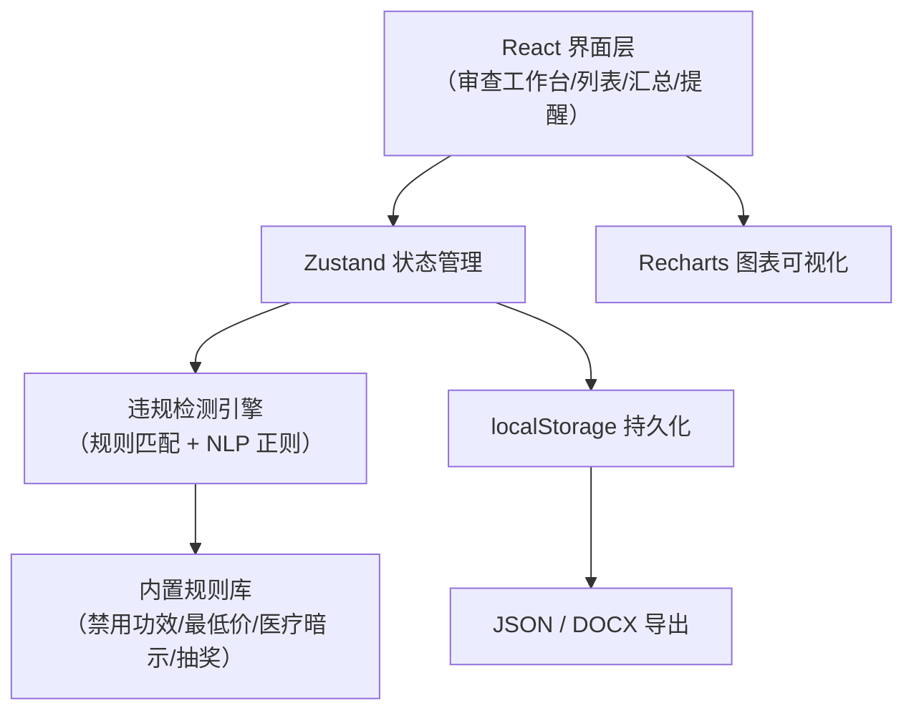
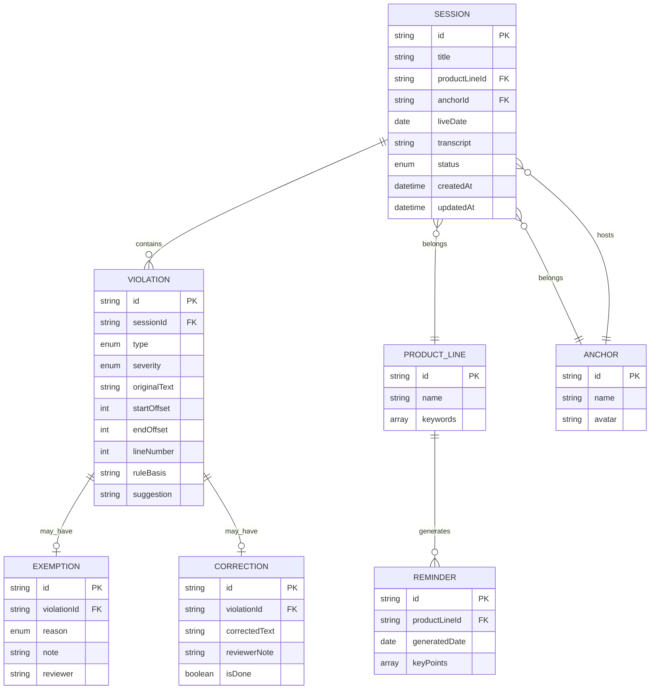

## 1. 架构设计

纯前端单页应用（SPA），违规检测引擎在浏览器端运行，数据持久化使用 localStorage + 可选导出 JSON 备份。无需后端服务即可完整使用，便于合规团队内网部署。

## 2. 技术说明

- 前端：React@18 + TypeScript + tailwindcss@3 + vite@5
- 状态管理：zustand@4（轻量，跨组件共享审查状态）
- 路由：react-router-dom@6（多页面 SPA）
- 图表：recharts@2（风险汇总仪表盘）
- 富文本标注：自定义 DOM 渲染 + Range API（原句高亮定位）
- 导出：客户端原生 Blob + 文件 API，docx@8 生成 Word 文档
- 数据存储：localStorage（按场次分片存储，单场上限 5MB 文本）
- Mock 数据：内置 3 场示例直播转写 + 商品线/主播基础数据

## 3. 路由定义

| 路由 | 页面用途 |
|------|----------|
| / | 项目列表首页（直播场次卡片 + 筛选） |
| /review/:sessionId | 审查工作台（核心检测 + 标注 + 整改） |
| /review/new | 新建审查（导入文本 + 选择场次信息） |
| /dashboard | 风险汇总中心（商品线仪表盘 + TOP排行） |
| /reminder/:productLineId | 开播重点提醒页（单页打印视图） |
| /recheck/:sessionId | 复播前整改检查页（对照视图） |
| /rules | 规则库管理（可选，可视化调整检测词） |

## 4. 数据模型

### 4.1 核心数据结构

### 4.2 违规类型枚举

| 类型值 | 中文名称 | 颜色标识 | 严重等级示例 |
|--------|----------|----------|--------------|
| FORBIDDEN_EFFECT | 禁用功效宣称 | #EF4444 红 | 高 |
| ABSOLUTE_WORD | 绝对化用语 | #F59E0B 橙 | 中 |
| PRICE_PROMISE | 最低价/价格承诺 | #F97316 深橙 | 高 |
| MEDICAL_IMPLICATION | 医疗暗示/治疗效果 | #DC2626 深红 | 极高 |
| UNCLEAR_LOTTERY | 抽奖规则不清 | #8B5CF6 紫 | 中 |
| EXAGGERATION | 夸大宣传 | #EAB308 黄 | 中 |

### 4.3 豁免原因枚举
- JOKE：玩笑话
- USER_REVIEW：引用用户评价
- BRAND_COPY：品牌官方文案
- SLIP_OF_TONGUE：口误

## 5. 违规检测引擎设计

### 5.1 四层检测策略

1. **关键词正则层**：精确匹配禁用词库（如"根治""100%""全网最低""治疗""包治百病"），支持前后文否定排除（如"不是100%"）
2. **模式匹配层**：正则模式识别句式（如"用了XX就好了""比XX便宜XX元""不XX退钱""免费送+条件不明确"）
3. **语义启发层**：关键词组合打分（如""+"见效快"+"无副作用"组合触发医疗暗示）
4. **上下文豁免层**：前置关键词（如"用户评论说""官方宣传""开玩笑"）降低分数或跳过

### 5.2 位置定位
- 文本导入后按换行分句，每句记录起始字符偏移 + 行号
- 违规匹配返回 `{startOffset, endOffset, lineNumber, matchedText}` 四元组
- 标注层通过字符 offset 包裹 `<mark>` 标签并绑定 data-violation-id

## 6. 导出文档模板

### 6.1 内部证据版（DOCX/JSON）
- 场次完整信息（商品线/主播/日期）
- 审查员 + 审查时间戳
- 违规清单表格：序号｜行号｜原句｜违规类型｜严重度｜规则依据｜整改建议｜是否豁免｜豁免原因｜备注
- 附录：完整原文（行号水印+违规高亮标记）

### 6.2 主播整改清单（精简 DOCX）
- 抬头：主播姓名 + 直播场次日期
- 仅包含未豁免违规：序号｜问题说明（原句截取）｜整改要求（简短）
- 末尾签字确认区 + 整改截止日期

### 6.3 开播提醒单页（打印 PDF）
- 商品线名称 + 日期
- TOP3 高频违规提醒（大字 + 色块）
- 重点禁用词速查表
- 典型错误 vs 正确说法对照
- 合规一句话口号
