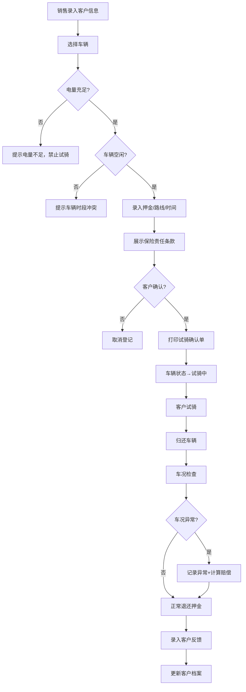
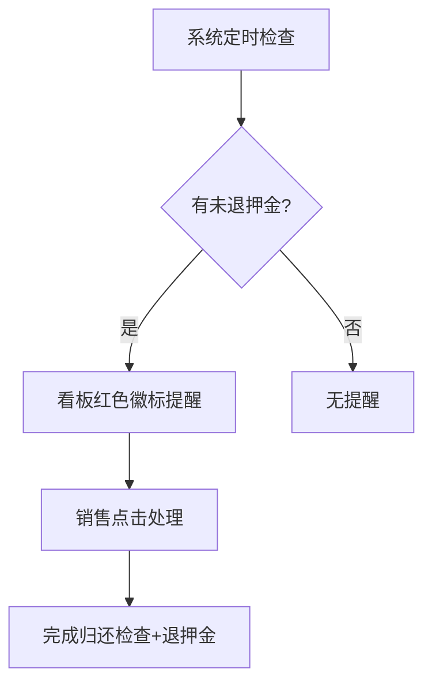

## 1. 产品概述

电动车门店试骑押金管理系统，解决纸单丢失、押金遗忘、车辆冲突等痛点，实现试骑全流程数字化管理。
- 目标用户：电动车门店销售人员和店长，覆盖试骑登记、押金收退、归还检查、客户反馈全链路
- 核心价值：杜绝纸单丢失、防止车辆时段冲突、自动提醒未退押金、提升试骑转化率追踪能力

## 2. 核心功能

### 2.1 用户角色

| 角色 | 登录方式 | 核心权限 |
|------|----------|----------|
| 销售 | 工号 + 密码 | 客户登记、试骑登记、押金收退、归还检查、打印确认单、客户反馈录入 |
| 店长 | 工号 + 密码 | 销售全部权限 + 导出报表（试骑转化率、异常车况）、车辆管理、数据统计 |

### 2.2 功能模块

1. **试骑看板**：当日试骑状态总览、未退押金提醒、低电量车辆预警
2. **试骑登记**：录入客户信息、选择车辆、押金收取、路线指定、时间设定
3. **归还检查**：车况检查（刮蹭/损坏）、押金退还、异常记录
4. **车辆管理**：车辆信息维护、电量状态更新、维修状态管理
5. **客户档案**：客户信息、试骑历史、购后反馈、推荐车型标签
6. **报表中心**：试骑转化率、异常车况统计、押金流水（店长专属）

### 2.3 页面详情

| 页面名称 | 模块名称 | 功能描述 |
|----------|----------|----------|
| 试骑看板 | 状态概览 | 显示今日试骑数、进行中数量、未退押金数、低电量车辆数 |
| 试骑看板 | 进行中列表 | 显示当前试骑中的车辆、客户、预计归还时间，超时高亮 |
| 试骑看板 | 未退押金提醒 | 红色徽标提示未退还押金记录，点击跳转处理 |
| 试骑看板 | 低电量预警 | 电量低于20%的车辆禁止安排试骑，黄色警示 |
| 试骑登记 | 客户信息 | 姓名、手机号、身份证号录入，支持历史客户自动填充 |
| 试骑登记 | 车辆选择 | 按车型筛选，显示车架号、电量、当前状态，冲突车辆置灰 |
| 试骑登记 | 押金收取 | 押金金额录入、支付方式选择，自动生成押金编号 |
| 试骑登记 | 路线与时间 | 预设路线选择、预计试骑时长设定、预计归还时间自动计算 |
| 试骑登记 | 保险提示 | 交接单中自动展示保险责任条款，客户确认后方可出发 |
| 试骑登记 | 打印确认单 | 一键打印试骑确认单（含客户信息、车辆信息、押金、路线、保险条款） |
| 归还检查 | 车况检查 | 逐项检查车况（刮蹭、轮胎、刹车、灯光等），支持拍照标记 |
| 归还检查 | 押金退还 | 确认退还押金，扣除赔偿金额（如有），打印退还凭证 |
| 归还检查 | 异常记录 | 记录车辆异常状况，自动关联车辆档案，影响后续试骑安排 |
| 车辆管理 | 车辆列表 | 所有车辆信息、状态（可用/试骑中/维修中/电量不足）、电量 |
| 车辆管理 | 电量更新 | 录入车辆当前电量，低于阈值自动标记不可试骑 |
| 车辆管理 | 维修登记 | 车辆损坏维修记录，维修期间禁止试骑 |
| 客户档案 | 客户列表 | 所有客户基本信息、试骑次数、购买状态 |
| 客户档案 | 试骑反馈 | 试骑后客户偏好、满意度、意向车型录入 |
| 客户档案 | 推荐标签 | 基于反馈自动生成推荐标签，辅助销售精准推荐 |
| 报表中心 | 试骑转化率 | 按时段统计试骑→购买转化率，支持筛选和导出 |
| 报表中心 | 异常车况 | 车辆异常频次统计、维修成本追踪，支持导出 |
| 报表中心 | 押金流水 | 押金收取/退还记录、未退押金明细，支持导出 |

## 3. 核心流程

### 3.1 试骑全流程

1. 销售在"试骑登记"页面录入客户信息和选择车辆
2. 系统校验：车辆电量是否充足、车辆是否空闲（同一时段不冲突）
3. 校验通过后，录入押金、路线、试骑时长
4. 展示保险责任条款，客户确认
5. 打印试骑确认单，车辆状态变为"试骑中"
6. 客户归还车辆，销售在"归还检查"页面逐项检查车况
7. 如有异常，记录损坏情况并计算赔偿金额
8. 退还押金（扣除赔偿），打印退还凭证
9. 录入客户试骑反馈，更新客户档案推荐标签

### 3.2 流程图

### 3.3 未退押金提醒流程

## 4. 用户界面设计

### 4.1 设计风格

- **主色调**：深靛蓝 (#1E3A5F) + 琥珀黄 (#F59E0B)，传达专业可靠与活力
- **辅助色**：状态绿 (#10B981)、警告橙 (#F97316)、危险红 (#EF4444)
- **按钮风格**：圆角 8px，主按钮带轻微阴影，hover 时提升阴影层级
- **字体**：标题使用 Noto Sans SC Bold，正文使用 Noto Sans SC Regular
- **布局风格**：左侧固定导航栏 + 右侧内容区，卡片式模块布局
- **图标风格**：线性图标（Lucide），2px 描边

### 4.2 页面设计概览

| 页面名称 | 模块名称 | UI 元素 |
|----------|----------|---------|
| 试骑看板 | 状态概览 | 四宫格统计卡片（深靛蓝底 + 白字），数字突出显示 |
| 试骑看板 | 进行中列表 | 表格布局，超时行橙色背景高亮，操作列按钮组 |
| 试骑看板 | 未退押金 | 右上角红色徽标气泡，下拉面板显示列表 |
| 试骑登记 | 客户信息 | 表单卡片，历史客户下拉自动填充 |
| 试骑登记 | 车辆选择 | 网格卡片，电量进度条，冲突车辆灰色蒙层 |
| 试骑登记 | 保险提示 | 底部固定面板，黄色边框，确认勾选框 |
| 归还检查 | 车况检查 | 分组勾选清单 + 备注输入框 |
| 车辆管理 | 车辆列表 | 表格 + 状态标签（彩色徽标） |
| 客户档案 | 客户详情 | 时间线展示试骑历史，标签云展示推荐标签 |
| 报表中心 | 数据图表 | 柱状图 + 趋势线，导出按钮 |

### 4.3 响应式设计

- 桌面优先设计，目标分辨率 1440×900 及以上
- 左侧导航栏可折叠，内容区自适应
- 表格列数较多时支持横向滚动

## 5. 业务规则

| 规则编号 | 规则描述 |
|----------|----------|
| BR-001 | 车辆电量低于20%时，系统禁止安排试骑 |
| BR-002 | 同一车辆同一时段（前后30分钟内）不允许分配给两个客户 |
| BR-003 | 试骑确认单必须包含保险责任条款和客户确认签名 |
| BR-004 | 押金未退还记录持续在看板提醒，直到完成退还操作 |
| BR-005 | 车况异常的车辆自动标记为"待检查"，禁止安排试骑 |
| BR-006 | 客户试骑反馈和推荐标签存入客户档案，供后续推荐使用 |
