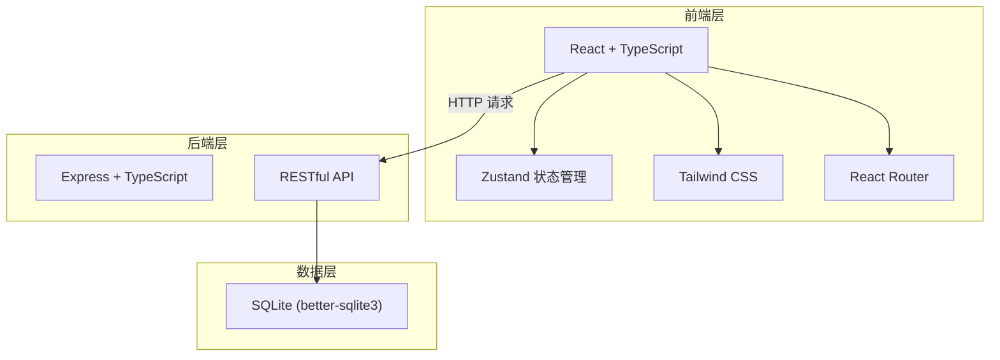
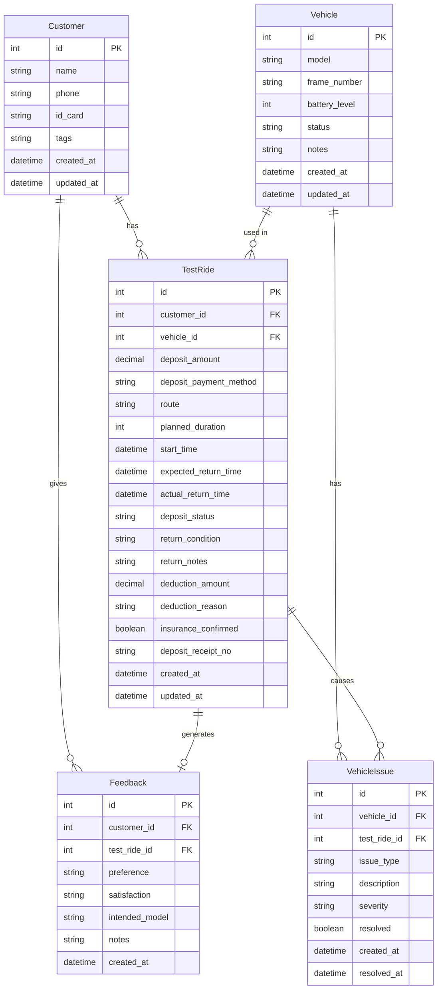

## 1. 架构设计



## 2. 技术说明

- **前端**：React@18 + TypeScript + Tailwind CSS@3 + Vite
- **初始化工具**：vite-init (react-express-ts 模板)
- **后端**：Express@4 + TypeScript (ESM)
- **数据库**：SQLite (better-sqlite3)，单文件数据库，重开软件状态持久化
- **状态管理**：Zustand
- **图标**：lucide-react
- **打印**：浏览器原生 window.print() + CSS @media print
- **图表**：recharts（报表中心可视化）
- **导出**：xlsx（Excel 导出）

## 3. 路由定义

| 路由 | 用途 |
|------|------|
| / | 试骑看板（首页） |
| /register | 试骑登记 |
| /return/:id | 归还检查 |
| /vehicles | 车辆管理 |
| /customers | 客户档案 |
| /customers/:id | 客户详情（试骑历史+反馈） |
| /reports | 报表中心（店长权限） |

## 4. API 定义

### 4.1 试骑记录

| 方法 | 路径 | 说明 |
|------|------|------|
| GET | /api/test-rides | 获取试骑记录列表（支持筛选） |
| POST | /api/test-rides | 创建试骑记录 |
| PUT | /api/test-rides/:id/return | 归还检查+退押金 |
| GET | /api/test-rides/active | 获取进行中的试骑 |
| GET | /api/test-rides/unreturned-deposits | 获取未退押金记录 |

### 4.2 车辆

| 方法 | 路径 | 说明 |
|------|------|------|
| GET | /api/vehicles | 获取车辆列表 |
| POST | /api/vehicles | 添加车辆 |
| PUT | /api/vehicles/:id | 更新车辆信息（含电量） |
| PUT | /api/vehicles/:id/status | 更新车辆状态 |
| GET | /api/vehicles/available | 获取可试骑车辆（含时段校验） |

### 4.3 客户

| 方法 | 路径 | 说明 |
|------|------|------|
| GET | /api/customers | 获取客户列表 |
| POST | /api/customers | 添加客户 |
| PUT | /api/customers/:id | 更新客户信息 |
| POST | /api/customers/:id/feedback | 录入试骑反馈 |
| GET | /api/customers/search | 按手机号/姓名搜索客户 |

### 4.4 报表

| 方法 | 路径 | 说明 |
|------|------|------|
| GET | /api/reports/conversion | 试骑转化率数据 |
| GET | /api/reports/vehicle-issues | 异常车况统计 |
| GET | /api/reports/deposit-flow | 押金流水 |
| GET | /api/reports/export/:type | 导出报表（Excel） |

## 5. 数据模型

### 5.1 数据模型定义



### 5.2 数据定义语言

```sql
CREATE TABLE IF NOT EXISTS customers (
    id INTEGER PRIMARY KEY AUTOINCREMENT,
    name TEXT NOT NULL,
    phone TEXT NOT NULL,
    id_card TEXT,
    tags TEXT DEFAULT '',
    created_at DATETIME DEFAULT CURRENT_TIMESTAMP,
    updated_at DATETIME DEFAULT CURRENT_TIMESTAMP
);

CREATE TABLE IF NOT EXISTS vehicles (
    id INTEGER PRIMARY KEY AUTOINCREMENT,
    model TEXT NOT NULL,
    frame_number TEXT NOT NULL UNIQUE,
    battery_level INTEGER DEFAULT 100,
    status TEXT DEFAULT 'available',
    notes TEXT DEFAULT '',
    created_at DATETIME DEFAULT CURRENT_TIMESTAMP,
    updated_at DATETIME DEFAULT CURRENT_TIMESTAMP
);

CREATE TABLE IF NOT EXISTS test_rides (
    id INTEGER PRIMARY KEY AUTOINCREMENT,
    customer_id INTEGER NOT NULL,
    vehicle_id INTEGER NOT NULL,
    deposit_amount DECIMAL(10,2) NOT NULL,
    deposit_payment_method TEXT DEFAULT 'cash',
    route TEXT,
    planned_duration INTEGER DEFAULT 30,
    start_time DATETIME NOT NULL,
    expected_return_time DATETIME NOT NULL,
    actual_return_time DATETIME,
    deposit_status TEXT DEFAULT 'collected',
    return_condition TEXT DEFAULT 'normal',
    return_notes TEXT DEFAULT '',
    deduction_amount DECIMAL(10,2) DEFAULT 0,
    deduction_reason TEXT DEFAULT '',
    insurance_confirmed INTEGER DEFAULT 0,
    deposit_receipt_no TEXT,
    created_at DATETIME DEFAULT CURRENT_TIMESTAMP,
    updated_at DATETIME DEFAULT CURRENT_TIMESTAMP,
    FOREIGN KEY (customer_id) REFERENCES customers(id),
    FOREIGN KEY (vehicle_id) REFERENCES vehicles(id)
);

CREATE TABLE IF NOT EXISTS feedbacks (
    id INTEGER PRIMARY KEY AUTOINCREMENT,
    customer_id INTEGER NOT NULL,
    test_ride_id INTEGER,
    preference TEXT DEFAULT '',
    satisfaction TEXT DEFAULT '',
    intended_model TEXT DEFAULT '',
    notes TEXT DEFAULT '',
    created_at DATETIME DEFAULT CURRENT_TIMESTAMP,
    FOREIGN KEY (customer_id) REFERENCES customers(id),
    FOREIGN KEY (test_ride_id) REFERENCES test_rides(id)
);

CREATE TABLE IF NOT EXISTS vehicle_issues (
    id INTEGER PRIMARY KEY AUTOINCREMENT,
    vehicle_id INTEGER NOT NULL,
    test_ride_id INTEGER,
    issue_type TEXT NOT NULL,
    description TEXT DEFAULT '',
    severity TEXT DEFAULT 'minor',
    resolved INTEGER DEFAULT 0,
    created_at DATETIME DEFAULT CURRENT_TIMESTAMP,
    resolved_at DATETIME,
    FOREIGN KEY (vehicle_id) REFERENCES vehicles(id),
    FOREIGN KEY (test_ride_id) REFERENCES test_rides(id)
);

CREATE INDEX idx_test_rides_customer ON test_rides(customer_id);
CREATE INDEX idx_test_rides_vehicle ON test_rides(vehicle_id);
CREATE INDEX idx_test_rides_status ON test_rides(deposit_status);
CREATE INDEX idx_test_rides_start_time ON test_rides(start_time);
CREATE INDEX idx_vehicles_status ON vehicles(status);
CREATE INDEX idx_customers_phone ON customers(phone);
CREATE INDEX idx_vehicle_issues_vehicle ON vehicle_issues(vehicle_id);
CREATE INDEX idx_vehicle_issues_resolved ON vehicle_issues(resolved);
```
