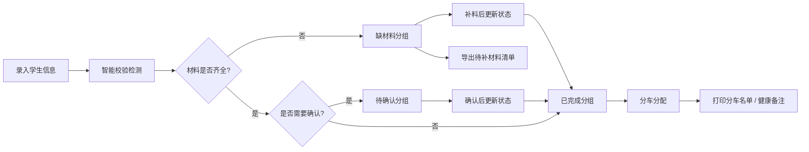

## 1. 产品概述

研学营证件收集管理系统，帮助老师高效收集和管理学生的身份证/户口本、健康备注、监护人授权和保险信息。解决家长发来的图片经常缺页、信息分散、难以追踪的痛点，实现从录入、核查到打印导出的全流程管理。

- 核心用户：带队老师、教务老师
- 核心价值：提升证件收集效率，降低遗漏风险，保障研学安全

## 2. 核心功能

### 2.1 用户角色

| 角色 | 使用场景 | 核心权限 |
|------|----------|----------|
| 带队老师 | 日常录入、分车管理、车上点名 | 录入学生、查看分组、打印分车名单、打印健康备注 |
| 教务老师 | 材料核查、导出统计 | 导出待补材料、查看全局进度、管理所有学生数据 |

### 2.2 功能模块

1. **学生信息录入**：学生姓名、班级、证件信息、健康/过敏备注、监护人授权、保险信息、分车分配
2. **分组看板**：按"缺材料"、"待确认"、"已完成"三栏展示学生清单
3. **智能提醒**：证件过期、监护人签名缺失、重复报名、健康风险提醒
4. **打印中心**：分车名单打印、按车号健康备注打印
5. **导出功能**：待补材料清单导出
6. **数据持久化**：本地存储，刷新不丢失

### 2.3 页面详情

| 页面名称 | 模块名称 | 功能描述 |
|----------|----------|----------|
| 主页面 | 顶部导航 | 标题、统计概览、添加学生按钮、打印/导出操作入口 |
| 主页面 | 分组看板 | 三栏布局（缺材料/待确认/已完成），拖拽或按钮切换状态 |
| 主页面 | 学生卡片 | 展示学生基本信息、状态标签、提醒标识、操作按钮 |
| 学生表单 | 录入表单 | 弹窗形式，包含学生所有信息字段及验证逻辑 |
| 学生表单 | 智能校验 | 实时检测证件有效期、重复报名、健康风险关键词 |
| 打印预览 | 分车名单 | 按车号分组的学生名单，可直接打印 |
| 打印预览 | 健康备注 | 按车号的健康/过敏备注，特殊学生高亮 |
| 提醒中心 | 提醒列表 | 汇总所有需要关注的提醒事项 |

## 3. 核心流程

## 4. 用户界面设计

### 4.1 设计风格

- **主色调**：深蓝（#1e3a5f）作为主色，传达专业可信的教育管理感
- **状态色**：红色（#dc2626）缺材料、琥珀色（#d97706）待确认、绿色（#059669）已完成
- **按钮风格**：圆角适中（8px），悬停有微妙阴影和颜色变化
- **字体**：系统字体栈，清晰易读，数字等宽显示
- **布局风格**：卡片式三栏看板，阴影层次分明
- **图标风格**：线性图标，简洁现代

### 4.2 页面设计概览

| 页面/模块 | 核心元素 | 设计要点 |
|----------|----------|----------|
| 顶部栏 | 标题、统计数字、操作按钮 | 深蓝色背景，白色文字，统计数字大字号醒目 |
| 分组看板 | 三列卡片组、每组标题+计数 | 卡片组有轻微背景色区分，标题带状态色标识 |
| 学生卡片 | 姓名班级、状态标签、提醒图标、操作区 | 白色卡片，悬停上浮，提醒用红色角标 |
| 表单弹窗 | 分组字段、实时校验提示 | 表单分区清晰，错误提示即时显示 |
| 打印页 | 清晰的表格布局、分页友好 | 打印专用样式，黑白友好，信息密度适中 |

### 4.3 响应式

- 桌面端优先设计（1280px 以上）
- 平板端自动调整为两列布局
- 移动端单列堆叠，表单适配触屏操作

### 4.4 特殊交互

- 学生卡片支持点击展开查看详情
- 状态切换有平滑过渡动画
- 提醒角标有呼吸动效提示
- 打印预览支持分页预览
