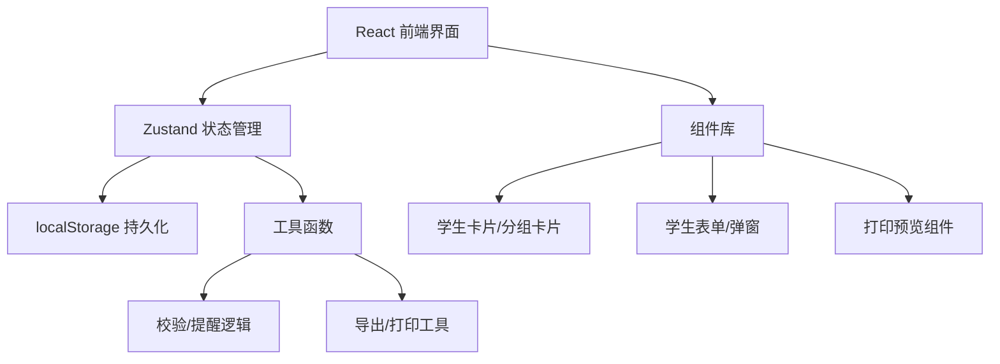
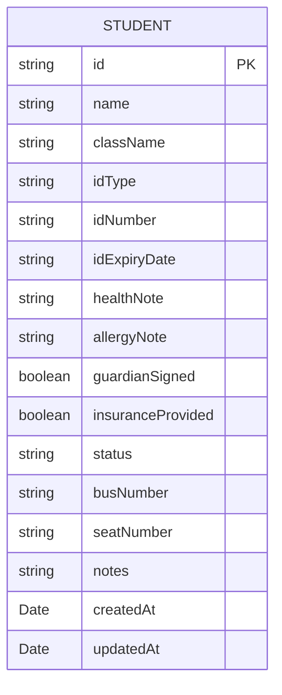

## 1. 架构设计



## 2. 技术描述

- **前端**：React@18 + TypeScript + Vite@5
- **样式**：TailwindCSS@3
- **状态管理**：zustand@4
- **图标**：lucide-react
- **数据存储**：localStorage（纯前端，无需后端）
- **初始化工具**：vite-init

## 3. 路由定义

| 路由 | 用途 |
|------|------|
| / | 主页面（分组看板 + 学生管理） |

单页应用，主要通过弹窗和组件切换实现不同功能视图。

## 4. 数据模型

### 4.1 数据模型定义



### 4.2 TypeScript 类型定义

```typescript
type StudentStatus = 'incomplete' | 'pending' | 'completed';

type IdType = 'idcard' | 'household';

interface Student {
  id: string;
  name: string;
  className: string;
  idType: IdType;
  idNumber: string;
  idExpiryDate: string;
  healthNote: string;
  allergyNote: string;
  guardianSigned: boolean;
  insuranceProvided: boolean;
  status: StudentStatus;
  busNumber: string;
  seatNumber: string;
  notes: string;
  createdAt: string;
  updatedAt: string;
}

interface AlertItem {
  type: 'expired' | 'duplicate' | 'no-signature' | 'health-risk';
  studentId: string;
  message: string;
}
```

### 4.3 状态计算规则

- **缺材料 (incomplete)**: 缺少任一必填项（证件信息、监护人签名、保险信息）
- **待确认 (pending)**: 材料齐全但有待确认事项（证件即将过期、健康备注有风险等）
- **已完成 (completed)**: 材料齐全且无待确认事项

### 4.4 提醒检测规则

1. **证件过期**: 证件有效期已过或30天内到期
2. **重复报名**: 同一姓名 + 班级 + 证件号组合重复
3. **监护人签名缺失**: guardianSigned 为 false
4. **健康风险**: healthNote 或 allergyNote 中包含"不能剧烈运动"、"心脏病"、"哮喘"等关键词

## 5. 项目结构

```
src/
├── components/
│   ├── StudentCard.tsx        # 学生信息卡片
│   ├── StudentForm.tsx        # 学生录入/编辑表单
│   ├── StatusColumn.tsx       # 分组列（缺材料/待确认/已完成）
│   ├── AlertBadge.tsx         # 提醒角标组件
│   ├── PrintBusList.tsx       # 打印分车名单
│   ├── PrintHealthNote.tsx    # 打印健康备注
│   └── Header.tsx             # 顶部导航栏
├── store/
│   └── useStudentStore.ts     # zustand 学生状态管理
├── utils/
│   ├── validators.ts          # 校验/提醒逻辑
│   ├── storage.ts             # localStorage 封装
│   └── export.ts              # 导出/打印工具函数
├── types/
│   └── index.ts               # TypeScript 类型定义
├── App.tsx
├── main.tsx
└── index.css
```

## 6. 核心实现要点

1. **状态自动计算**: 学生状态（缺材料/待确认/已完成）根据字段自动推导，不手动存储
2. **本地存储持久化**: zustand 中间件 + localStorage，状态变更自动保存
3. **打印样式**: 使用 CSS @media print 专门优化打印效果
4. **表单校验**: 实时校验，录入时即时反馈提醒
5. **导出功能**: CSV 格式导出待补材料清单，兼容 Excel 打开
