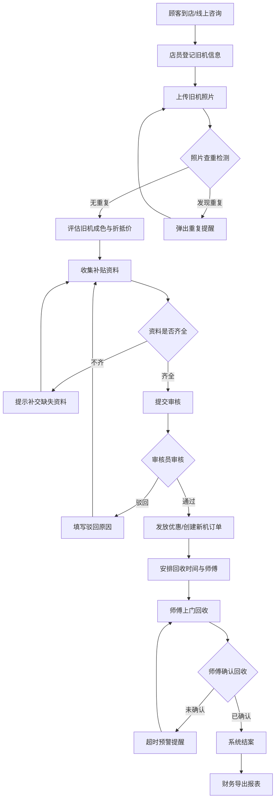

## 1. 产品概述

家电以旧换新台——面向家电门店的一站式以旧换新管理系统，将旧机评估、政府补贴审核、新机下单、上门回收和安装调度串成完整闭环，解决店员用表格管理易遗漏、流程断档的问题。

- **目标用户**：家电门店店员、审核员、安装/回收师傅、财务人员
- **核心价值**：杜绝补贴资料不齐就发优惠、旧机照片重复使用、回收未确认就结案等操作漏洞，提升以旧换新全流程的合规性和效率

## 2. 核心功能

### 2.1 用户角色

| 角色 | 进入方式 | 核心权限 |
|------|----------|----------|
| 店员 | 账号登录 | 登记旧机、提交评估、创建新机订单、查看工单 |
| 审核员 | 账号登录 | 审核补贴资料、批准/驳回优惠发放 |
| 安装师傅 | 账号登录 | 查看回收任务、确认回收、填写楼层电梯信息 |
| 财务 | 账号登录 | 导出补贴/折抵/待回收清单、查看结算报表 |

### 2.2 功能模块

1. **工作台**：今日待办、流程统计、快捷操作入口、预警提醒
2. **以旧换新登记**：旧机品类成色录入、照片上传与查重、补贴资料收集、新机订单关联
3. **工单跟踪**：全量工单列表、状态筛选、流程推进、详情查看
4. **回收调度**：师傅视角任务列表、楼层电梯信息、时间安排、回收确认
5. **财务导出**：补贴汇总、折抵明细、待回收清单、结算报表

### 2.3 页面详情

| 页面名称 | 模块名称 | 功能描述 |
|----------|----------|----------|
| 工作台 | 数据概览 | 当日新增工单、待审核数、待回收数、已结案数统计卡片 |
| 工作台 | 预警提醒 | 补贴资料即将过期、回收超时未确认、旧机照片重复警告 |
| 工作台 | 快捷操作 | 新建登记、我的待审、我的回收等快捷入口按钮 |
| 以旧换新登记 | 旧机信息 | 品类选择（冰箱/洗衣机/空调/电视等）、品牌型号、购买年份、成色评级（优/良/中/差） |
| 以旧换新登记 | 照片上传 | 旧机外观照片上传（正面、侧面、铭牌），上传时自动查重提醒 |
| 以旧换新登记 | 补贴资料 | 身份证照片、旧机购买凭证、政府补贴资格截图，资料齐备状态指示 |
| 以旧换新登记 | 新机订单 | 关联新机型号、售价、优惠金额、折抵金额、实付金额 |
| 以旧换新登记 | 回收安排 | 预约回收日期时间段、楼层、电梯情况、备注 |
| 工单跟踪 | 工单列表 | 全部/待评估/待审核/待回收/已结案标签筛选，搜索和排序 |
| 工单跟踪 | 工单卡片 | 旧机品类图标、客户姓名、当前状态标签、操作时间线 |
| 工单详情 | 流程时间线 | 评估→审核→回收→结算四步进度条，每步状态和操作人 |
| 工单详情 | 资料审核 | 补贴资料查看、通过/驳回操作，驳回需填写原因 |
| 工单详情 | 回收确认 | 师傅填写回收确认码、上传回收现场照片 |
| 回收调度 | 任务列表 | 师傅待回收任务卡片，按日期分组排列 |
| 回收调度 | 地址详情 | 客户楼层、电梯/楼梯、旧机尺寸重量、搬运难度评估 |
| 回收调度 | 回收确认 | 输入确认码、上传照片、标记完成 |
| 财务导出 | 补贴汇总 | 按时间段统计政府补贴总额，按品类/月份分组 |
| 财务导出 | 折抵明细 | 每笔旧机折抵金额明细表 |
| 财务导出 | 待回收清单 | 所有未完成回收的工单列表 |
| 财务导出 | 导出操作 | 一键导出 Excel/CSV，支持筛选条件 |

## 3. 核心流程

顾客到店 → 店员登记旧机信息（拍照、评估成色）→ 收集补贴资料 → 系统自动检查资料完整性 → 资料齐全则提交审核 → 审核员审核补贴资格 → 通过后发放优惠 → 创建新机订单 → 安排回收时间 → 师傅上门回收并确认 → 系统结案 → 财务导出报表

### 业务规则

1. **补贴资料不齐不能下发优惠**：身份证、购买凭证、补贴资格截图三项缺一不可，否则"提交审核"按钮置灰
2. **同一旧机照片重复使用提醒**：上传照片时进行图片哈希比对，若与已有工单重复则弹窗提醒，需确认后方可继续
3. **回收未确认不能结案**：只有师傅完成回收确认（输入确认码+上传照片）后，工单才能流转到"已结案"状态

## 4. 用户界面设计

### 4.1 设计风格

- **主色调**：暖橙色（#E8652B）象征家电活力与换新，搭配深灰色（#1A1A2E）沉稳底色
- **辅色**：浅灰背景（#F5F3EF）带来门店柜台感，薄荷绿（#2ECDA7）用于成功/通过状态
- **按钮风格**：圆角矩形（8px），主操作按钮带微投影，次要按钮边框样式
- **字体**：标题使用 Noto Serif SC 衬线字体传递信任感，正文使用 Noto Sans SC 无衬线字体保证可读性
- **布局风格**：左侧固定导航栏 + 右侧内容区，卡片式模块布局
- **图标风格**：线性图标搭配品类实物图标（冰箱/洗衣机等），2x描边

### 4.2 页面设计概览

| 页面名称 | 模块名称 | UI要素 |
|----------|----------|--------|
| 工作台 | 数据概览 | 四宫格统计卡片，数字大号加粗，底部渐变色带，hover微缩放 |
| 工作台 | 预警提醒 | 红点角标通知栏，点击展开详情面板，滑入动画 |
| 工作台 | 快捷操作 | 圆形图标+文字按钮，2x2网格排列，hover放大效果 |
| 以旧换新登记 | 旧机信息 | 分步表单，品类选择用图标卡片（非下拉），成色用星级评分 |
| 以旧换新登记 | 照片上传 | 拖拽上传区域，缩略图预览，重复警告横幅（红底白字） |
| 以旧换新登记 | 补贴资料 | 清单式上传项，绿色勾/红色叉状态图标，整体进度条 |
| 以旧换新登记 | 新机订单 | 右侧摘要卡片，金额高亮，折抵计算动画 |
| 工单跟踪 | 工单列表 | 横向标签切换，纵向卡片列表，状态色条标识 |
| 工单跟踪 | 工单卡片 | 左侧品类图标，中间信息，右侧状态徽章，hover投影加深 |
| 工单详情 | 流程时间线 | 顶部横向四步进度条，当前步骤高亮脉冲动画 |
| 工单详情 | 资料审核 | 资料预览弹窗，底部通过/驳回按钮，驳回需填原因 |
| 回收调度 | 任务列表 | 日期分组标题，任务卡片含楼层标签和电梯图标 |
| 回收调度 | 地址详情 | 楼层/电梯信息卡片，搬运难度色标（绿/黄/红） |
| 财务导出 | 报表区域 | 数据表格带斑马纹，汇总行加粗，导出按钮右上角固定 |

### 4.3 响应式设计

- 桌面优先设计，最小适配 1280px 宽度
- 导航栏在 1024px 以下折叠为汉堡菜单
- 表格在平板竖屏下可横向滚动
- 移动端隐藏次要操作，核心操作按钮固定底部

### 4.4 3D 场景指导

不适用
