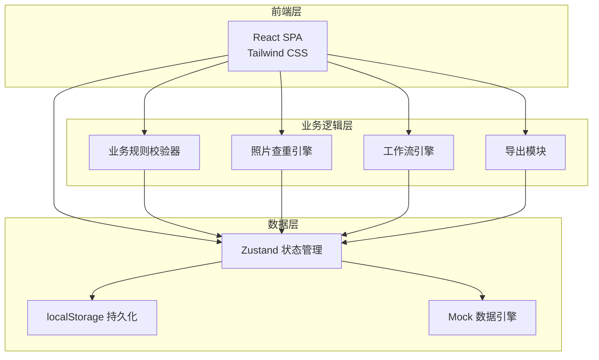
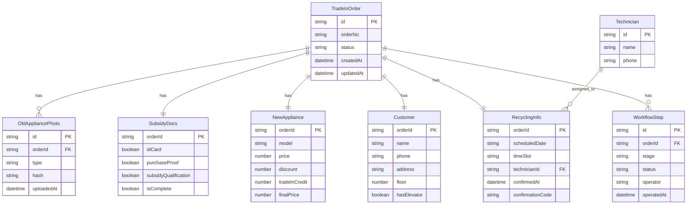

## 1. 架构设计



## 2. 技术说明

- **前端**：React@18 + Tailwind CSS@3 + Vite
- **初始化工具**：Vite
- **后端**：无（纯前端应用，数据使用 localStorage 持久化）
- **数据库**：无后端数据库，使用 localStorage + Zustand persist 中间件
- **状态管理**：Zustand（轻量、支持 persist）
- **路由**：React Router v6
- **导出**：使用 xlsx 库生成 Excel 文件
- **图片处理**：浏览器端图片哈希（使用 crypto-js MD5）用于查重

## 3. 路由定义

| 路由 | 用途 |
|------|------|
| `/` | 工作台首页，数据概览和快捷操作 |
| `/register` | 以旧换新登记页面，分步表单 |
| `/register/:id` | 编辑已有登记 |
| `/orders` | 工单跟踪列表页 |
| `/orders/:id` | 工单详情页，含流程时间线 |
| `/recycling` | 回收调度页面（师傅视角） |
| `/finance` | 财务导出页面 |

## 4. API 定义

无后端 API，所有数据操作通过 Zustand Store 完成。核心数据操作接口如下：

```typescript
interface TradeInOrder {
  id: string
  orderNo: string
  status: "draft" | "assessing" | "reviewing" | "approved" | "recycling" | "completed"
  createdAt: string
  updatedAt: string

  oldAppliance: {
    category: "refrigerator" | "washer" | "ac" | "tv" | "other"
    brand: string
    model: string
    purchaseYear: number
    condition: "excellent" | "good" | "fair" | "poor"
    tradeInValue: number
    photos: OldAppliancePhoto[]
  }

  subsidyDocs: {
    idCard: DocUpload | null
    purchaseProof: DocUpload | null
    subsidyQualification: DocUpload | null
    isComplete: boolean
  }

  newAppliance: {
    model: string
    price: number
    discount: number
    tradeInCredit: number
    finalPrice: number
  }

  customer: {
    name: string
    phone: string
    address: string
    floor: number
    hasElevator: boolean
    note: string
  }

  recycling: {
    scheduledDate: string
    timeSlot: string
    technicianId: string
    confirmedAt: string | null
    confirmationCode: string
    photos: string[]
  }

  workflow: WorkflowStep[]
}

interface WorkflowStep {
  stage: "assessing" | "reviewing" | "recycling" | "completed"
  status: "pending" | "in_progress" | "done" | "rejected"
  operator: string
  operatedAt: string
  remark: string
}

interface DocUpload {
  id: string
  fileName: string
  dataUrl: string
  hash: string
  uploadedAt: string
}

interface OldAppliancePhoto {
  id: string
  type: "front" | "side" | "nameplate"
  dataUrl: string
  hash: string
  uploadedAt: string
}

interface Technician {
  id: string
  name: string
  phone: string
}

interface PhotoDuplicateWarning {
  existingOrderId: string
  existingOrderNo: string
  matchType: "exact" | "similar"
  confidence: number
}
```

## 5. 服务端架构图

不适用（纯前端应用）

## 6. 数据模型

### 6.1 数据模型定义



### 6.2 数据定义语言

使用 localStorage 存储，Zustand persist 中间件自动序列化。初始化 Mock 数据包含：

- 3 位安装师傅（张师傅、李师傅、王师傅）
- 8 条示例工单（覆盖各状态：draft/assessing/reviewing/approved/recycling/completed）
- 品类品牌预设数据（冰箱/洗衣机/空调/电视及常见品牌）
