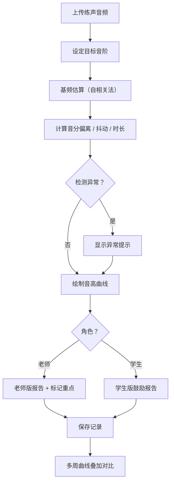

## 1. 产品概述

声乐音高练习复盘工具，帮助声乐老师和学生高效完成练声作业的音准分析。老师上传学生的练声音频并设定目标音阶，系统自动估算每段基频（F0）、偏离音分、抖动和持续时间，绘制音高曲线。学生版报告用鼓励语气指出需重点练习的段落，老师版保留完整曲线和参数，支持多周曲线叠加对比稳定度变化，学生可回听对应音频片段，老师可标记练声重点。

- 目标用户：声乐老师（批量点评）、声乐学生（自查练习）
- 核心价值：将"凭耳朵听"变为"数据驱动"，提升点评效率和练习反馈质量

## 2. 核心功能

### 2.1 用户角色

| 角色 | 进入方式 | 核心权限 |
|------|----------|----------|
| 老师 | 选择"老师版"入口 | 上传音频、设定音阶、查看参数曲线、标记重点、多周对比 |
| 学生 | 选择"学生版"入口 | 上传音频、查看鼓励式报告、回听片段、查看多周趋势 |

### 2.2 功能模块

1. **练习复盘页**：音频上传、目标音阶设定、音高分析、曲线绘制、报告展示
2. **多周对比页**：选择历史练习记录、曲线叠加、稳定度趋势
3. **重点标记页**：老师标记练声重点段落、学生查看标记

### 2.3 页面详情

| 页面名称 | 模块名称 | 功能描述 |
|----------|----------|----------|
| 练习复盘页 | 音频上传区 | 拖拽或点击上传练声音频文件（WAV/MP3），显示波形预览 |
| 练习复盘页 | 目标音阶设定 | 预设常见音阶（大调、小调、半音阶等），支持自定义音符序列和起始音高 |
| 练习复盘页 | 音高分析引擎 | 基于自相关法估算 F0，计算音分偏离、抖动（jitter）、每音持续时间 |
| 练习复盘页 | 音高曲线图 | 实际音高曲线 + 目标参考线，横轴时间、纵轴频率/音名，支持缩放 |
| 练习复盘页 | 异常提示栏 | 检测环境噪声过大、伴奏干扰、音区异常（男/女声）、音频剪切不完整 |
| 练习复盘页 | 学生版报告 | 鼓励语气总结，高亮需练习段落，提供练习建议 |
| 练习复盘页 | 老师版报告 | 完整曲线 + 数值参数表，可导出 |
| 多周对比页 | 历史记录选择 | 选择 2-8 周的练习记录进行对比 |
| 多周对比页 | 叠加曲线图 | 多条音高曲线叠加显示，颜色区分，稳定度指标对比 |
| 多周对比页 | 稳定度趋势 | 音分偏离标准差、抖动均值等指标的时间趋势折线图 |
| 重点标记页 | 标记编辑器 | 老师在曲线上框选段落，添加文字标注（如"注意气息支撑"） |
| 重点标记页 | 标记查看 | 学生查看老师标记，点击标记可回听对应片段 |

## 3. 核心流程

**老师复盘流程**：老师上传学生音频 → 设定目标音阶 → 系统分析基频和参数 → 老师查看曲线与参数 → 标记重点段落 → 生成老师版和学生版报告

**学生自查流程**：学生上传自己的音频 → 选择目标音阶 → 系统分析 → 查看鼓励式报告 → 回听问题段落 → 查看多周进步趋势

**多周对比流程**：选择历史记录 → 叠加曲线 → 查看稳定度趋势 → 判断进步情况

## 4. 用户界面设计

### 4.1 设计风格

- **主色调**：深靛蓝（#1B2A4A）+ 暖琥珀色（#E8A838）作为点缀，营造专业而温暖的声乐教学氛围
- **次色调**：柔和的灰色系（#F5F5F0 画布背景、#3A3A3A 文字）、淡蓝绿色（#5BC0BE）用于曲线高亮
- **按钮风格**：圆角胶囊按钮，hover 时微抬阴影，琥珀色主按钮 + 深靛蓝次按钮
- **字体**：标题使用 Playfair Display（典雅衬线体），正文使用 DM Sans（清晰无衬线体）
- **布局**：左侧窄导航栏 + 中央画布区 + 右侧参数面板，卡片式内容区
- **图标**：Lucide 图标库，线条纤细风格
- **曲线风格**：目标音阶用虚线，实际音高用渐变实线，问题段落用红色半透明底色

### 4.2 页面设计概览

| 页面名称 | 模块名称 | UI 元素 |
|----------|----------|----------|
| 练习复盘页 | 音频上传区 | 拖拽区、波形预览画布、播放/暂停按钮、时间轴 |
| 练习复盘页 | 音阶设定 | 下拉预设选择器、自定义音符输入、起始音高滑块 |
| 练习复盘页 | 音高曲线图 | Canvas 绘制、网格背景、目标虚线、实际曲线、缩放滑块、音名标注 |
| 练习复盘页 | 异常提示 | 顶部横幅、图标 + 文字描述、严重等级色标 |
| 练习复盘页 | 参数面板 | 表格：音名、目标频率、实际频率、偏离音分、抖动、时长 |
| 练习复盘页 | 学生报告 | 卡片式布局、鼓励表情、高亮段落色块、练习建议列表 |
| 多周对比页 | 记录选择 | 多选卡片列表、周次标签、缩略曲线预览 |
| 多周对比页 | 叠加图 | Canvas、图例色标、稳定度指标数值卡 |
| 重点标记页 | 标记编辑 | 曲线上可拖拽选区、弹出标注输入框、标记列表 |

### 4.3 响应式设计

- 桌面优先设计（1440px 基准）
- 平板适配（768px）：右侧参数面板折叠为底部抽屉
- 移动端适配（375px）：单列布局，曲线图全宽，参数表格横向滚动

### 4.4 3D 场景指导

不适用
