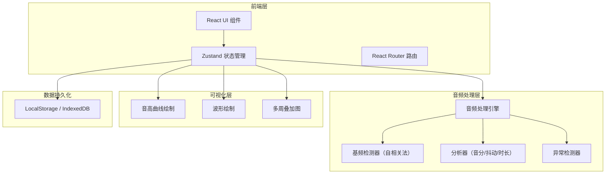
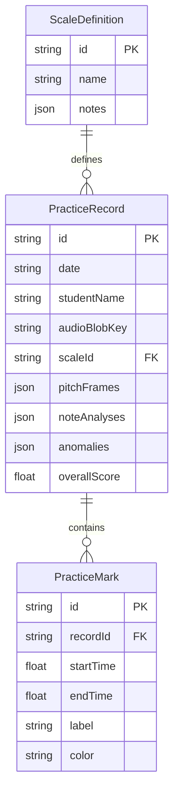

## 1. 架构设计



## 2. 技术说明

- **前端框架**：React 18 + TypeScript + Vite
- **样式方案**：Tailwind CSS 3
- **状态管理**：Zustand
- **路由**：React Router DOM v6
- **音频处理**：Web Audio API（AudioContext、AnalyserNode）+ 自相关基频检测算法
- **曲线绘制**：Canvas API（手动绘制，避免重型图表库，精确控制渲染）
- **数据持久化**：IndexedDB（存储音频 Blob、分析结果、标记数据），LocalStorage（用户偏好）
- **后端**：无（纯前端应用，所有计算在浏览器端完成）

## 3. 路由定义

| 路由 | 用途 |
|------|------|
| `/` | 首页/角色选择（老师版 / 学生版入口） |
| `/review` | 练习复盘页（音频上传、音阶设定、音高分析、报告展示） |
| `/compare` | 多周对比页（历史曲线叠加、稳定度趋势） |
| `/marks` | 重点标记页（老师标记/学生查看） |

## 4. API 定义

无后端 API，所有数据在本地处理和存储。

### 4.1 核心数据接口

```typescript
interface NoteTarget {
  name: string
  frequency: number
  duration: number
}

interface ScaleDefinition {
  id: string
  name: string
  notes: NoteTarget[]
}

interface PitchFrame {
  time: number
  frequency: number
  confidence: number
}

interface NoteAnalysis {
  noteName: string
  targetFreq: number
  actualFreq: number
  deviationCents: number
  jitter: number
  duration: number
  startTime: number
  endTime: number
}

interface AnomalyWarning {
  type: 'noise' | 'accompaniment' | 'range_mismatch' | 'incomplete'
  severity: 'low' | 'medium' | 'high'
  message: string
  timeRange?: [number, number]
}

interface PracticeMark {
  id: string
  startTime: number
  endTime: number
  label: string
  color: string
  createdBy: 'teacher'
}

interface PracticeRecord {
  id: string
  date: string
  studentName: string
  audioBlobKey: string
  scaleId: string
  pitchFrames: PitchFrame[]
  noteAnalyses: NoteAnalysis[]
  anomalies: AnomalyWarning[]
  marks: PracticeMark[]
  overallScore: number
}

interface WeeklyComparison {
  records: PracticeRecord[]
  stabilityTrend: {
    week: string
    avgDeviation: number
    avgJitter: number
  }[]
}
```

## 5. 服务器架构图

不适用（纯前端应用）

## 6. 数据模型

### 6.1 数据模型定义



### 6.2 数据存储方案

使用 IndexedDB 存储以下数据：

- **practice-records**：练习记录（含分析结果）
- **audio-blobs**：音频文件 Blob
- **practice-marks**：老师标记
- **scale-definitions**：音阶定义（含预设和自定义）

使用 LocalStorage 存储：
- **user-preferences**：角色选择、音区偏好（男/女声）、界面设置

### 6.3 核心算法说明

**基频检测（自相关法）**：
1. 对音频信号分帧（帧长 2048，步长 512）
2. 对每帧计算自相关函数
3. 在人声频率范围（80Hz-1000Hz）内寻找自相关峰值
4. 峰值对应周期即为基频周期，取倒数得到 F0
5. 置信度由峰值与次峰比值决定

**音分偏离计算**：
```
deviation_cents = 1200 * log2(actualFreq / targetFreq)
```

**抖动（Jitter）计算**：
```
jitter = mean(|F0[i] - F0[i-1]|) / mean(F0)
```

**异常检测**：
- 噪声：信号能量低于阈值或高频能量占比过高
- 伴奏：频谱中检测到多个独立基频
- 音区不匹配：检测到的 F0 范围与设定的男/女声音区不符
- 剪切不完整：首尾帧能量突变或 F0 不连续
