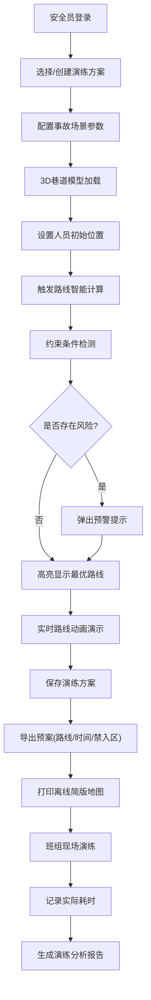

## 1. 产品概述

矿洞应急路线推演系统是一款面向矿山企业的3D可视化安全培训工具，解决传统平面巷道图抽象难懂的问题。通过沉浸式3D巷道模型，帮助新员工直观理解风门、积水点、避险硐室等关键设施的空间关系，模拟不同事故场景下的最优撤离路线，提升应急演练效率与实战效果。

- 核心目标：将抽象的平面巷道图转化为直观的3D可视化模型，实现应急路线的交互式推演与演练管理
- 目标用户：矿山安全员、新入职矿工、应急救援班组
- 市场价值：提升矿山安全培训质量，降低事故伤亡风险，满足安全生产标准化要求

## 2. 核心功能

### 2.1 用户角色

| 角色 | 登录方式 | 核心权限 |
|------|----------|----------|
| 安全员 | 本地账号登录 | 创建/编辑巷道模型、配置事故场景、保存演练方案、导出预案、查看演练记录 |
| 班组员工 | 访问码进入 | 参与演练、查看路线、打印离线地图、记录实际耗时 |

### 2.2 功能模块

1. **3D巷道可视化**：巷道模型展示、设施标注、视角控制、图层切换
2. **事故模拟推演**：事故类型选择、路线智能计算、约束条件检测、实时预警提示
3. **演练方案管理**：方案创建保存、场景配置、参数调整、历史版本管理
4. **预案导出打印**：路线图导出、时间估算、禁入区域标注、离线简版地图打印
5. **演练记录追踪**：实际耗时记录、演练评分、历史数据统计、培训效果分析

### 2.3 页面详情

| 页面名称 | 模块名称 | 功能描述 |
|-----------|-------------|---------------------|
| 主控制台 | 3D场景视图 | 展示3D巷道模型，支持旋转、缩放、平移等交互操作 |
| 主控制台 | 设施标注面板 | 显示/隐藏主巷、支巷、风门、积水点、避险点、人员位置等标注 |
| 主控制台 | 模拟控制面板 | 选择事故类型（火灾、水灾、塌方），触发路线推演 |
| 主控制台 | 路线信息栏 | 展示推演路线、预计时间、途经节点、风险提示 |
| 方案管理 | 方案列表 | 展示已保存的演练方案，支持搜索、筛选、编辑、删除 |
| 方案管理 | 方案配置 | 配置事故参数、约束条件、人员初始位置、目标避险点 |
| 预案导出 | 预览面板 | 预览导出内容，包括路线图、时间轴、禁入区域 |
| 预案导出 | 打印设置 | 设置打印格式、纸张大小、简版/完整版切换 |
| 演练记录 | 记录列表 | 展示历史演练记录，包括方案名称、参与人员、实际耗时、评分 |
| 演练记录 | 详情分析 | 单条演练的详细分析，与预计时间对比，优化建议 |

## 3. 核心流程

### 3.1 应急推演流程

安全员进入系统后，首先选择或创建演练方案，配置事故类型与参数。系统根据巷道拓扑和约束条件智能计算最优撤离路线，在3D视图中高亮显示。推演过程中，当路线穿过封闭巷道、通风方向不利或积水深度超限时，系统实时弹出预警提示。推演完成后，安全员可保存方案并导出预案给班组。

班组员工通过访问码进入演练模式，查看3D路线和离线打印的简版地图。演练过程中记录实际耗时，系统自动对比预计时间生成分析报告。

### 3.2 流程图

## 4. 用户界面设计

### 4.1 设计风格

- **设计方向**：工业科技风 + 沉浸式黑暗模式，营造专业严谨的安全培训氛围
- **主色调**：深矿蓝 (#0a1628) 作为主背景，搭配警示橙 (#ff6b35)、安全绿 (#2ecc71)、警戒红 (#e74c3c) 作为功能色
- **辅助色**：科技青 (#00d4ff) 用于3D路线高亮，金属灰 (#34495e) 用于巷道墙体
- **字体**：标题使用 Orbitron（科技感等宽字体），正文使用 JetBrains Mono（专业清晰的代码字体），确保数字和专业术语显示清晰
- **按钮风格**：立体工业按钮，带有金属边框和微弱内发光效果，悬停时有呼吸动画
- **布局风格**：左侧工具面板 + 中央3D主视图 + 右侧信息面板的三栏式专业布局，顶部导航栏，底部状态栏
- **视觉元素**：扫描线纹理、网格背景、HUD风格数据展示、微弱的辉光效果，模拟工业监控系统的视觉感受

### 4.2 页面设计概览

| 页面名称 | 模块名称 | UI元素 |
|-----------|-------------|-------------|
| 主控制台 | 3D场景视图 | 深色3D巷道，金属质感墙体，发光标注点，流动的路线光效，第一人称/第三人称视角切换 |
| 主控制台 | 设施标注面板 | 图标+文字的可折叠列表，带开关控制，选中时高亮对应3D对象 |
| 主控制台 | 模拟控制面板 | 工业风格按钮组，下拉选择器，参数滑块，一键推演按钮带有脉冲动画 |
| 主控制台 | 路线信息栏 | HUD风格透明面板，实时显示距离、时间、风险等级，不同等级用不同颜色标识 |
| 方案管理 | 方案列表 | 卡片式布局，每张卡片显示方案名称、事故类型、创建时间，带操作按钮 |
| 方案管理 | 方案配置 | 表格式参数配置，支持多行编辑，参数验证提示 |
| 预案导出 | 预览面板 | 模拟打印效果，可缩放预览，分页显示 |
| 预案导出 | 打印设置 | 选项卡式设置，实时预览效果变化 |
| 演练记录 | 记录列表 | 时间线布局，对比预计与实际时间的柱状图 |
| 演练记录 | 详情分析 | 数据可视化图表，优化建议标签 |

### 4.3 响应式

- 桌面端优先设计，适配 1920×1080 及以上分辨率，三栏布局充分利用大屏空间
- 平板端自适应调整为上下布局，控制面板折叠为可展开抽屉
- 移动端精简为核心3D视图+浮动按钮，满足现场查看路线的基本需求
- 触控优化：大尺寸触控按钮，手势支持双指缩放、单指旋转3D视图

### 4.4 3D场景指引

- **环境氛围**：地下矿井环境，使用深色雾效营造纵深感，顶部和底部逐渐融入黑暗
- **光照设置**：主光源模拟矿灯效果（聚光灯，跟随视角移动），环境光使用冷蓝色调，关键设施（避险点、风门）使用自发光材质
- **摄像机设置**：默认第三人称俯视角度，支持切换第一人称沉浸式视角，摄像机移动有平滑阻尼效果
- **构图焦点**：初始视角聚焦于人员初始位置，路线推演时相机自动跟随路线移动，关键节点处自动放大展示
- **交互动画**：路线以流动光效形式动态显示，风门开关有动画效果，积水区域有波纹动画，人员移动有行走动画
- **后处理效果**：轻微的噪点和晕影模拟头戴式矿灯效果，紧急预警时屏幕边缘闪烁红色，HUD风格的扫描线叠加
- **性能预算**：3D模型面数控制在5万面以内，使用实例化渲染重复设施，目标帧率60fps

## 5. 交互细节

### 5.1 3D交互

- 鼠标左键拖拽：旋转视角
- 鼠标滚轮：缩放
- 鼠标右键拖拽：平移
- 双击标注点：聚焦到该设施并显示详情
- 键盘 WASD：第一人称模式下移动
- 空格键：开始/暂停路线动画演示

### 5.2 预警交互

- 路线穿过封闭巷道：红色闪烁边框 + 声音警报 + 弹窗说明
- 通风方向不利：橙色渐变边框 + 警告图标 + 建议调整路线
- 积水深度超限：蓝色波纹边框 + 深度数值显示 + 禁止通行标记

### 5.3 动画效果

- 页面加载：各面板从边缘滑入，3D场景渐显， staggered 延迟效果
- 路线推演：从起点向终点流动的光带，节点处有脉冲闪光
- 按钮悬停：背景色渐变 + 轻微放大 + 发光效果
- 预警出现：抖动动画 + 颜色脉冲 + 屏幕边缘闪烁
