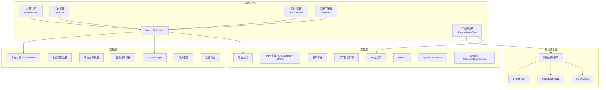
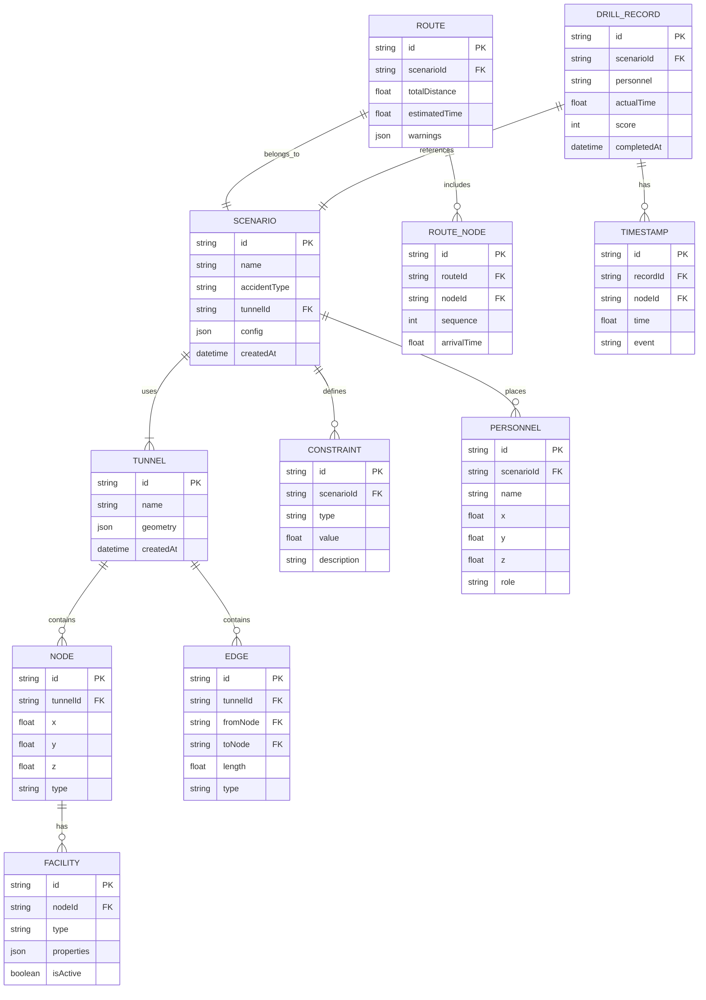

## 1. 架构设计



## 2. 技术描述

- **前端框架**：React@18 + TypeScript + Vite@5，保证开发效率与类型安全
- **3D引擎**：three.js@0.160 + @react-three/fiber@8 + @react-three/drei@9 + @react-three/postprocessing@2，实现高性能3D渲染与后处理效果
- **样式方案**：TailwindCSS@3 + CSS变量主题系统，实现工业科技风格
- **状态管理**：Zustand@4，轻量级状态管理，支持3D场景与UI状态同步
- **路由管理**：React Router@6，单页应用多页面路由
- **数据存储**：IndexedDB (dexie@4) 存储大量模型与记录数据，LocalStorage 存储配置
- **图表可视化**：Recharts@2，实现演练记录的数据可视化
- **导出打印**：html2canvas@1 + jspdf@2，实现PDF导出与打印功能
- **图标库**：Lucide React，专业统一的图标系统
- **动画库**：framer-motion@10，实现UI交互动画

## 3. 目录结构

```
src/
├── assets/              # 静态资源
│   ├── fonts/          # 字体文件
│   └── textures/       # 3D纹理材质
├── components/         # 通用UI组件
│   ├── ui/            # 基础组件 (Button, Panel, etc.)
│   ├── layout/        # 布局组件
│   └── common/        # 业务通用组件
├── pages/             # 页面组件
│   ├── Dashboard/     # 主控制台
│   ├── Scenarios/     # 方案管理
│   ├── Export/        # 预案导出
│   └── Records/       # 演练记录
├── store/             # 状态管理
│   ├── useSceneStore.ts    # 3D场景状态
│   ├── useScenarioStore.ts # 演练方案状态
│   └── useRecordStore.ts   # 演练记录状态
├── engine/            # 核心算法引擎
│   ├── pathfinding/   # 寻路算法
│   ├── constraints/   # 约束检测
│   └── estimation/    # 时间估算
├── data/              # 数据模型与Mock
│   ├── models/        # 数据模型定义
│   └── mock/          # Mock数据
├── hooks/             # 自定义Hooks
│   ├── use3DControls.ts
│   └── useAnimation.ts
├── utils/             # 工具函数
│   ├── export.ts      # 导出工具
│   └── print.ts       # 打印工具
├── styles/            # 全局样式
│   └── theme.css      # 主题变量
├── types/             # TypeScript类型定义
└── App.tsx            # 应用入口
```

## 4. 路由定义

| 路由 | 页面 | 功能 |
|-------|------|------|
| / | 主控制台 | 3D巷道可视化、事故模拟推演、路线展示 |
| /scenarios | 方案管理 | 演练方案列表、创建、编辑、配置 |
| /scenarios/:id | 方案详情 | 单个方案的详细配置与预览 |
| /export | 预案导出 | 预案预览、PDF导出、打印设置 |
| /records | 演练记录 | 历史演练记录列表、数据分析 |
| /records/:id | 记录详情 | 单条演练的详细分析报告 |
| /drill | 演练模式 | 班组员工演练界面、计时、路线指引 |

## 5. 数据模型

### 5.1 ER图



### 5.2 核心类型定义

```typescript
// 巷道节点类型
type NodeType = 'junction' | 'entrance' | 'exit' | 'facility';
type FacilityType = 'door' | 'water' | 'shelter' | 'ventilation' | 'sign';
type AccidentType = 'fire' | 'flood' | 'collapse' | 'gas';
type ConstraintType = 'closed' | 'water_depth' | 'ventilation' | 'blocked';

interface TunnelNode {
  id: string;
  x: number;
  y: number;
  z: number;
  type: NodeType;
  name?: string;
}

interface TunnelEdge {
  id: string;
  from: string;
  to: string;
  length: number;
  type: 'main' | 'branch';
  isClosed?: boolean;
  waterDepth?: number;
  ventilationDirection?: 'forward' | 'backward' | 'none';
}

interface Facility {
  id: string;
  nodeId: string;
  type: FacilityType;
  name: string;
  status: 'normal' | 'warning' | 'danger';
  properties: Record<string, any>;
}

interface Constraint {
  id: string;
  type: ConstraintType;
  edgeId?: string;
  nodeId?: string;
  value: number;
  threshold: number;
  description: string;
}

interface RouteWarning {
  type: ConstraintType;
  edgeId: string;
  message: string;
  severity: 'warning' | 'danger';
  suggestedAction?: string;
}

interface Route {
  id: string;
  nodes: string[];
  edges: string[];
  totalDistance: number;
  estimatedTime: number;
  warnings: RouteWarning[];
}

interface Scenario {
  id: string;
  name: string;
  accidentType: AccidentType;
  tunnelId: string;
  startNodeId: string;
  endNodeId: string;
  constraints: Constraint[];
  createdAt: string;
}

interface DrillRecord {
  id: string;
  scenarioId: string;
  participantName: string;
  actualTime: number;
  estimatedTime: number;
  score: number;
  timestamps: { nodeId: string; time: number; event?: string }[];
  completedAt: string;
}
```

## 6. 核心算法说明

### 6.1 A*寻路算法

使用A*算法在巷道图中寻找最优路径：
- 节点权重：通过时间 = 距离 / 移动速度
- 边权重加成：
  - 封闭巷道：权重 = Infinity（不可通行）
  - 积水深度 > 阈值：权重 *= 5（难以通行）
  - 通风方向不利：权重 *= 2（行进困难）
- 启发函数：欧几里得距离 / 基准速度

### 6.2 约束检测

路线计算完成后，逐条边检测约束条件：
1. 封闭检测：`edge.isClosed === true` → 红色预警
2. 积水检测：`edge.waterDepth > 0.5m` → 橙色预警，`> 1.0m` → 红色预警
3. 通风检测：火灾时 `edge.ventilationDirection === 'forward'`（顺风，烟雾扩散方向）→ 橙色预警

### 6.3 时间估算

预计时间 = Σ(边长 / 移动速度) + 调整系数
- 基准移动速度：1.2m/s（正常行走）
- 积水调整：深度0.3-0.5m → 速度×0.7，0.5-1.0m → 速度×0.4
- 上坡调整：每5度倾角 → 速度×0.9
- 人员调整：佩戴装备 → 速度×0.8

## 7. 3D性能优化

1. **几何体复用**：使用 InstancedMesh 渲染重复的管道、支架等
2. **LOD策略**：远距离设施使用简化模型
3. **视锥体剔除**：只渲染相机可见范围内的对象
4. **材质共享**：同类设施共享材质实例
5. **后处理降级**：低性能设备自动关闭Bloom、SSAO等效果

## 8. 数据持久化

- 巷道模型数据：IndexedDB 存储几何数据，支持离线加载
- 演练方案：IndexedDB 存储，支持版本管理
- 演练记录：IndexedDB 存储，支持导出CSV
- 用户配置：LocalStorage 存储界面偏好、主题设置
