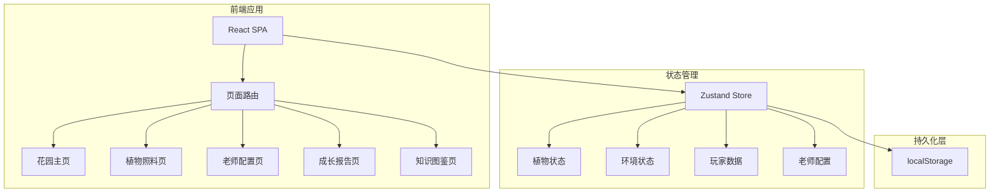
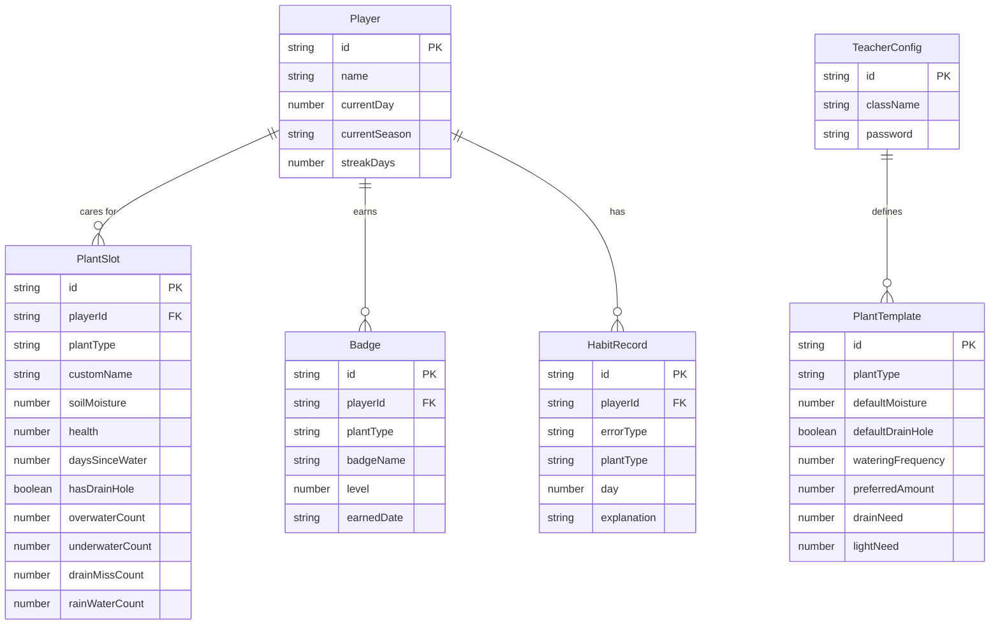

## 1. 架构设计



纯前端应用，无后端服务。所有数据通过 localStorage 持久化，老师配置和学生进度均存储在本地。

## 2. 技术说明

- **前端框架**：React@18 + TypeScript + Vite
- **样式方案**：TailwindCSS@3 + 自定义 CSS 动画
- **状态管理**：Zustand（植物状态、环境模拟、玩家数据、老师配置）
- **路由**：react-router-dom v6
- **持久化**：localStorage（自动保存/加载）
- **图标**：lucide-react
- **初始化工具**：vite-init，模板 react-ts

## 3. 路由定义

| 路由 | 用途 |
|------|------|
| `/` | 花园主页，展示所有植物和环境信息 |
| `/plant/:id` | 植物照料页，交互式浇水/排水操作 |
| `/teacher` | 老师配置页，管理课堂植物和学生 |
| `/report` | 成长报告页，习惯分析+徽章+家长模式 |
| `/guide` | 知识图鉴页，四种植物养护知识 |

## 4. 数据模型

### 4.1 数据模型定义



### 4.2 数据定义

**PlantType 枚举**：

| 值 | 中文名 | 浇水频率(天) | 喜水量 | 排水需求(1-5) | 光照需求(1-5) |
|----|--------|-------------|--------|---------------|---------------|
| `succulent` | 多肉 | 7-10 | 1 | 5 | 5 |
| `mint` | 薄荷 | 2-3 | 3 | 3 | 2 |
| `seedling` | 幼苗 | 1-2 | 2 | 3 | 3 |
| `flowering` | 开花植物 | 3-4 | 4 | 4 | 4 |

**SoilMoisture 范围**：0-100
- 0-20：干涸（危险）
- 20-40：偏干（需注意）
- 40-60：适宜
- 60-80：偏湿
- 80-100：积水（危险）

**Health 范围**：0-100
- 0-20：濒死
- 20-40：萎蔫
- 40-60：不佳
- 60-80：良好
- 80-100：健康

**错误类型枚举**：`overwater` | `underwater` | `drain_miss` | `rain_water`

**徽章等级**：
- Level 1：入门（正确照料5次）
- Level 2：熟练（正确照料15次）
- Level 3：达人（正确照料30次）

## 5. 核心游戏逻辑

### 5.1 环境模拟引擎

- 每个游戏日自动推进季节和天气
- 土壤湿度自然蒸发：每日减少 `蒸发率 × 温度系数`
- 雨天额外增加湿度：+15~25
- 日照影响蒸发速度：强光蒸发快

### 5.2 浇水效果计算

```
新湿度 = 当前湿度 + 浇水量 × 植物吸收系数 - 溢出量
溢出 = max(0, 新湿度 - 100) × 排水系数(有排水孔: 0.8, 无排水孔: 0)
健康变化 = f(新湿度与适宜范围的关系, 浇水是否正确)
```

### 5.3 错误检测规则

| 检测项 | 条件 | 记录类型 |
|--------|------|----------|
| 过度浇水 | 当前湿度>60 且 浇水量>植物喜水量 | overwater |
| 忘记排水 | 无排水孔 且 湿度>80 持续2天 | drain_miss |
| 雨天浇水 | 天气=雨天 且 执行浇水 | rain_water |
| 浇水不足 | 天数>植物浇水频率 且 未浇水 | underwater |

### 5.4 徽章计算

按植物类型统计正确操作次数，达到阈值自动颁发对应等级徽章。
- 多肉达人 / 薄荷能手 / 幼苗守护者 / 花语专家
