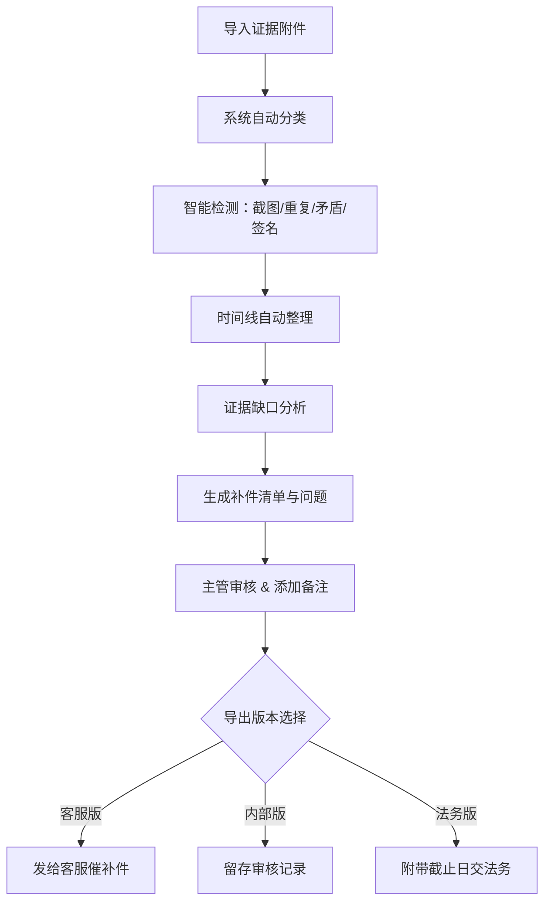

## 1. 产品概述
客服证据附件清单是一款面向售后主管的证据管理工具，用于在处理高额投诉时系统化管理客服上传的各类证据（聊天截图、物流照片、检测单、客户说明），自动检测证据缺口和异常，生成补件清单，确保提交给法务前证据完整有效。

- **核心问题**：交给法务前常发现缺少关键证据，反复补件效率低下；截图不完整、证据重复、客户说法矛盾、检测单缺签名等问题难以及时发现
- **目标用户**：售后主管、客服人员、法务人员
- **产品价值**：提升证据审核效率 60%，减少因证据不全导致的法务退回率，缩短投诉处理周期

## 2. 核心功能

### 2.1 用户角色
| 角色 | 使用方式 | 核心权限 |
|------|----------|----------|
| 售后主管 | 主要使用者 | 上传证据、整理时间线、审核检测结果、确认并导出补件清单 |
| 客服人员 | 接收补件清单 | 查看需补充的证据项，向客户催交材料 |
| 法务人员 | 查看法务版清单 | 查看完整证据链及补件截止日，评估法律风险 |

### 2.2 功能模块
1. **证据管理面板**：附件上传区、证据分类标签、证据列表与详情
2. **时间线视图**：按时间排序的证据链、来源标注、证据关联
3. **智能检测中心**：截图完整性检测、重复附件检测、说法矛盾检测、签名缺失检测
4. **补件清单生成器**：缺口分析、自动生成补问问题、多版本导出（客服版/内部版/法务版）
5. **主管审核工作台**：检测结果确认、敏感备注添加、清单审批导出

### 2.3 页面详情
| 页面名称 | 模块名称 | 功能描述 |
|----------|----------|----------|
| 主工作台 | 左侧证据上传区 | 支持拖拽上传聊天截图、物流照片、检测单、客户说明，自动分类识别 |
| 主工作台 | 中间时间线视图 | 按时间轴展示所有证据，标注证据来源（哪张图/哪段文字），支持点击查看详情 |
| 主工作台 | 右侧检测与补件 | 智能检测结果展示、证据缺口列表、补件建议、导出按钮 |
| 证据详情弹窗 | 证据信息展示 | 显示证据大图/全文、上传时间、证据类型、关联说明 |
| 证据详情弹窗 | 来源标注 | 可在截图上标注框选区域，关联对应的文字说明或时间节点 |
| 补件清单预览 | 客服版 | 仅展示需要客户补充的证据项和问题，不含内部敏感备注 |
| 补件清单预览 | 内部版 | 包含所有检测结果、敏感备注、内部处理意见 |
| 补件清单预览 | 法务版 | 完整证据链 + 补件截止日 + 法务风险提示 |

## 3. 核心流程

售后主管登录后，首先在左侧上传区导入客服提交的所有证据附件，系统自动按类型分类。随后系统自动进行智能检测，在右侧展示检测结果（截图截半、重复附件、说法矛盾、检测单缺签名等），同时中间时间线按时间顺序整理证据链。

主管查看时间线和检测结果后，可添加敏感备注和内部说明。系统根据证据缺口自动生成补件清单和需要补问客户的问题。主管确认后，可选择导出三种版本：客服版（不含敏感信息）用于发给客服催客户补件，内部版留存审核记录，法务版附带补件截止日供法务评估。

## 4. 用户界面设计

### 4.1 设计风格
- **主色调**：深邃藏蓝 (#1e3a5f) 搭配 警示橙 (#ff6b35) 和 成功绿 (#2d936c)
- **设计风格**：专业严谨的企业级工具风格，卡片式布局，清晰的信息层级
- **按钮风格**：直角微圆角（4px），实心主按钮配轮廓次按钮，操作明确
- **字体**：标题使用 Noto Serif SC 增强专业感，正文使用 Noto Sans SC 保证可读性
- **图标风格**：线性图标搭配色彩标签，简洁明了
- **视觉特色**：时间线采用竖向时间轴设计，检测结果用三色标签区分严重程度

### 4.2 页面设计概述
| 页面名称 | 模块名称 | UI 元素 |
|----------|----------|---------|
| 主工作台 | 顶部导航栏 | 应用标题、当前案件编号、用户头像、帮助按钮 |
| 主工作台 | 左侧上传区 | 拖拽上传框、分类标签页（聊天/物流/检测/说明）、证据缩略图列表 |
| 主工作台 | 中间时间线 | 竖向时间轴、时间节点卡片、证据来源标记、悬停预览 |
| 主工作台 | 右侧面板 | 检测结果汇总、缺口列表、补件建议、导出操作区 |
| 补件预览弹窗 | 版本切换 | 三个 Tab 切换（客服版/内部版/法务版）、打印/导出按钮 |
| 补件预览弹窗 | 清单内容 | 表格形式展示补件项、优先级、截止日期、说明 |

### 4.3 响应式
- 桌面端优先（1280px+），三栏布局
- 平板端（768-1279px）：左右面板可折叠，中间时间线自适应
- 移动端（<768px）：单栏堆叠，底部 Tab 切换模块
- 触控优化：按钮最小 44px，拖拽区域支持触摸操作
