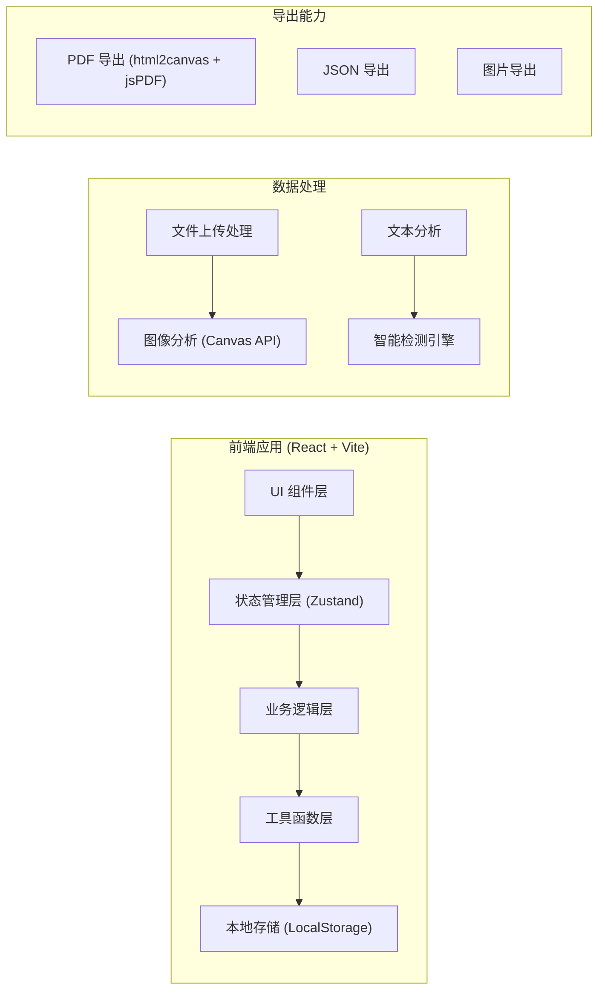
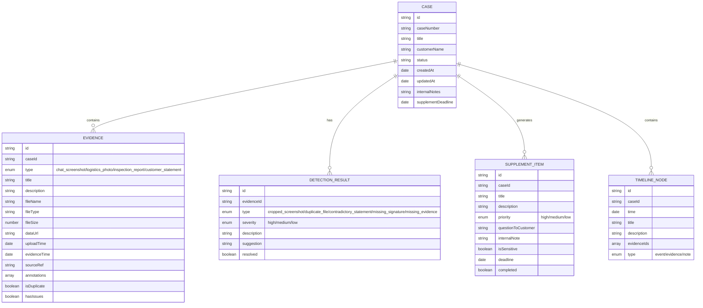

## 1. 架构设计

本应用为纯前端单页应用，无需后端服务，所有数据处理在浏览器端完成。支持本地存储保存案件数据，支持导出 JSON/PDF 格式的补件清单。



## 2. 技术描述

- **前端框架**：React@18 + TypeScript
- **构建工具**：Vite@5
- **样式方案**：TailwindCSS@3 + CSS 变量
- **状态管理**：Zustand（轻量级状态管理）
- **图标库**：Lucide React（线性图标）
- **PDF 导出**：html2canvas + jsPDF
- **日期处理**：date-fns
- **本地存储**：LocalStorage + IndexedDB（用于存储大文件）

## 3. 路由定义

| 路由 | 用途 |
|------|------|
| / | 主工作台（证据上传 + 时间线 + 检测结果） |
| /case/:id | 指定案件详情页 |

由于是单页工具型应用，主路由承载所有核心功能，通过组件切换实现不同视图。

## 4. 数据模型

### 4.1 数据模型定义



### 4.2 核心数据结构（TypeScript）

```typescript
type EvidenceType = 'chat_screenshot' | 'logistics_photo' | 'inspection_report' | 'customer_statement';

type DetectionType = 'cropped_screenshot' | 'duplicate_file' | 'contradictory_statement' | 'missing_signature' | 'missing_evidence';

type Severity = 'high' | 'medium' | 'low';

interface Evidence {
  id: string;
  caseId: string;
  type: EvidenceType;
  title: string;
  description: string;
  fileName: string;
  fileType: string;
  fileSize: number;
  dataUrl: string;
  uploadTime: Date;
  evidenceTime?: Date;
  sourceRef?: string;
  annotations: Annotation[];
  isDuplicate: boolean;
  hasIssues: boolean;
}

interface Annotation {
  id: string;
  x: number;
  y: number;
  width: number;
  height: number;
  label: string;
  description?: string;
}

interface DetectionResult {
  id: string;
  evidenceId?: string;
  type: DetectionType;
  severity: Severity;
  description: string;
  suggestion: string;
  resolved: boolean;
}

interface SupplementItem {
  id: string;
  caseId: string;
  title: string;
  description: string;
  priority: Severity;
  questionToCustomer: string;
  internalNote: string;
  isSensitive: boolean;
  deadline?: Date;
  completed: boolean;
}

interface Case {
  id: string;
  caseNumber: string;
  title: string;
  customerName: string;
  status: 'draft' | 'reviewing' | 'confirmed' | 'exported';
  createdAt: Date;
  updatedAt: Date;
  internalNotes: string;
  supplementDeadline?: Date;
  evidences: Evidence[];
  detections: DetectionResult[];
  supplements: SupplementItem[];
  timeline: TimelineNode[];
}
```

## 5. 核心功能实现方案

### 5.1 智能检测引擎

| 检测类型 | 实现方式 |
|----------|----------|
| 截图截半检测 | 使用 Canvas API 分析图片边缘像素，检测左右或上下边缘是否有明显截断特征（如文字不完整、边缘像素突变） |
| 重复附件检测 | 计算文件哈希（MD5/SHA-1）或对比文件名+文件大小+图像像素数据，相似度 > 95% 判定为重复 |
| 说法矛盾检测 | 提取客户说明中的关键陈述点，对比不同时间点的陈述，检测关键词矛盾（如"未收到"vs"已签收"） |
| 检测单缺签名 | 使用 Canvas 分析检测单图片底部区域，检测是否有手写签名特征（像素密度、笔迹曲线） |
| 证据缺口分析 | 基于预设证据清单模板，比对已上传证据类型，标记缺失项 |

### 5.2 时间线整理

- 自动提取证据中的时间信息（文件名、EXIF、OCR 识别）
- 支持手动调整时间节点顺序
- 时间节点支持关联多个证据
- 支持在时间线上添加备注事件

### 5.3 多版本导出

| 版本 | 包含内容 | 导出格式 |
|------|----------|----------|
| 客服版 | 补件清单、补问问题、截止日期 | PDF |
| 内部版 | 全部检测结果、敏感备注、内部意见 | PDF + JSON |
| 法务版 | 完整证据链、补件截止日、风险提示 | PDF + 证据包 ZIP |

## 6. 文件结构

```
src/
├── components/          # 组件目录
│   ├── layout/         # 布局组件
│   ├── evidence/       # 证据相关组件
│   ├── timeline/       # 时间线组件
│   ├── detection/      # 检测结果组件
│   ├── supplement/     # 补件清单组件
│   └── common/         # 通用组件
├── store/              # 状态管理
│   └── useCaseStore.ts
├── hooks/              # 自定义 Hooks
│   ├── useFileUpload.ts
│   ├── useDetection.ts
│   └── useTimeline.ts
├── utils/              # 工具函数
│   ├── imageAnalyzer.ts
│   ├── fileHash.ts
│   ├── textAnalyzer.ts
│   └── exportUtils.ts
├── types/              # TypeScript 类型定义
│   └── index.ts
├── data/               # 模拟数据与常量
│   └── mockData.ts
├── App.tsx
├── main.tsx
└── index.css
```
