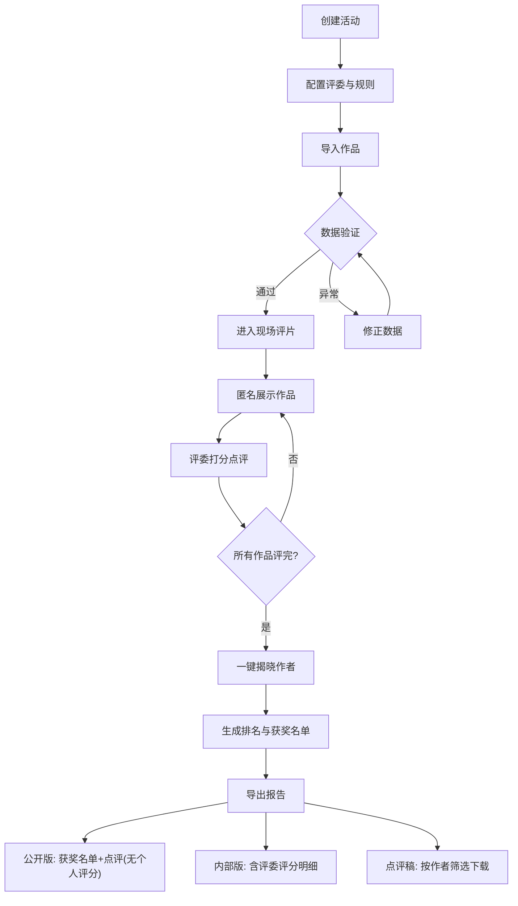

## 1. 产品概述

摄影协会评片桌面台——为摄影协会月度评片活动打造的一站式桌面应用。解决评片现场匿名编号展示、评委打分记录、作者信息隐藏/揭晓、数据验证和结果导出等核心痛点，让评片流程从混乱的手工操作变为流畅的数字化体验。

- 目标用户：摄影协会活动主持、评委、摄影师会员
- 核心价值：现场匿名评片、一键揭晓作者、智能验证提醒、多版本导出

## 2. 核心功能

### 2.1 用户角色

| 角色 | 参与方式 | 核心权限 |
|------|----------|----------|
| 活动主持 | 创建活动、控制现场 | 导入作品、管理评委、控制揭晓、导出结果 |
| 评委 | 现场打分点评 | 查看作品、录入评分与点评、标记缺席 |
| 摄影师 | 活动后查看 | 下载本人作品点评稿 |

### 2.2 功能模块

1. **活动管理页**：创建活动、配置评委名单、设定评分范围和每人作品上限
2. **作品导入页**：批量导入作品（图片路径、作者、主题），自动验证
3. **现场评片页**：匿名编号大屏展示、评委逐项打分点评、缺席补录
4. **揭晓与排名页**：一键揭晓作者、实时排名、获奖名单生成
5. **导出中心页**：多版本导出（公开版/内部版）、点评稿下载

### 2.3 页面详情

| 页面名称 | 模块名称 | 功能描述 |
|----------|----------|----------|
| 活动管理页 | 活动创建 | 输入活动名称、日期、评分范围（默认1-10）、每人作品上限（默认3） |
| 活动管理页 | 评委管理 | 添加/删除评委、标记缺席评委、补录缺席说明 |
| 活动管理页 | 活动列表 | 显示历史活动、快速进入继续评片 |
| 作品导入页 | 批量导入 | 支持CSV/Excel导入作品信息（图片路径、作者、主题） |
| 作品导入页 | 数据验证 | 图片路径失效提醒、同一作者超限提醒、评委漏评提醒、评分超范围提醒 |
| 作品导入页 | 作品预览 | 缩略图网格预览、验证状态标识 |
| 现场评片页 | 大屏展示 | 全屏展示当前作品图片和匿名编号，隐藏作者信息 |
| 现场评片页 | 评委打分面板 | 各评委评分输入框、点评文本框、实时汇总 |
| 现场评片页 | 导航控制 | 上/下一张、跳转指定编号、进度指示 |
| 现场评片页 | 缺席处理 | 标记评委缺席、补录说明文字 |
| 揭晓与排名页 | 一键揭晓 | 切换匿名/实名模式，显示作者信息 |
| 揭晓与排名页 | 实时排名 | 按综合评分排序、高亮获奖作品 |
| 揭晓与排名页 | 获奖名单 | 自动生成金/银/铜奖、可手动调整 |
| 导出中心页 | 公开版导出 | 获奖名单+点评稿（不含评委个人打分） |
| 导出中心页 | 内部版导出 | 含评委个人评分明细的完整报表 |
| 导出中心页 | 点评稿下载 | 摄影师按作者筛选下载本人点评稿 |

## 3. 核心流程

活动主持创建活动并配置评委和规则，导入参赛作品后系统自动验证数据完整性。现场评片时，作品以匿名编号展示，评委逐项打分和录入点评。活动结束后主持一键揭晓作者信息，系统自动排名生成获奖名单，支持导出公开版和内部版报告。

## 4. 用户界面设计

### 4.1 设计风格

- **主色调**：深色背景（#0F0F0F）搭配暖金色点缀（#C9A84C），营造专业摄影暗房氛围
- **辅助色**：暗灰卡片（#1A1A2E）、柔白文字（#E8E6E1）、警示红（#E74C3C）、通过绿（#2ECC71）
- **按钮风格**：圆角微凸、金色边框按钮为主操作，暗色幽灵按钮为次操作
- **字体**：标题使用 Playfair Display 衬线体（文艺感），正文使用 Noto Sans SC（中文适配）
- **布局风格**：侧栏导航 + 主内容区，现场评片页为全屏沉浸模式
- **图标**：线性图标，2px 描边，金色强调

### 4.2 页面设计概览

| 页面名称 | 模块名称 | UI 元素 |
|----------|----------|----------|
| 活动管理页 | 活动创建 | 居中卡片表单、金色边框输入框、暗色背景 |
| 活动管理页 | 评委管理 | 标签式评委列表、+/- 按钮、缺席开关 |
| 作品导入页 | 批量导入 | 拖拽上传区、CSV模板下载、导入进度条 |
| 作品导入页 | 数据验证 | 行内红/绿状态标记、顶部汇总警告条 |
| 现场评片页 | 大屏展示 | 全屏图片、角落匿名编号（大号金色）、底部半透明控制栏 |
| 现场评片页 | 评委打分面板 | 右侧抽屉式面板、评委头像+评分输入、点评文本域 |
| 揭晓与排名页 | 一键揭晓 | 中央大按钮（揭晓前锁定态→揭晓后金色闪烁）、卡片翻转动画 |
| 揭晓与排名页 | 排名列表 | 金/银/铜色边框卡片、渐变背景、序号勋章 |
| 导出中心页 | 导出选项 | 三列卡片布局、图标+描述、下载按钮 |

### 4.3 响应式设计

- 桌面优先设计，最小支持 1280px 宽度
- 现场评片大屏模式优化至 1920×1080 及以上
- 侧栏可折叠适配中等屏幕

### 4.4 动效设计

- 页面切换：淡入淡出 + 微位移
- 评委打分：数字滚动动画
- 揭晓按钮：脉冲光效 → 卡片翻转显示作者
- 获奖排名：从下至上逐个飞入
- 验证警告：滑入式通知条
