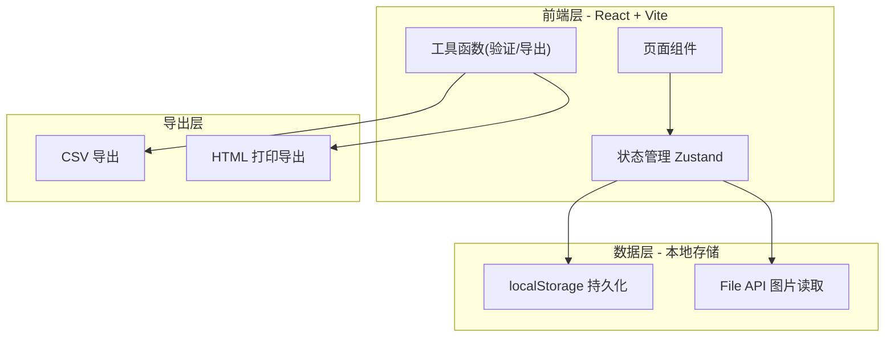
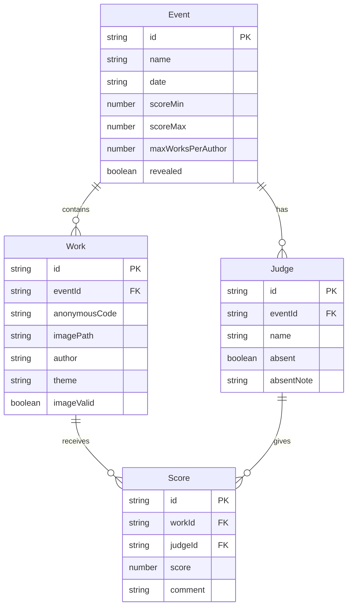

## 1. 架构设计



纯前端桌面应用，无后端服务。数据通过 localStorage 持久化，图片通过 File API 本地读取，导出通过浏览器下载实现。

## 2. 技术说明

- **前端框架**：React 18 + TypeScript
- **构建工具**：Vite
- **样式方案**：Tailwind CSS 3
- **状态管理**：Zustand（轻量、支持持久化中间件）
- **图标库**：Lucide React
- **数据导入**：PapaParse（CSV 解析）、xlsx（Excel 解析）
- **导出方案**：jsPDF + html2canvas（PDF）、原生 CSV 生成、HTML 打印
- **图片处理**：File API + URL.createObjectURL
- **动画**：Framer Motion
- **后端**：无（纯本地运行）
- **数据库**：localStorage（Zustand persist 中间件）

## 3. 路由定义

| 路由 | 用途 |
|------|------|
| / | 首页 - 活动列表与创建入口 |
| /event/:id | 活动详情 - 评委管理 + 作品导入 |
| /event/:id/review | 现场评片 - 匿名展示与打分 |
| /event/:id/reveal | 揭晓与排名 |
| /event/:id/export | 导出中心 |

## 4. 数据模型

### 4.1 数据模型定义



### 4.2 数据定义

```typescript
interface Event {
  id: string
  name: string
  date: string
  scoreMin: number
  scoreMax: number
  maxWorksPerAuthor: number
  revealed: boolean
}

interface Judge {
  id: string
  eventId: string
  name: string
  absent: boolean
  absentNote: string
}

interface Work {
  id: string
  eventId: string
  anonymousCode: string
  imagePath: string
  author: string
  theme: string
  imageValid: boolean
}

interface Score {
  id: string
  workId: string
  judgeId: string
  score: number | null
  comment: string
}
```

## 5. 关键技术方案

### 5.1 图片路径处理

桌面环境通过 File API 让用户选择本地图片文件夹，将文件转为 Blob URL 进行展示。导入时通过 CSV/Excel 中的图片文件名匹配文件夹中的文件。

### 5.2 数据验证

- **图片路径失效**：导入时逐条检查文件是否存在，标记 imageValid
- **同一作者超限**：聚合统计作者作品数，超限时弹窗提醒
- **评委漏评**：计算每个评委的已评/未评数量，未完成时高亮提醒
- **评分超范围**：输入时实时校验，超出 [scoreMin, scoreMax] 即时标红

### 5.3 匿名与揭晓

- 匿名编号格式：A01、A02...（自动生成）
- 揭晓前：仅显示编号 + 图片 + 主题
- 揭晓后：显示作者 + 综合评分 + 排名
- 一键揭晓：修改 Event.released = true，触发 UI 重渲染

### 5.4 导出方案

- **公开版**：获奖作品 + 评委综合点评（不包含个人评分）
- **内部版**：所有作品 + 每位评委个人评分 + 点评
- **点评稿**：按作者筛选，每位摄影师可下载仅含本人作品的点评
- 格式：CSV（数据）+ HTML 打印（格式化报告）
