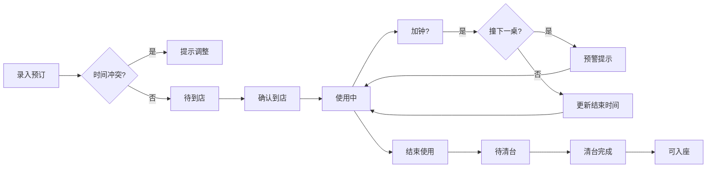

## 1. 产品概述

茶馆包间翻台管理系统，解决周末高峰期包间预订混乱问题。前台实时掌握包间状态，避免加钟冲突、清台未完成就入座等问题；店长可查看翻台率、加钟收入，分析清台效率瓶颈。

- 核心问题：前台无法实时掌握包间状态，微信群清台进度不同步，加钟撞单、清台未完成放人、套餐未备齐等问题频发
- 目标用户：茶馆前台收银员、店长/经营者
- 市场价值：提升翻台效率15%以上，减少客户投诉，数据驱动运营决策

## 2. 核心 Features

### 2.1 用户角色

| 角色 | 登录方式 | 核心权限 |
|------|---------|---------|
| 前台 | 直接访问（本地应用） | 录入预订、修改状态、加钟操作、打印当日单、查看提示 |
| 店长 | 切换店长视图 | 导出数据、查看翻台率、分析清台效率、复盘问题包间 |

### 2.2 功能模块

1. **翻台主页面**：包间分组展示（待到店/使用中/待清台/可入座）、实时状态更新、冲突提示
2. **预订录入**：新增/编辑预订（包间、客人、套餐、时间、备注）
3. **状态流转**：到店确认、加钟操作、清台开始/完成、套餐备餐标记
4. **冲突预警**：加钟撞单提示、清台未完成提示、套餐未备齐提示、客人迟到提示
5. **前台打印**：当日包间单打印预览与打印
6. **店长分析**：翻台率统计、加钟收入统计、清台慢包间复盘分析、数据导出

### 2.3 页面详情

| 页面名称 | 模块名称 | 功能描述 |
|---------|---------|---------|
| 翻台主页 | 顶部操作栏 | 日期选择、新增预订按钮、打印按钮、店长视图切换、刷新按钮 |
| 翻台主页 | 状态分组面板 | 四个分组列（待到店/使用中/待清台/可入座），每组显示包间卡片列表 |
| 翻台主页 | 包间卡片 | 显示包间号、客人姓名、套餐、到店时间、预计结束、加钟次数、清台状态、操作按钮 |
| 翻台主页 | 冲突提示条 | 顶部悬浮显示当前冲突预警列表，点击定位到相关包间 |
| 预订录入弹窗 | 表单模块 | 包间选择、客人信息、茶席套餐、到店时间、预计时长、人数、备注 |
| 预订录入弹窗 | 加钟模块 | 加钟时长选择、加钟费用计算 |
| 店长分析页 | 数据概览 | 今日/本周翻台率、总营收、加钟收入占比、平均清台时长 |
| 店长分析页 | 清台复盘 | 清台时长排名、慢包间列表、套餐复杂度与人手分析 |
| 店长分析页 | 数据导出 | 导出CSV格式的翻台记录和收入明细 |

## 3. 核心流程

### 3.1 预订录入流程
前台录入客户预订信息 → 系统自动检查时间冲突 → 若无冲突则保存并显示在"待到店"组 → 有冲突则提示调整时间或换包间

### 3.2 包间使用流程
客户到店 → 前台点击"确认到店" → 包间移至"使用中"组 → 套餐备齐后标记"套餐已备" → 客户加钟时检查是否与下一桌冲突 → 客户离开点击"结束使用" → 包间移至"待清台"组 → 阿姨清台完成点击"清台完成" → 包间移至"可入座"组

### 3.3 冲突预警流程
状态变更时自动检测 → 发现冲突（加钟撞单/清台未完成/套餐未备/迟到）→ 顶部显示红色预警条 → 点击预警定位到对应包间 → 显示处理建议

## 4. 界面设计

### 4.1 设计风格
- **主色调**：深茶色 #5D4E37（温暖木质感）、琥珀金 #C9A86C（点缀）、米白 #F5F1E8（背景）
- **次色调**：绿色 #4A7C59（可入座/正常）、橙色 #E67E22（使用中/待处理）、红色 #C0392B（冲突/预警）
- **按钮风格**：圆角8px，微阴影，悬停有轻微上浮动效
- **字体**：标题用"Noto Serif SC"（宋体，典雅），正文用"Noto Sans SC"（黑体，清晰易读）
- **布局**：卡片式分组布局，四列等高，卡片有细微木纹质感背景
- **图标**：使用emoji图标（🍵 茶、⏰ 时间、💰 收入、🧹 清台、⚠️ 预警）

### 4.2 页面设计概览

| 页面名称 | 模块名称 | UI 元素 |
|---------|---------|---------|
| 翻台主页 | 顶部操作栏 | 深茶色背景，白色文字，左侧日期选择器，中间logo，右侧功能按钮组 |
| 翻台主页 | 分组面板 | 四列网格布局，每列顶部有分组标题和计数徽章，背景为浅米色卡片 |
| 翻台主页 | 包间卡片 | 白色卡片，阴影柔和，顶部显示包间号和状态标签，中部显示客人信息和时间，底部操作按钮 |
| 翻台主页 | 预警条 | 红色渐变背景，固定在页面顶部，可展开/收起，带闪烁动效 |
| 预订弹窗 | 表单布局 | 两列网格，标签右对齐，输入框带边框，底部确认/取消按钮 |
| 店长分析页 | 数据卡片 | 大数字展示，带趋势箭头，背景微渐变 |
| 店长分析页 | 复盘列表 | 表格样式，交替行底色，慢包间高亮显示 |

### 4.3 响应式设计
- **桌面端**（1280px+）：四列并排布局，信息完整展示
- **平板端**（768px-1279px）：两列布局，分组标题改为折叠可展开
- **移动端**（<768px）：单列布局，横向滚动切换分组，精简卡片信息

### 4.4 动效与交互
- 卡片进入：淡入+轻微上移（animation-delay 错开）
- 状态变更：卡片高亮闪烁一次后平滑移动到新分组
- 预警提示：呼吸灯效果（opacity 0.8-1 循环）
- 按钮悬停：背景色加深+轻微上浮2px
- 模态框：缩放进入（0.9→1）+ 背景遮罩淡入
