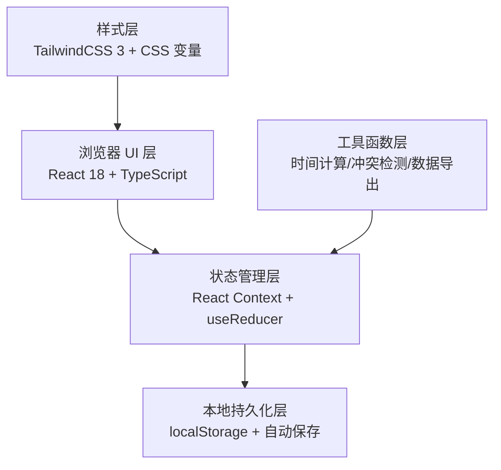
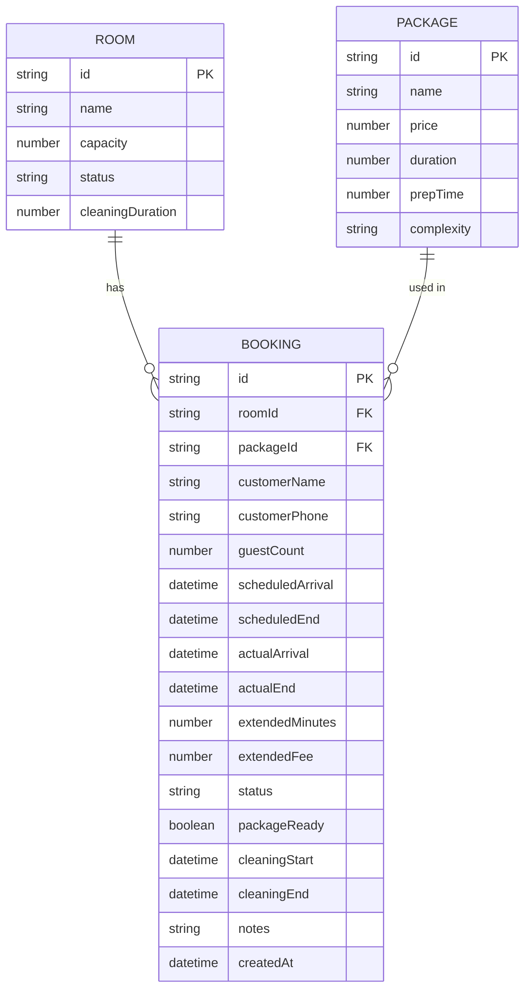

## 1. 架构设计

本系统为纯前端单页应用，数据存储在浏览器 localStorage 中，无需后端服务，适合茶馆单店使用。



## 2. 技术选型

- **前端框架**：React@18 + TypeScript@5
- **构建工具**：Vite@5
- **样式方案**：TailwindCSS@3 + PostCSS
- **状态管理**：React Context + useReducer（轻量级，避免过度设计）
- **数据持久化**：localStorage（自动保存，页面刷新不丢失）
- **日期处理**：date-fns（轻量级日期库）
- **图标**：Lucide React（开源图标库）+ Emoji
- **打印**：原生 window.print() + 打印专用CSS

## 3. 目录结构

```
src/
├── components/
│   ├── layout/
│   │   ├── Header.tsx          # 顶部操作栏
│   │   └── AlertBar.tsx        # 冲突预警条
│   ├── boards/
│   │   ├── BoardColumn.tsx     # 分组列
│   │   └── RoomCard.tsx        # 包间卡片
│   ├── modals/
│   │   ├── BookingModal.tsx    # 预订录入弹窗
│   │   └── ExtendModal.tsx     # 加钟弹窗
│   ├── manager/
│   │   ├── StatsOverview.tsx   # 数据概览
│   │   ├── CleaningAnalysis.tsx # 清台复盘
│   │   └── ExportPanel.tsx     # 数据导出
│   └── common/
│       ├── Button.tsx
│       ├── Input.tsx
│       └── Select.tsx
├── context/
│   └── BookingContext.tsx      # 全局状态管理
├── types/
│   └── index.ts                # TypeScript 类型定义
├── utils/
│   ├── timeUtils.ts            # 时间计算
│   ├── conflictDetector.ts     # 冲突检测
│   ├── statsCalculator.ts      # 统计计算
│   ├── exportUtils.ts          # 导出工具
│   └── storage.ts              # 本地存储
├── data/
│   └── mockData.ts             # 初始模拟数据
├── hooks/
│   └── useAutoSave.ts          # 自动保存Hook
├── App.tsx
├── main.tsx
└── index.css
```

## 4. 路由定义

| 路由 | 页面 | 说明 |
|------|------|------|
| `/` | 翻台主页 | 默认页面，包间状态看板 |
| `/manager` | 店长分析页 | 数据统计与导出 |

## 5. 数据模型

### 5.1 ER 图



### 5.2 类型定义

```typescript
// 包间状态
type RoomStatus = 'available' | 'occupied' | 'cleaning' | 'reserved';

// 预订状态
type BookingStatus = 'pending' | 'checked-in' | 'in-use' | 'completed' | 'cancelled';

// 套餐复杂度
type PackageComplexity = 'simple' | 'medium' | 'complex';

interface Room {
  id: string;
  name: string;
  capacity: number;
  cleaningDuration: number; // 标准清台时长（分钟）
}

interface Package {
  id: string;
  name: string;
  price: number;
  duration: number; // 分钟
  prepTime: number; // 备餐时间（分钟）
  complexity: PackageComplexity;
}

interface Booking {
  id: string;
  roomId: string;
  packageId: string;
  customerName: string;
  customerPhone: string;
  guestCount: number;
  scheduledArrival: Date;
  scheduledEnd: Date;
  actualArrival?: Date;
  actualEnd?: Date;
  extendedMinutes: number;
  extendedFee: number;
  status: BookingStatus;
  packageReady: boolean;
  cleaningStart?: Date;
  cleaningEnd?: Date;
  notes: string;
  createdAt: Date;
}

interface ConflictAlert {
  id: string;
  type: 'time-conflict' | 'cleaning-incomplete' | 'package-not-ready' | 'late-arrival';
  bookingId: string;
  message: string;
  severity: 'warning' | 'error';
}

interface DailyStats {
  date: string;
  totalBookings: number;
  turnoverRate: number; // 翻台率
  totalRevenue: number;
  extendRevenue: number;
  avgCleaningTime: number;
  slowRooms: Array<{ roomId: string; avgCleaningTime: number; count: number }>;
}
```

### 5.3 localStorage 存储键

- `teahouse_rooms` - 包间列表
- `teahouse_packages` - 套餐列表
- `teahouse_bookings` - 预订记录
- `teahouse_lastSync` - 最后同步时间

## 6. 核心算法

### 6.1 冲突检测算法

1. **加钟撞单检测**：检查该包间在当前预订结束时间 + 加钟时长范围内，是否有其他预订的开始时间
2. **清台未完成检测**：新预订的到店时间早于当前预订的预计清台完成时间（结束时间+清台时长）
3. **套餐未备齐检测**：当前时间距离预订到店时间 < 套餐备餐时间，且 packageReady 为 false
4. **客人迟到检测**：当前时间 > 预订到店时间 + 15分钟，且 actualArrival 为空

### 6.2 翻台率计算

```
翻台率 = 当日包间使用总次数 / 包间数量
平均清台时长 = 清台完成时间 - 清台开始时间 的平均值
加钟收入占比 = 加钟总收入 / 总营收 * 100%
```

### 6.3 清台慢包间分析

1. 统计每个包间近7天的平均清台时长
2. 与标准清台时长对比，超过1.5倍标记为"慢包间"
3. 分析慢包间的套餐复杂度分布
4. 分析同时间段其他包间的清台效率（判断人手问题）
