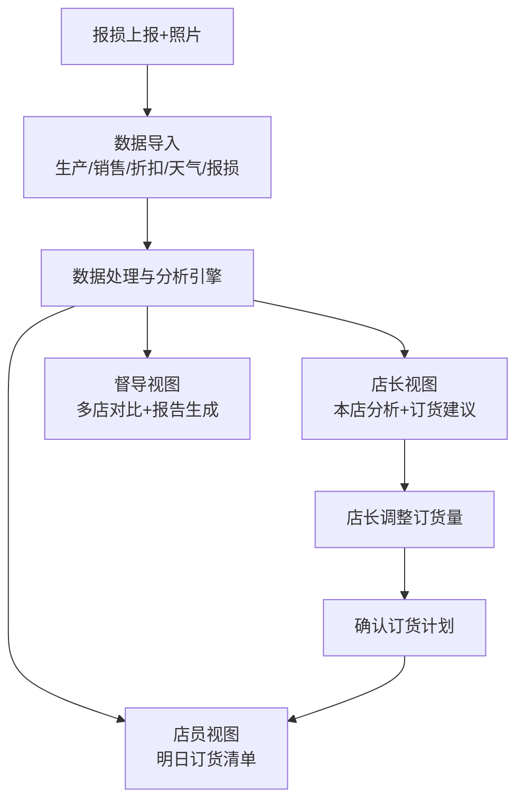

## 1. 产品概述

商超鲜食报损图系统，帮助便利店解决鲜食便当"上午卖不够、晚上又报损"的订货难题。通过整合生产到店、销售、时段折扣、天气和报损记录等多维数据，按门店、品类和时段分析缺货、滞销和折扣效果，为店长提供次日订货建议，为督导提供门店对比分析，为店员提供简明的订货指引。

### 产品价值
- 降低报损率，减少浪费和成本损失
- 减少缺货，提升销售额和顾客满意度
- 数据驱动订货，替代"店长靠感觉"的经验模式
- 区分商圈差异与店长能力，让督导评价更客观

---

## 2. 核心功能

### 2.1 用户角色

| 角色 | 描述 | 核心权限 |
|------|------|----------|
| 店长 | 单门店管理者 | 查看本店数据、调整订货建议、上报报损及照片 |
| 督导 | 多门店管理者 | 查看所有门店数据、对比分析、生成督导报告 |
| 店员 | 门店执行人员 | 查看明日订货建议、协助上报报损 |

### 2.2 功能模块

1. **数据导入中心**：生产到店记录、销售流水、时段折扣配置、天气数据、报损记录、报损照片
2. **报损分析仪表盘**：总览关键指标、趋势图、品类分布、时段分布
3. **门店对比分析**：多门店报损率对比、同时段报损聚类、按门店类型/天气交叉分析
4. **订货建议**：基于历史销售和天气的次日订货量建议、店长调整功能、店员查看视图
5. **折扣效果分析**：时段折扣效果评估、买一赠一效果、临时团购影响
6. **报损记录与留证**：报损明细、原因标注、照片上传、系统退货记录

### 2.3 页面详情

| 页面名称 | 模块名称 | 功能描述 |
|----------|----------|----------|
| 登录页 | 角色选择 | 选择角色进入对应视图（店长/督导/店员） |
| 店长仪表盘 | 数据总览 | 本店今日报损率、缺货预警、销售趋势、关键指标卡片 |
| 店长仪表盘 | 时段分析 | 按时段展示销售/报损/折扣效果的堆叠柱状图 |
| 店长仪表盘 | 品类分析 | 各品类报损率、缺货率对比条形图 |
| 订货建议页 | 订货列表 | 各品类/单品次日建议订货量，支持店长手动调整 |
| 订货建议页 | 调整记录 | 保存店长调整后的订货量，记录调整原因 |
| 报损上报页 | 报损录入 | 录入报损商品、数量、原因、上传照片 |
| 报损上报页 | 历史记录 | 本店历史报损记录查询 |
| 督导总览页 | 门店排名 | 各门店报损率排名、环比变化 |
| 督导总览页 | 时段聚类 | 识别"总在同一时段报损"的门店 |
| 督导总览页 | 天气对比 | 按天气类型对比各门店表现 |
| 督导总览页 | 门店类型对比 | 按商圈类型（社区/写字楼/学校）对比分析 |
| 督导报告页 | 详细报告 | 生成指定时间段的督导分析报告 |
| 店员视图 | 订货清单 | 简洁展示明日订货明细，便于核对备货 |
| 数据导入页 | 批量导入 | 支持CSV/Excel批量导入各类数据 |
| 数据导入页 | 照片管理 | 报损照片的上传、预览、管理 |

---

## 3. 核心流程

### 3.1 店长日常流程
1. 店长登录系统 → 查看昨日报损和销售分析 → 查看系统生成的次日订货建议 → 根据经验微调订货量 → 确认提交 → 店员可查看明日订货清单

### 3.2 报损上报流程
2. 营业结束 → 店长/店员盘点报损商品 → 录入报损明细（商品、数量、原因）→ 上传报损照片 → 提交记录 → 数据进入分析池

### 3.3 督导分析流程
3. 督导登录 → 查看门店报损总览 → 发现异常门店 → 深入分析时段/品类/天气维度 → 生成督导报告 → 指导门店改进

---

## 4. 用户界面设计

### 4.1 设计风格

**设计方向：** 专业数据感 + 温暖便利店氛围

- **主色调**：暖橙色系（#FF7A45 主色），呼应鲜食便当的温暖感，搭配深灰蓝（#1E293B）作为数据面板底色
- **辅助色**：
  - 绿色（#10B981）：表示销售/正常/低报损
  - 红色（#EF4444）：表示报损/告警/高损耗
  - 黄色（#F59E0B）：表示折扣/促销/中等
  - 蓝色（#3B82F6）：表示天气/外部因素
- **按钮风格**：圆角矩形（12px半径），微阴影，悬停时有轻微上浮效果
- **字体**：标题使用 "Noto Sans SC" 粗体，数据使用等宽数字字体增强可读性，正文使用清晰的无衬线字体
- **布局风格**：卡片式布局，卡片间有微妙阴影和圆角，数据密度高但不拥挤
- **图标风格**：线性图标，统一2px描边，配合少量暖色填充
- **数据可视化**：使用Chart.js，图表配色与整体风格统一，动画过渡流畅

### 4.2 页面设计概述

| 页面名称 | 模块名称 | UI元素 |
|----------|----------|--------|
| 登录页 | 角色选择 | 三张角色卡片（店长/督导/店员），大图标+标题+描述，点击进入 |
| 店长仪表盘 | 顶部指标区 | 四个大指标卡片（今日报损率、今日销售额、缺货商品数、折扣贡献率），带环比小箭头 |
| 店长仪表盘 | 时段分析图 | 大尺寸堆叠柱状图，横轴为时段（早/中/晚/夜），纵轴为数量，堆叠销售/报损/折扣 |
| 店长仪表盘 | 品类分析 | 横向条形图，各品类对比报损率与缺货率 |
| 店长仪表盘 | 明日订货速览 | 底部快捷入口，显示三个核心品类建议订货量 |
| 订货建议页 | 品类分组列表 | 可展开的品类分组，每行显示：商品名、建议量、店长调整量、单位、历史参考 |
| 订货建议页 | 调整操作 | 数字输入框、快捷按钮（+1/-1/+10/-10）、调整原因备注 |
| 报损上报页 | 商品选择 | 搜索框+常用商品快捷选择 |
| 报损上报页 | 照片上传 | 拖拽上传区域，缩略图预览，支持多张 |
| 督导总览页 | 门店排名表 | 带排名序号、门店名称、报损率（色阶）、环比、门店类型标签 |
| 督导总览页 | 时段热力图 | 行=门店，列=时段，颜色深浅表示报损严重程度 |
| 督导总览页 | 天气对比图 | 分组柱状图，按天气类型分组，每组内各门店对比 |

### 4.3 响应式设计

- **设计原则**：Desktop-first，针对平板和手机做适配
- **桌面端**（1440px+）：多列布局，数据密度高，图表完整展示
- **平板端**（768-1024px）：两列布局，图表自适应缩放
- **手机端**（<768px）：单列布局，卡片堆叠，图表简化，重点数据突出
- **触控优化**：移动端按钮最小48px，列表项增大点击区域

### 4.4 特殊交互说明

- **时段热力图交互**：悬停显示详情，点击门店跳转到门店详情
- **订货调整滑块**：除了数字输入，还提供拖拽滑块快速调整
- **报损原因标签**：预设常用原因标签（过期/品相不佳/顾客退回/系统退货/原因空白），一键选择
- **买一赠一/临时团购标注**：在销售和报损数据上用特殊标记区分，悬停显示说明
- **系统退货说明**：报损记录中系统退货项有特殊图标，点击展开退货原因详情
