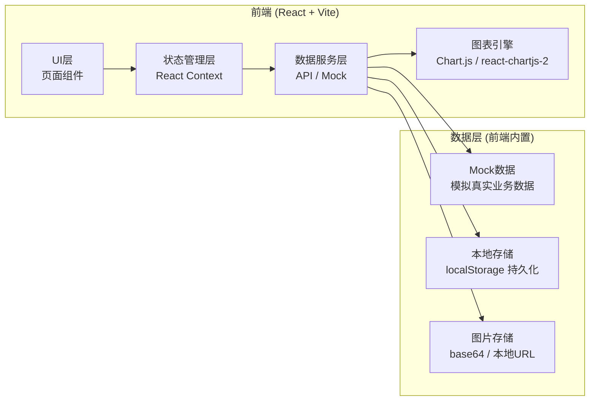
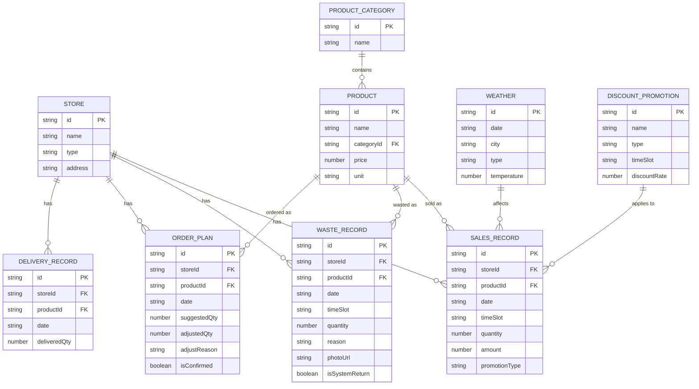

## 1. 架构设计



---

## 2. 技术描述

- **前端框架**：React@18 + TypeScript
- **构建工具**：Vite@5
- **样式方案**：TailwindCSS@3
- **图表库**：Chart.js@4 + react-chartjs-2@5
- **路由管理**：React Router@6
- **图标库**：Lucide React
- **状态管理**：React Context + useReducer
- **日期处理**：date-fns
- **数据导入**：PapaParse（CSV解析）
- **开发语言**：TypeScript

### 技术选型说明

1. **纯前端架构**：由于是数据可视化分析工具，前端内置Mock数据即可完整演示，无需后端服务
2. **localStorage持久化**：用户的订货调整、报损记录等数据保存在本地浏览器
3. **Chart.js**：轻量且功能完整的图表库，满足柱状图、折线图、热力图等多种可视化需求

---

## 3. 路由定义

| 路由路径 | 页面 | 角色 | 说明 |
|----------|------|------|------|
| `/` | 登录页（角色选择） | 所有 | 入口页面，选择角色进入 |
| `/manager/dashboard` | 店长仪表盘 | 店长 | 本店数据总览和分析 |
| `/manager/order` | 订货建议页 | 店长 | 查看和调整次日订货量 |
| `/manager/waste` | 报损上报页 | 店长 | 录入报损和上传照片 |
| `/supervisor/dashboard` | 督导总览页 | 督导 | 多门店对比和分析 |
| `/supervisor/report` | 督导报告页 | 督导 | 生成和查看分析报告 |
| `/staff/order` | 店员订货视图 | 店员 | 查看明日订货清单 |
| `/data/import` | 数据导入页 | 店长/督导 | 批量导入各类数据 |

---

## 4. 核心数据模型

### 4.1 数据模型ER图



### 4.2 核心类型定义

```typescript
// 门店
interface Store {
  id: string;
  name: string;
  type: 'community' | 'office' | 'school' | 'station';
  address: string;
}

// 商品品类
interface Category {
  id: string;
  name: string;
}

// 商品
interface Product {
  id: string;
  name: string;
  categoryId: string;
  price: number;
  unit: string;
}

// 时段
type TimeSlot = 'morning' | 'noon' | 'afternoon' | 'evening' | 'night';

// 销售记录
interface SalesRecord {
  id: string;
  storeId: string;
  productId: string;
  date: string;
  timeSlot: TimeSlot;
  quantity: number;
  amount: number;
  promotionType?: 'buyOneGetOne' | 'timeDiscount' | 'groupBuy' | null;
}

// 报损记录
interface WasteRecord {
  id: string;
  storeId: string;
  productId: string;
  date: string;
  timeSlot: TimeSlot;
  quantity: number;
  reason: 'expired' | 'poorQuality' | 'customerReturn' | 'systemReturn' | 'unknown';
  photoUrls: string[];
  isSystemReturn: boolean;
  remark?: string;
}

// 订货计划
interface OrderPlan {
  id: string;
  storeId: string;
  productId: string;
  date: string;
  suggestedQty: number;
  adjustedQty: number | null;
  adjustReason?: string;
  isConfirmed: boolean;
}

// 天气
interface Weather {
  date: string;
  city: string;
  type: 'sunny' | 'cloudy' | 'rainy' | 'snowy' | 'hot' | 'cold';
  temperature: number;
}

// 折扣活动
interface DiscountPromotion {
  id: string;
  name: string;
  type: 'buyOneGetOne' | 'timeDiscount' | 'groupBuy';
  timeSlot: TimeSlot;
  discountRate: number;
  startDate: string;
  endDate: string;
}
```

---

## 5. 页面组件结构

```
src/
├── pages/
│   ├── Login/           # 登录/角色选择页
│   ├── Manager/
│   │   ├── Dashboard/   # 店长仪表盘
│   │   ├── OrderPlan/   # 订货建议页
│   │   └── WasteReport/ # 报损上报页
│   ├── Supervisor/
│   │   ├── Dashboard/   # 督导总览页
│   │   └── Report/      # 督导报告页
│   └── Staff/
│       └── OrderList/   # 店员订货视图
├── components/
│   ├── common/          # 通用组件（卡片、按钮、图表等）
│   ├── charts/          # 图表组件
│   └── layout/          # 布局组件
├── context/             # React Context
├── data/                # Mock数据
├── hooks/               # 自定义Hooks
├── utils/               # 工具函数
└── types/               # TypeScript类型
```

---

## 6. 核心算法说明

### 6.1 订货建议算法
- 基于近7天同时段的销售均值
- 考虑天气因素（雨雪天鲜食需求下降）
- 考虑星期几效应（工作日vs周末）
- 考虑近期报损率进行负反馈调节
- 店长调整量 = 建议量 × (1 + 人工调整系数)

### 6.2 报损率计算
- 报损率 = 报损数量 / (生产到店数量)
- 缺货率 = 预估缺货数量 / 需求预测量
- 时段报损率 = 该时段报损量 / 当日总报损量

### 6.3 折扣效果评估
- 折扣贡献率 = 折扣时段销售额增量 / 折扣成本
- 买一赠一效果 = (活动期销量 - 基期销量) / 基期销量
