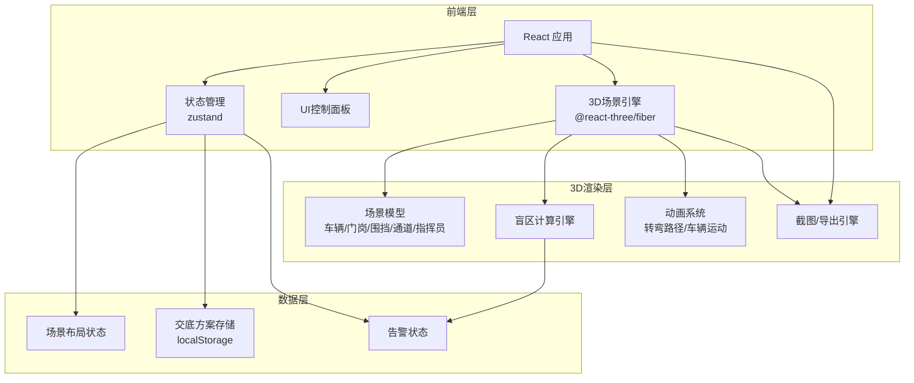
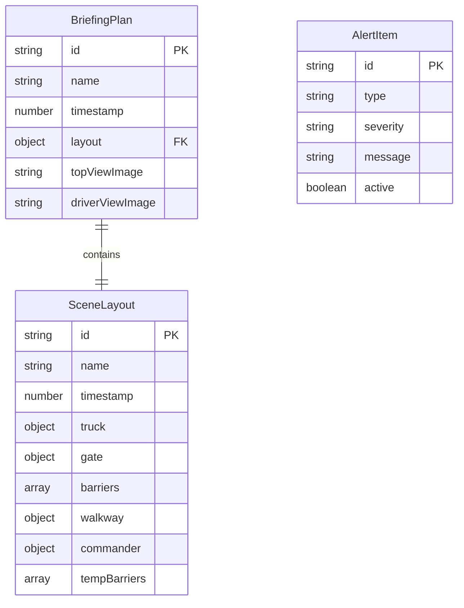

## 1. 架构设计



## 2. 技术说明
- 前端：React@18 + tailwindcss@3 + vite
- 3D渲染：three + @react-three/fiber + @react-three/drei + @react-three/postprocessing
- 初始化工具：vite-init
- 后端：无（纯前端，数据存储于 localStorage）
- 状态管理：zustand

## 3. 路由定义
| 路由 | 用途 |
|------|------|
| / | 3D盲区预演主页，包含场景、控制面板、告警 |
| /briefing | 交底方案管理页，方案列表、导出预览 |

## 4. API定义
无后端API，所有数据通过 zustand + localStorage 持久化。

### 4.1 核心数据类型

```typescript
interface SceneLayout {
  id: string;
  name: string;
  timestamp: number;
  truck: { x: number; z: number; rotation: number; speed: number };
  gate: { x: number; z: number; rotation: number };
  barriers: Array<{ id: string; x: number; z: number; rotation: number; length: number }>;
  walkway: { x: number; z: number; rotation: number; width: number; length: number };
  commander: { x: number; z: number };
  tempBarriers: Array<{ id: string; x: number; z: number; rotation: number }>;
}

interface AlertItem {
  id: string;
  type: "overspeed" | "blindspot" | "walkway_blocked" | "view_blocked";
  severity: "danger" | "warning";
  message: string;
  active: boolean;
}

interface BriefingPlan {
  id: string;
  name: string;
  timestamp: number;
  layout: SceneLayout;
  topViewImage: string;
  driverViewImage: string;
}
```

## 5. 服务器架构图
无后端服务。

## 6. 数据模型

### 6.1 数据模型定义



### 6.2 盲区计算逻辑
- 土方车右转盲区区域：基于车辆几何参数（车长8m、车宽2.5m、驾驶室高度2.8m）计算
- 右前柱盲区：驾驶室A柱遮挡区域，约右前45度扇形
- 右侧盲区：车身右侧0-3m范围，沿车身延伸至车尾
- 内轮差区域：右转时前轮与后轮轨迹差，基于转弯半径计算扇形区域
- 危险检测：检查指挥员/行人是否在盲区多边形内（点在多边形内算法）
