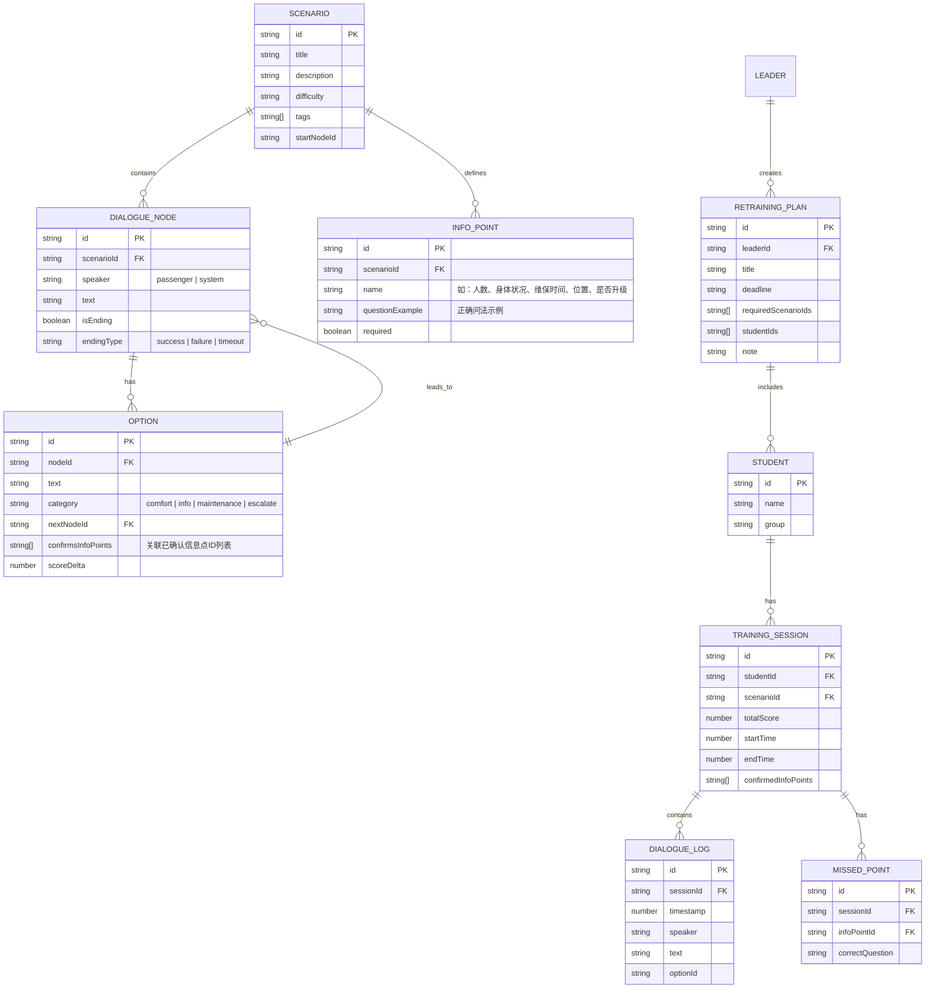

## 1. 架构设计

```mermaid
flowchart LR
    subgraph "前端层 (React + TypeScript"
        A["路由层 (React Router)"]
        B["页面层 (Pages)
        学员首页 / 训练页 / 报告页 / 案例管理 / 数据分析 / 补训安排
        C["组件层 (Components)
        对话气泡 / 状态栏 / 选项面板 / 状态胶囊 / 图表"]
        D["状态层 (Zustand)
        游戏状态 / 学员状态 / 案例数据"]
        E["工具层 (Utils)
        漏问检测 / 评分算法 / 数据持久化"]
    end
    
    subgraph "数据层"
        F["LocalStorage (持久化存储)
        案例库 / 学员记录 / 补训名单"]
        G["内置 Mock 数据
        预置场景 / 预设学员 / 对话节点"]
    end
    
    A --> B --> C --> D --> E
    D --> F
    E --> G
```

## 2. 技术选型

- 前端：React@18 + TypeScript + Vite
- 样式：TailwindCSS@3
- 状态管理：Zustand
- 路由：React Router DOM
- 图表：纯 CSS/SVG 实现轻量图表（无需引入额外图表库，保持轻量）
- 图标：lucide-react
- 数据持久化：LocalStorage + Mock 数据（纯前端演示，无需后端）
- 初始化工具：vite-init
- 后端：无（纯前端应用，数据存储在 LocalStorage）

## 3. 路由定义

| 路由 | 用途 |
|------|------|
| / | 角色选择入口页 |
| /student | 学员端首页（场景选择 + 进度概览） |
| /student/training/:scenarioId | 剧情训练页 |
| /student/report/:sessionId | 培训报告页 |
| /supervisor/login | 主管登录页 |
| /supervisor/cases | 案例管理页 |
| /supervisor/cases/:caseId/edit | 案例编辑器 |
| /supervisor/analytics | 数据分析页 |
| /leader/login | 组长登录页 |
| /leader/training | 补训安排页 |

## 4. 数据模型

### 4.1 数据模型定义



### 4.2 项目结构

```
src/
├── components/
│   ├── training/
│   │   ├── CallStatusBar.tsx      # 通话状态栏
│   │   ├── DialogueBubble.tsx    # 对话气泡
│   │   ├── InfoStatusBar.tsx   # 信息确认状态栏
│   │   ├── OptionPanel.tsx   # 选项面板
│   │   └── OptionCard.tsx    # 单个选项卡片
│   ├── report/
│   │   ├── ScoreOverview.tsx   # 得分总览
│   │   ├── DialogueReplay.tsx # 对话回放
│   │   └── SuggestionList.tsx  # 改进建议
│   │   └── MissedHighlight.tsx # 漏问高亮
│   ├── supervisor/
│   │   ├── CaseCard.tsx      # 案例卡片
│   │   ├── CaseEditor.tsx     # 案例编辑器
│   │   ├── AnalyticsChart.tsx   # 分析图表
│   │   └── MissedBarChart.tsx # 漏问柱状图
│   ├── leader/
│   │   ├── StudentGrid.tsx    # 学员网格
│   │   └── RetrainingForm.tsx # 补训表单
│   └── common/
│       ├── RoleSelector.tsx   # 角色选择器
│       └── PageHeader.tsx   # 页面头部
├── pages/
│   ├── RoleSelect.tsx
│   ├── student/
│   │   ├── Home.tsx
│   │   ├── Training.tsx
│   │   └── Report.tsx
│   ├── supervisor/
│   │   ├── Login.tsx
│   │   ├── CaseList.tsx
│   │   ├── CaseEdit.tsx
│   │   └── Analytics.tsx
│   └── leader/
│       ├── Login.tsx
│       └── Retraining.tsx
├── store/
│   ├── useGameStore.ts      # 游戏状态
│   ├── useStudentStore.ts   # 学员状态
│   └── useCaseStore.ts     # 案例/主管状态
├── data/
│   ├── scenarios.ts         # 预置场景数据
│   └── students.ts          # 预置学员数据
├── utils/
│   ├── missedPoints.ts      # 漏问检测算法
│   ├── scoring.ts          # 评分算法
│   └── storage.ts          # LocalStorage 封装
├── types/
│   └── index.ts           # 类型定义
├── App.tsx
├── main.tsx
└── index.css
```

## 5. 核心算法

### 5.1 漏问检测算法

每个场景预定义一组必须确认的信息点（InfoPoint）。训练过程中跟踪学员通过选项确认的信息点集合。训练结束时，将已确认集合与必须集合做差集，得到漏问点。每个漏问点关联正确问法示例和改进建议。

### 5.2 评分算法

总分 = 信息完整度（60%）+ 安抚有效性（25%）+ 响应效率（15%）

- 信息完整度：已确认信息点 / 必须信息点总数 × 60
- 安抚有效性：选择安抚类选项次数和乘客反馈综合评分
- 响应效率：总对话轮次越少得分越高（基准轮次内满分）
