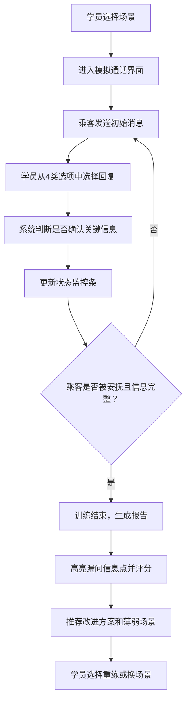

## 1. 产品概述

电梯困人安抚剧情培训游戏，通过沉浸式分支对话模拟训练物业客服新人处理电梯困人应急事件。解决新人着急忘问关键信息（人数、身体状况、维保到场时间）的问题，同时为主管提供案例库管理和学员数据分析能力。

- 目标用户：物业客服新人、客服主管、客服组长
- 核心价值：降低新人培训成本、标准化应急话术、追踪薄弱环节、持续迭代案例

## 2. 核心功能

### 2.1 用户角色

| 角色 | 登录方式 | 核心权限 |
|------|----------|----------|
| 学员（客服） | 选择姓名进入 | 进行剧情训练、查看个人培训报告、练习薄弱场景 |
| 主管 | 密码登录 | 管理案例库（增删改查）、查看所有学员漏问数据、识别薄弱场景 |
| 组长 | 密码登录 | 查看本组学员成绩、安排补训名单、导出培训记录 |

### 2.2 功能模块

1. **学员端首页**：角色选择入口、训练进度概览、薄弱场景推荐
2. **剧情训练页**：分支对话系统、实时状态面板、选项选择
3. **培训报告页**：对话回放、漏问信息点高亮、评分与改进建议
4. **主管案例管理**：案例列表、案例编辑器、场景标签管理
5. **主管数据分析**：学员漏问统计、薄弱场景排行、培训完成度仪表盘
6. **组长补训安排**：学员列表、补训名单编辑、通知导出

### 2.3 页面详情

| 页面名称 | 模块名称 | 功能描述 |
|----------|----------|----------|
| 学员端首页 | 角色入口 | 输入姓名或选择预设学员身份进入系统 |
| 学员端首页 | 进度卡片 | 展示已完成场景数、平均得分、最近训练时间 |
| 学员端首页 | 薄弱场景 | 根据历史数据推荐最需练习的Top3场景 |
| 学员端首页 | 场景选择 | 展示所有可用剧情场景卡片，支持难度筛选 |
| 剧情训练页 | 通话状态栏 | 显示通话时长、困人时长倒计时、电梯位置 |
| 剧情训练页 | 对话气泡区 | 乘客消息、客服回复交替显示，带打字机动画 |
| 剧情训练页 | 状态监控条 | 实时显示已确认信息点：人数/身体状况/维保/位置/升级 |
| 剧情训练页 | 选项面板 | 4类选项：安抚话术、确认信息、通知维保、升级经理 |
| 培训报告页 | 得分总览 | 总评分、响应速度、信息完整度三维雷达 |
| 培训报告页 | 对话回放 | 完整对话时间线，漏问信息点红色标注 |
| 培训报告页 | 改进建议 | 针对本次训练的具体改进点和正确话术参考 |
| 培训报告页 | 再练一次 | 可重玩本场景或跳转到推荐薄弱场景 |
| 案例管理页 | 案例列表 | 卡片式展示案例，支持按场景标签/难度筛选 |
| 案例管理页 | 案例编辑器 | 对话节点编辑、选项配置、正确答案标记、漏问点定义 |
| 数据分析页 | 信息漏问榜 | 柱状图展示各信息点被漏问的频次排行 |
| 数据分析页 | 场景难度榜 | 各场景平均得分排行，识别最难场景 |
| 数据分析页 | 学员排行榜 | 学员平均得分、完成场景数排名 |
| 补训安排页 | 学员网格 | 展示本组学员状态，支持多选加入补训 |
| 补训安排页 | 补训编辑 | 设定补训截止日期、指定必练场景、添加备注 |

## 3. 核心流程

学员训练流程：学员选择场景 → 进入模拟通话 → 通过分支选项对话 → 系统实时跟踪信息确认状态 → 训练结束生成报告 → 高亮漏问信息点 → 推荐改进方案和薄弱场景再训练。

主管管理流程：主管登录 → 查看现有案例或新建 → 编辑对话节点和分支 → 配置漏问检测点 → 保存发布 → 学员训练后查看数据分析 → 识别系统薄弱点 → 迭代案例库。

组长管理流程：组长登录 → 查看本组学员成绩 → 筛选未达标或需加强学员 → 创建补训计划 → 指定必练场景和截止日期 → 导出名单通知。

## 4. 用户界面设计

### 4.1 设计风格

- 主色：深海军蓝 `#0F2A44`（专业、冷静）
- 辅色：警示橙 `#FF6B35`（紧急提醒）、安全绿 `#2EC4B6`（已确认）
- 中性色：暖白 `#F7F5F2`、浅灰 `#E8E4DE`、深灰 `#4A4A4A`
- 按钮风格：圆角 8px，悬停时轻微上浮 + 阴影加深
- 字体：标题用 "Noto Serif SC" 宋体体现专业感，正文用 "PingFang SC"
- 布局风格：学员端用电话模拟界面（深色模拟手机通话），管理端用仪表盘卡片式布局
- 图标风格：lucide-react 线性图标，关键状态用带颜色的实心圆点标记

### 4.2 页面设计概览

| 页面名称 | 模块名称 | UI 元素 |
|----------|----------|---------|
| 剧情训练页 | 通话状态栏 | 深色渐变背景、闪烁红色"通话中"指示灯、计时器数字字体 |
| 剧情训练页 | 对话气泡 | 乘客消息左侧灰色气泡、客服回复右侧蓝色气泡、入场动画 |
| 剧情训练页 | 状态监控条 | 5个信息点胶囊，已确认变绿带勾、未确认灰色、超时橙色闪烁 |
| 剧情训练页 | 选项面板 | 4个分类标签页，每个选项卡片带图标和简短效果提示 |
| 培训报告页 | 漏问高亮 | 对话气泡上红色边框 + 感叹号标记 + 悬浮显示正确问法 |
| 数据分析页 | 漏问榜 | 横向条形图，柱子颜色从橙色渐变到红色，数值标签 |
| 案例管理页 | 编辑器 | 节点可视化拖拽、连接线、侧边属性面板 |

### 4.3 响应式

- 桌面端优先设计（管理端）
- 学员训练页适配平板和手机竖屏（模拟通话场景）
- 所有按钮最小触摸区域 44x44px
- 表格在小屏幕下自动转为卡片列表

### 4.4 动效设计

- 对话入场：消息气泡从下往上滑入 + 透明度渐变
- 选项选择：点击后卡片轻微缩放反馈
- 状态变更：信息点胶囊填充时脉冲动效
- 页面切换：淡入淡出 + 轻微位移
