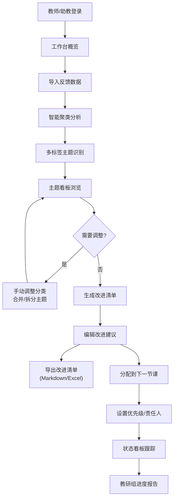

## 1. 产品概述

课程作业反馈聚类系统是一款面向高校教师和教研组的教学分析工具，通过智能聚类学生作业疑问、助教批注和错题说明，帮助教师快速识别教学薄弱环节，生成针对性的教学改进清单，并可将改进点分配到后续课程中跟进落实。

- **核心问题**：学生作业反馈分散、助教批注量大但难以归纳，教师无法快速定位需要补讲的知识点
- **目标用户**：课程主讲教师、助教、教学教研组
- **核心价值**：将零散反馈转化为可执行的教学改进行动，避免"报告写完就没人跟进"

---

## 2. 核心功能

### 2.1 用户角色

| 角色 | 核心权限 |
|------|----------|
| 教师 | 导入反馈数据、查看聚类结果、手动调整主题、导出改进清单、分配到课程 |
| 助教 | 导入反馈数据、辅助标注和分类 |
| 教研组 | 查看汇总报告、跟踪改进落实情况 |

### 2.2 功能模块

1. **数据导入模块**：支持学生反馈、助教批注、错题说明三种数据源的批量导入和手动录入
2. **智能聚类模块**：自动归并为概念理解、步骤遗漏、工具使用、题目歧义等主题，支持多标签分类
3. **聚类结果浏览**：按主题查看、搜索代表原话，统计频次和严重程度
4. **人工调整模块**：拖拽重新分类、合并/拆分主题、编辑标签和描述
5. **改进清单导出**：生成结构化教学改进清单，支持Markdown/Excel导出
6. **课程分配与跟踪**：将改进点分配到具体下一节课，设置优先级和责任人，跟踪完成状态

### 2.3 页面详情

| 页面名称 | 模块名称 | 功能描述 |
|-----------|-------------|---------------------|
| 工作台（首页） | 概览面板 | 数据统计卡片、最近导入记录、待跟进改进点、快捷操作入口 |
| 工作台 | 快速导入 | 三种数据源的快速导入区域，支持粘贴文本和上传文件 |
| 数据管理 | 反馈列表 | 所有导入反馈的表格展示，支持筛选、搜索、批量操作 |
| 数据管理 | 详情编辑 | 单条反馈的详情查看和编辑，支持多标签标注 |
| 聚类分析 | 主题看板 | 聚类主题卡片墙，显示主题名称、数量、严重程度、代表原话 |
| 聚类分析 | 主题详情 | 单主题下所有反馈的列表，支持批量重分类、合并、拆分 |
| 聚类分析 | 对比视图 | 同一条反馈在多个主题中的归属展示（多标签支持） |
| 改进清单 | 清单生成 | 基于聚类结果自动生成改进建议，支持手动编辑和排序 |
| 改进清单 | 导出中心 | 选择导出格式、字段、范围，一键下载 |
| 课程跟进 | 课程日历 | 课程列表与改进点分配拖拽界面 |
| 课程跟进 | 状态看板 | 按课程分组的改进点完成状态看板（待办/进行中/已完成） |
| 课程跟进 | 进度报告 | 教研组视角的整体改进进度统计和趋势图 |

---

## 3. 核心流程

### 3.1 主要用户流程（教师视角）

教师登录系统后，首先在工作台概览当前教学情况。通过快速导入区粘贴或上传学生作业反馈、助教批注和错题说明，系统自动进行智能聚类，识别出"概念理解""步骤遗漏""工具使用""题目歧义"等主题，同时标注每条反馈中涉及的多个问题点（多标签）。教师在主题看板中浏览聚类结果，可拖拽调整分类、合并相似主题、拆分模糊主题，系统会特别标记低频但严重的问题。确认主题后，系统生成教学改进清单，教师可编辑调整后导出为Markdown或Excel。最后在课程跟进模块，将改进点拖拽分配到具体的下一节课，设置优先级，教研组可通过状态看板持续跟踪落实进度。

### 3.2 流程图

---

## 4. 用户界面设计

### 4.1 设计风格

**设计理念：学术专业 + 温暖人文** - 既体现教学分析的严谨专业，又传递教育的温度和关怀

- **主色调**：深靛蓝 (#1e3a5f) - 代表专业、知识、信任
- **辅助色**：暖琥珀色 (#f59e0b) - 代表创意、重点、提醒
- **成功色**：森林绿 (#10b981) - 代表完成、进步
- **警示色**：珊瑚红 (#ef4444) - 代表严重问题
- **背景色**：米白渐层 (#fafaf9 → #f5f5f4) - 护眼、不刺眼
- **卡片背景**：纯白 (#ffffff) 配柔和阴影

- **按钮风格**：圆润矩形（圆角12px），主色填充配微浮雕阴影，悬停时上浮2px
- **字体方案**：
  - 标题：思源宋体 / Noto Serif SC - 书卷气，适合教育场景
  - 正文：思源黑体 / Noto Sans SC - 清晰易读
  - 数据/代码：JetBrains Mono - 数字和标签展示
- **布局风格**：卡片式布局，左侧导航栏 + 顶部状态栏 + 主内容区，信息层级分明
- **图标风格**：线性图标（Lucide风格），统一2px描边，配暖琥珀色强调

### 4.2 页面设计概览

| 页面名称 | 模块名称 | UI元素 |
|-----------|-------------|-------------|
| 工作台 | 概览面板 | 渐变数据卡片（带迷你趋势图）、环形进度图、时间线式最近活动 |
| 工作台 | 快速导入 | 三栏分区拖拽上传区、大粘贴输入框、文件格式说明提示 |
| 聚类分析 | 主题看板 | Masonry瀑布流卡片布局、彩色主题标签、严重程度徽章（带脉冲动画）、代表原话引用块 |
| 聚类分析 | 主题详情 | 左侧反馈列表（可多选）、右侧详情面板、分类拖拽手柄、关键词词云 |
| 改进清单 | 清单生成 | 可折叠改进条目（带优先级拖拽排序）、自动建议标签、AI建议文本框 |
| 课程跟进 | 课程日历 | 周视图时间轴、改进点卡片拖拽、颜色编码优先级、完成状态复选框 |
| 课程跟进 | 状态看板 | Kanban三列看板、卡片拖拽、进度条统计、逾期红色高亮 |

### 4.3 响应式设计

- **设计策略**：桌面端优先设计，在1440px宽度下最优展示
- **平板端（≥768px）**：左侧导航栏收缩为图标模式，卡片流减少列数
- **移动端（<768px）**：底部Tab导航替代侧边栏，卡片改为单列堆叠，表格改为卡片列表
- **触摸优化**：拖拽区域≥48px，点击区域足够大，支持手势滑动切换页面

### 4.4 视觉动效

- **页面入场**：顶部导航先出现，然后卡片区域从下往上淡入错开100ms
- **卡片悬停**：上浮3px + 阴影加深 + 边框微亮
- **严重问题标签**：呼吸脉冲动画（每3秒一次）
- **拖拽操作**：半透明跟随效果，目标区域高亮闪烁
- **数据统计**：数字滚动动画（从0到目标值，600ms缓动）
- **状态切换**：进度条平滑填充，复选框勾选有弹性动画
