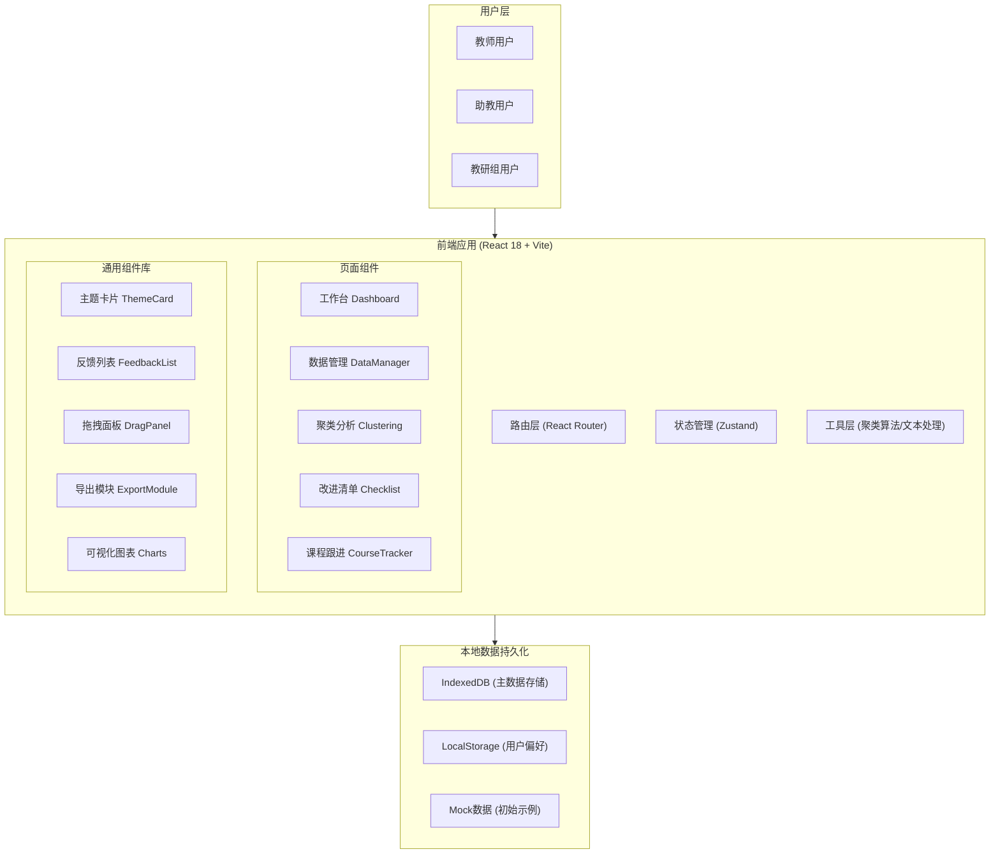
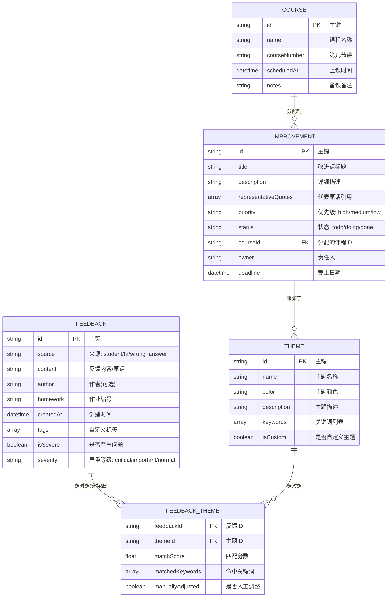

## 1. 架构设计



## 2. 技术描述

- **前端框架**: React@18 + React Router@6 (路由管理)
- **初始化工具**: Vite@5 (快速构建与热更新)
- **样式方案**: TailwindCSS@3 + PostCSS (原子化CSS)
- **状态管理**: Zustand@4 (轻量级状态管理，替代Redux)
- **图标库**: lucide-react (线性图标，符合设计风格)
- **拖拽交互**: @dnd-kit/core + @dnd-kit/sortable (现代拖拽库，性能优秀)
- **可视化图表**: recharts@2 (React图表库，支持响应式)
- **文件处理**: xlsx (Excel导出)、file-saver (文件下载)
- **本地存储**: Dexie.js (IndexedDB封装，结构化数据持久化)
- **文本处理**: 内置中文分词 + TF-IDF关键词提取 (轻量级，无需外部服务)
- **聚类算法**: 内置DBSCAN + 关键词相似度匹配 (前端本地执行)
- **后端**: None (纯前端应用，数据本地持久化)
- **数据库**: IndexedDB (通过Dexie.js封装)

**设计决策说明**:
1. 纯前端架构：避免后端部署成本，数据保存在教师本地浏览器，适合课堂轻量使用
2. 内置聚类算法：不依赖外部NLP服务，使用关键词匹配+规则分类，可离线运行
3. IndexedDB持久化：支持大量反馈数据，容量远超LocalStorage

## 3. 路由定义

| 路由路径 | 页面名称 | 用途 |
|----------|----------|------|
| `/` | 工作台 Dashboard | 数据概览、快速导入、待办提醒 |
| `/data` | 数据管理 DataManager | 反馈数据列表、增删改查、筛选搜索 |
| `/data/new` | 新建反馈 | 单条反馈录入与多标签标注 |
| `/clustering` | 聚类分析 Clustering | 主题看板、聚类结果浏览与调整 |
| `/clustering/theme/:id` | 主题详情 | 单主题反馈列表、批量操作 |
| `/checklist` | 改进清单 Checklist | 生成改进清单、编辑、导出 |
| `/courses` | 课程跟进 CourseTracker | 课程日历、改进点分配、状态看板 |
| `/courses/report` | 进度报告 | 教研组视角的整体进度统计 |
| `/settings` | 设置 | 自定义主题标签、导入导出数据、偏好设置 |

## 4. 核心算法与规则定义 (前端本地执行)

### 4.1 预设主题关键词库

```typescript
interface ThemeKeywords {
  id: string;
  name: string;          // 主题名称
  color: string;         // 主题配色
  keywords: string[];    // 匹配关键词
  weight: number;        // 匹配权重
}

const DEFAULT_THEMES: ThemeKeywords[] = [
  {
    id: 'concept',
    name: '概念理解',
    color: '#ef4444',
    keywords: ['概念不清', '不理解', '不懂', '混淆', '分不清', '什么是', '定义', '含义', '不太明白', '搞不懂'],
    weight: 1.2
  },
  {
    id: 'formula',
    name: '公式套用',
    color: '#f59e0b',
    keywords: ['公式错', '套错', '用错公式', '代入', '计算错误', '推导', '公式记错', '公式怎么用'],
    weight: 1.2
  },
  {
    id: 'step',
    name: '步骤遗漏',
    color: '#8b5cf6',
    keywords: ['步骤', '漏了', '缺少', '跳过', '过程', '中间步骤', '怎么来的', '不知道从哪下手'],
    weight: 1.0
  },
  {
    id: 'tool',
    name: '工具使用',
    color: '#06b6d4',
    keywords: ['软件', '工具', '不会用', '报错', '安装', '环境', 'Matlab', 'Python', 'Excel', 'SPSS', '代码出错'],
    weight: 1.1
  },
  {
    id: 'ambiguity',
    name: '题目歧义',
    color: '#10b981',
    keywords: ['题目不清楚', '看不懂题', '歧义', '表述不清', '什么意思', '题目有问题', '看不懂问题'],
    weight: 1.1
  },
  {
    id: 'difficulty',
    name: '难度过大',
    color: '#ec4899',
    keywords: ['太难', '不会做', '做不出来', '超出范围', '超纲', '难度大', '做不完'],
    weight: 1.0
  }
];
```

### 4.2 多标签分类算法

```typescript
/**
 * 多标签分类：一条反馈可归属多个主题
 * @param text 反馈文本
 * @param themes 主题库
 * @param threshold 匹配阈值（默认0.3）
 * @returns Array<{themeId: string, score: number, matchedKeywords: string[]}>
 */
function multiLabelClassify(text, themes, threshold = 0.3) {
  const results = [];
  for (const theme of themes) {
    let matchCount = 0;
    const matched = [];
    for (const kw of theme.keywords) {
      if (text.includes(kw)) {
        matchCount++;
        matched.push(kw);
      }
    }
    const score = (matchCount * theme.weight) / Math.max(theme.keywords.length * 0.5, 1);
    if (score >= threshold) {
      results.push({ themeId: theme.id, score, matchedKeywords: matched });
    }
  }
  // 低频但严重：单独标记"严重"属性（基于关键词+手动标记）
  return results.sort((a, b) => b.score - a.score);
}
```

### 4.3 严重程度判定规则

| 严重等级 | 判定规则 | 视觉表现 |
|----------|----------|----------|
| 🔴 严重 | 同时命中≥3个主题，或包含"完全不会""全班都不懂"等关键词 | 红色脉冲动画，优先展示 |
| 🟠 重要 | 命中2个主题，或涉及基础概念/公式 | 橙色高亮 |
| 🟡 一般 | 命中1个主题，属于常规反馈 | 普通展示 |
| ⭐ 低频但严重 | 同主题≤2条但命中严重关键词 | 特殊星形标记，不被频率过滤 |

## 5. 数据模型

### 5.1 实体关系图



### 5.2 Dexie.js 数据库Schema

```typescript
import Dexie, { Table } from 'dexie';

export class AppDB extends Dexie {
  feedback!: Table<Feedback, string>;
  themes!: Table<Theme, string>;
  feedbackThemes!: Table<FeedbackTheme, [string, string]>;
  improvements!: Table<Improvement, string>;
  courses!: Table<Course, string>;

  constructor() {
    super('CourseFeedbackDB');
    this.version(1).stores({
      feedback: 'id, source, homework, createdAt, severity',
      themes: 'id, name, isCustom',
      feedbackThemes: '[feedbackId+themeId], themeId, feedbackId',
      improvements: 'id, status, priority, courseId',
      courses: 'id, scheduledAt, courseNumber'
    });
  }
}
```

## 6. 导入/导出格式定义

### 6.1 数据导入格式（支持纯文本/CSV）

**纯文本格式**（每行一条，可带前缀标注来源）：
```
# 学生反馈
S: 第3章的拉普拉斯变换概念不清，公式也套不对
S: 这道题题目表述不清楚，不知道在问什么

# 助教批注
TA: 概念理解有偏差，建议回顾定义
TA: 步骤跳太多，中间推导省略了关键环节

# 错题说明
W: 全班50%学生第2题做错，主要是公式记错了
```

**CSV格式**：
| content | source | homework | author |
|---------|--------|----------|--------|
| 拉普拉斯变换不懂 | student | HW3 | 张三 |
| 公式套错 | ta | HW3 | 李助教 |

### 6.2 改进清单导出格式

**Markdown导出模板**：
```markdown
# 《高等数学A》第3章作业教学改进清单
生成日期：2026-06-18

## 📊 总体概况
- 共收集反馈：128条
- 识别主题：6个
- 严重问题：5个

## 🎯 核心改进点（按优先级）

### 🔴 P0 - 必须补讲：拉普拉斯变换概念与公式
- **关联主题**：概念理解、公式套用
- **代表原话**：
  > "拉普拉斯变换的定义不理解，公式也经常套错" —— 学生A
  > "概念混淆，逆变换和正变换分不清" —— 助教批注
- **建议课时**：20分钟
- **分配到**：第8节课（6月20日）

### 🟠 P1 - 重点回顾：解题步骤规范
...

## 📅 下节课分配表
| 课程 | 改进点 | 责任人 | 状态 |
|------|--------|--------|------|
| 第8节 | 拉普拉斯变换 | 王老师 | 待办 |
```
