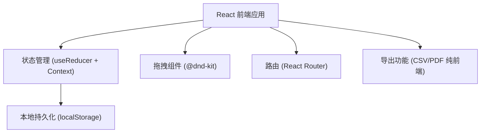
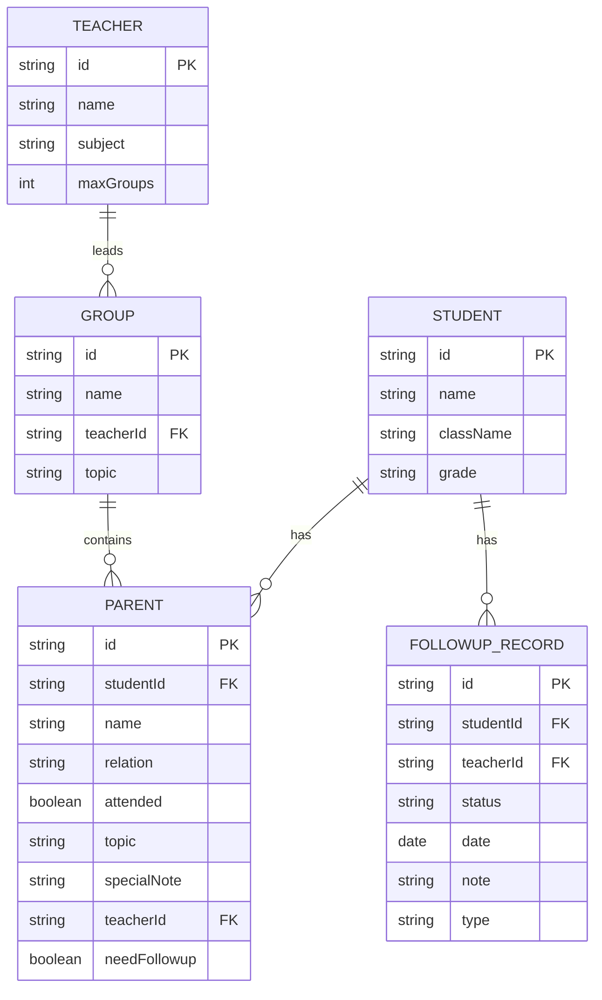

## 1. 架构设计

## 2. 技术描述

- **前端框架**: React@18 + TypeScript
- **构建工具**: Vite@5
- **样式方案**: TailwindCSS@3
- **状态管理**: React Context + useReducer
- **本地存储**: localStorage（数据持久化，刷新不丢失）
- **拖拽库**: @dnd-kit/core + @dnd-kit/sortable + @dnd-kit/utilities
- **路由**: React Router DOM@6
- **图标**: lucide-react
- **后端**: 无后端，纯前端应用
- **数据库**: localStorage 模拟

## 3. 路由定义

| 路由 | 用途 |
|------|------|
| / | 首页/身份选择 |
| /students | 学生与家长信息录入 |
| /groups | 分组管理（拖拽分组） |
| /export | 导出中心 |
| /followup | 跟进管理 |
| /grade-view | 年级组长视图 |

## 4. 数据模型

### 4.1 数据模型定义

### 4.2 数据实体说明

**Student（学生）**
- id: 唯一标识
- name: 学生姓名
- className: 班级
- grade: 年级

**Parent（家长）**
- id: 唯一标识
- studentId: 关联学生ID
- name: 家长姓名
- relation: 与学生关系（父亲/母亲/其他）
- attended: 是否到场
- topic: 沟通主题（学习习惯/同伴关系/其他）
- specialNote: 特殊备注（如离异家庭等）
- teacherId: 负责老师ID
- needFollowup: 是否需要会后跟进
- groupId: 所属小组ID

**Teacher（老师）**
- id: 唯一标识
- name: 老师姓名
- subject: 科目
- maxGroups: 最多带几组

**Group（小组）**
- id: 唯一标识
- name: 小组名称
- teacherId: 负责老师ID
- topic: 小组主题

**FollowupRecord（跟进记录）**
- id: 唯一标识
- studentId: 学生ID
- parentId: 家长ID
- teacherId: 负责老师ID
- status: 跟进状态（待跟进/进行中/已完成/需持续跟进）
- date: 跟进日期
- note: 跟进记录
- type: 跟进方式（面谈/电话/家访）

## 5. 核心功能模块

### 5.1 智能提醒模块

提醒类型及检测逻辑：

1. **老师带组过多**：统计每个老师负责的小组数，超过 maxGroups 时提醒
2. **特殊备注冲突**：同组内检测是否有"离异家庭"等不宜同组的特殊备注
3. **未到家长分组**：attended=false 的家长被分配到小组时提醒
4. **跟进无负责人**：needFollowup=true 但 teacherId 为空的家长提醒

### 5.2 拖拽分组模块

- 使用 @dnd-kit 实现流畅的拖拽体验
- 支持从"未分组池"拖入小组
- 支持小组间拖动交换
- 支持在小组内排序
- 移动端降级为点击选择+移动按钮

### 5.3 导出模块

- **座谈表导出**：按小组导出 CSV，包含小组名、负责老师、家长名单、沟通主题
- **跟进清单导出**：导出所有 needFollowup 的家庭 CSV，含学生/家长信息、负责老师、状态
- 纯前端实现，无需后端
