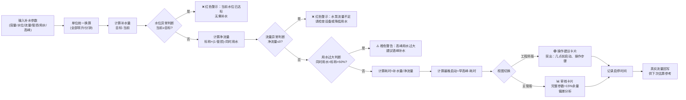

## 1. 产品概述

物业工程部夜间楼顶水塔补水耗时估算工具，解决水泵标称流量与实际管损不一致导致早高峰前补不满水被投诉的问题。

- 核心用途：输入水塔参数与用水情况，精确计算补水耗时与最晚启动时间，提供值班工程师操作建议与主管审核视图
- 目标用户：物业值班工程师（一线操作）、工程主管（审核与追溯）
- 价值：杜绝早高峰缺水投诉，建立补水历史数据闭环，持续优化估算准确度

## 2. 核心功能

### 2.1 用户角色

| 角色 | 登录方式 | 核心权限 |
|------|---------|---------|
| 值班工程师 | 无需登录 | 输入参数、查看耗时、记录启停时间、操作建议 |
| 工程主管 | 无需登录（视图切换） | 查看完整参数、保守余量估算、历史记录、审核数据 |

### 2.2 功能模块

1. **参数输入页**：水塔容量/单位选择、当前水位、目标水位、水泵标称流量/单位、管路损耗系数、同时用水量估计、早高峰时间
2. **估算结果页**：补水耗时（分钟/小时）、最晚启动时间、实际净流量、异常提示（水位超限/流量为零/用水过大）
3. **双视图切换**：值班工程师版（突出操作建议）、主管版（完整参数+15%保守余量）
4. **历史记录**：记录实际启动/停止时间、自动计算真实补水速度、供下次估算参考

### 2.3 页面详情

| 页面名称 | 模块名称 | 功能描述 |
|---------|---------|---------|
| 主页面 | 参数输入区 | 6组参数输入，支持吨/立方米/升每分钟混合单位，下拉选择 |
| 主页面 | 异常提示区 | 当前水位>目标、净流量≤0、估计用水过大时红色警示 |
| 主页面 | 估算结果卡片 | 显示补水量、净流量、耗时、最晚启动时间 |
| 主页面 | 角色视图切换 | Tab切换工程师版/主管版，主管版附加15%余量与完整参数表 |
| 主页面 | 操作建议区 | 工程师版：醒目倒计时建议、操作步骤、确认按钮 |
| 主页面 | 历史记录区 | 展示最近10次补水记录，含实际启停时间、真实流量、估算偏差 |
| 主页面 | 启停记录弹窗 | 记录实际启动/停止时间，自动回填计算真实速度 |

## 3. 核心流程

用户输入参数后，系统自动进行单位换算→计算补水量→扣除管损与同时用水→计算净流量→判断异常→生成耗时与最晚启动时间→按角色呈现视图→完成补水后记录实际时间→更新历史数据库。

## 4. 用户界面设计

### 4.1 设计风格

- **主色调**：深蓝工业风 `#0A2540`（专业/可靠），点缀水蓝 `#00B8D9`（水元素），警示橙 `#FF5630`、警告黄 `#FFAB00`、成功绿 `#36B37E`
- **按钮风格**：直角微圆角(4px)，厚实高度(48px)，工程仪表板风格，主按钮渐变深蓝+发光边框
- **字体**：标题使用 `JetBrains Mono`（等宽数字，工程仪表感），正文使用 `Noto Sans SC`（中文可读性）
- **布局风格**：卡片式分区，左侧参数面板+右侧结果面板的双栏桌面布局，参数区用类似仪表刻度的输入框
- **图标风格**：线性工程图标（⚙️ 🔧 💧 📊 ⏰），数字使用等宽字体强化读数感

### 4.2 页面设计概览

| 页面名称 | 模块名称 | UI元素 |
|---------|---------|--------|
| 主页面 | 顶部标题栏 | 深蓝渐变背景，水滴滴落微动效，大标题「水塔补水耗时估算系统」，右上角视图切换Tab |
| 主页面 | 参数输入面板 | 6组参数卡片，每组带工程图标+单位下拉，输入框底部有彩色刻度线，数值变化有数字滚动动画 |
| 主页面 | 异常提示条 | 顶部悬浮警示条，红/橙/黄三色，带闪烁脉冲动画，可关闭 |
| 主页面 | 结果展示面板 | 大卡片布局，关键指标（耗时/启动时间）用巨型数字展示，其他指标网格排列 |
| 主页面 | 操作建议区 | 工程师版：绿色渐变大卡片，大号倒计时指示，1-2-3操作步骤清单，底部「已启动」「已停止」按钮 |
| 主页面 | 主管审核区 | 主管版：参数明细表+15%保守余量列，历史偏差趋势小图，签名栏 |
| 主页面 | 历史记录 | 底部时间线卡片，最近10次记录，悬停展开详情，真实vs估算对比色条 |

### 4.3 响应式

- **桌面优先**：≥1280px，双栏布局（参数40% + 结果60%）
- **平板适配**：768-1279px，单栏堆叠，结果区置于参数区下方
- **手机适配**：<768px，紧凑单栏，巨型数字缩放，按钮全宽
- **触控优化**：所有可点击元素≥44×44px，关键操作按钮放大

### 4.4 动效与细节

- 数字变化：使用 CSS counter 动画模拟仪表数字滚动
- 水元素：背景细微蓝色粒子浮动，模拟水中气泡
- 警示动画：异常提示出现时边框红光脉冲
- 卡片交互：悬停上浮4px+阴影加深
- 页面加载：从上到下渐次显现（staggered reveal）
