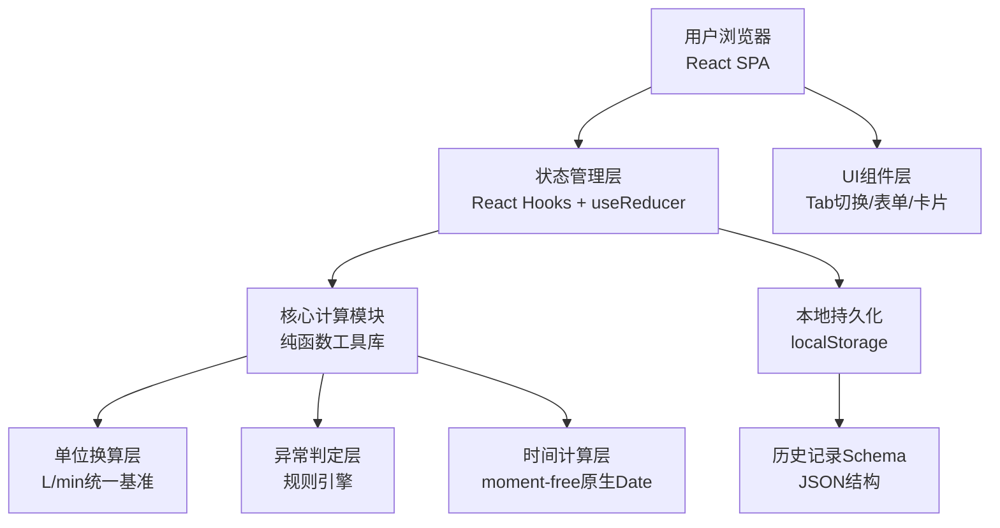

## 1. 架构设计



## 2. 技术描述

- **前端**：React@18 + TypeScript + tailwindcss@3 + vite
- **初始化工具**：vite-init
- **后端**：None（纯前端应用，所有数据本地化）
- **数据存储**：localStorage 存储历史补水记录与用户偏好
- **状态管理**：React useState + useReducer + useContext，避免过度设计
- **日期处理**：原生 Intl.DateTimeFormat + Date API，不引入 moment/day.js

## 3. 路由定义

| 路由 | 用途 |
|-----|------|
| / | 主页面（单页应用，所有功能在同一页完成） |

> 本应用为单页工具，无需多路由。所有模块通过组件状态控制显隐。

## 4. 数据模型

### 4.1 输入参数模型

```typescript
// 单位枚举
type VolumeUnit = 'ton' | 'cubicMeter' | 'liter';
type FlowUnit = 'lpm' | 'lph' | 'tph' | 'cmh'; // 升/分、升/时、吨/时、方/时
type PercentUnit = 'percent';

interface InputParams {
  // 水塔容量
  tankCapacity: number;
  tankCapacityUnit: VolumeUnit;
  
  // 当前水位（%或体积）
  currentWaterLevel: number;
  currentLevelType: 'percent' | 'volume';
  currentLevelUnit: VolumeUnit;
  
  // 目标水位
  targetWaterLevel: number;
  targetLevelType: 'percent' | 'volume';
  targetLevelUnit: VolumeUnit;
  
  // 水泵标称流量
  pumpFlowRate: number;
  pumpFlowUnit: FlowUnit;
  
  // 管路损耗 0-1 或 0%-100%
  pipeLoss: number;
  pipeLossType: 'ratio' | 'percent';
  
  // 同时用水估计
  concurrentUsage: number;
  concurrentUsageUnit: FlowUnit;
  
  // 早高峰时间
  morningPeakTime: string; // HH:mm 格式
}
```

### 4.2 计算结果模型

```typescript
interface CalculationWarnings {
  levelExceeded: boolean;      // 当前水位≥目标
  zeroFlow: boolean;            // 净流量≤0
  excessiveUsage: boolean;      // 同时用水>标称50%
  messages: string[];
}

interface CalculationResult {
  // 基础换算（统一单位：升、升/分钟）
  tankCapacityLiters: number;
  currentLiters: number;
  targetLiters: number;
  requiredLiters: number;         // 需要补的水量
  
  // 流量计算
  nominalFlowLpm: number;         // 标称流量 升/分
  pipeLossAmount: number;         // 管损流量
  concurrentUsageLpm: number;     // 同时用水 升/分
  netFlowLpm: number;             // 净流量 = 标称×(1-管损)-同时用水
  
  // 时间计算
  fillMinutesExact: number;       // 精确耗时（分钟，可能小数）
  fillMinutesRounded: number;     // 向上取整分钟
  fillDurationDisplay: string;    // "2小时35分钟"
  
  latestStartTime: Date;          // 最晚启动时间（Date对象）
  latestStartDisplay: string;     // "凌晨 02:25"
  
  // 主管版余量
  conservativeBufferPct: number;  // 15%
  conservativeMinutes: number;    // 含余量耗时
  conservativeStartTime: Date;    // 含余量启动时间
  
  // 异常
  warnings: CalculationWarnings;
}
```

### 4.3 历史记录模型

```typescript
interface FillHistoryRecord {
  id: string;                    // UUID
  createdAt: number;             // 创建时间戳
  paramsSnapshot: InputParams;   // 当时的输入参数快照
  estimatedResult: Pick<CalculationResult, 
    'requiredLiters' | 'fillMinutesExact' | 'netFlowLpm'>;
  
  // 工程师补录的实际数据
  actualStartTime: number | null;   // 实际启动时间戳
  actualStopTime: number | null;    // 实际停止时间戳
  actualFillMinutes: number | null; // 实际耗时（自动计算）
  
  // 实际水位验证
  actualStopLevel: number | null;   // 实际停止时水位
  actualStopLevelUnit: VolumeUnit | null;
  
  // 回算的真实速度
  actualFlowLpm: number | null;     // 真实净流量 升/分
  estimateAccuracyPct: number | null; // 估算准确度（实际vs计划）
  
  // 备注
  notes: string;
  engineerName: string;
}

interface HistoryStore {
  records: FillHistoryRecord[];
  lastUpdated: number;
}
```

## 5. 核心工具函数

### 5.1 单位换算

```typescript
// 体积换算：转升
const toLiters = (value: number, unit: VolumeUnit): number => {
  switch (unit) {
    case 'ton': return value * 1000;           // 1吨水=1000升
    case 'cubicMeter': return value * 1000;     // 1方=1000升
    case 'liter': return value;
  }
};

// 流量换算：转升/分钟
const toLpm = (value: number, unit: FlowUnit): number => {
  switch (unit) {
    case 'lpm': return value;
    case 'lph': return value / 60;
    case 'tph': return (value * 1000) / 60;     // 吨/时 → 升/分
    case 'cmh': return (value * 1000) / 60;     // 方/时 → 升/分
  }
};
```

### 5.2 计算主函数

```typescript
function calculateFillTime(params: InputParams): CalculationResult {
  // 1. 统一单位
  // 2. 计算当前/目标/补水量
  // 3. 计算标称/管损/同时用水/净流量
  // 4. 异常判定
  // 5. 耗时与最晚启动时间
  // 6. 主管版余量
  // 7. 返回完整结果
}
```

## 6. 组件划分

```
App.tsx (根组件，状态容器)
├── Header.tsx          (标题 + 视图切换Tab)
├── AlertBanner.tsx     (异常提示横幅)
├── ParameterPanel.tsx  (参数输入区)
│   ├── ParamInput.tsx  (单参数输入组件，含单位下拉)
│   └── TimePicker.tsx  (早高峰时间选择)
├── ResultPanel.tsx     (结果展示区)
│   ├── EngineerView.tsx (工程师版视图)
│   └── SupervisorView.tsx (主管版视图)
├── ActionButtons.tsx   (启动/停止记录按钮)
├── HistoryTimeline.tsx (历史记录时间线)
└── RecordModal.tsx     (启停时间补录弹窗)
```
