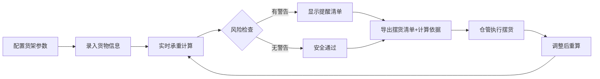

## 1. 产品概述

货架层板承重分配计算器，解决仓库小家电入库时层板承重不均导致的压弯风险问题。通过输入货架参数和货物信息，自动计算每层总重、局部集中载荷风险和安全余量，生成摆货清单和主管审核报告。

- 核心用户：仓库主管、仓管员
- 核心价值：避免层板压弯、规范摆货流程、留存计算依据

## 2. 核心功能

### 2.1 用户角色
| 角色 | 使用场景 | 核心权限 |
|------|---------|---------|
| 仓库主管 | 设置货架参数、审核计算报告、留档 | 查看完整报告、导出计算依据 |
| 仓管员 | 输入货物信息、执行摆货、调整后重算 | 输入数据、查看摆货清单、重新计算 |

### 2.2 功能模块
1. **货架配置页**：设置层板限重、层数、层板尺寸、建议单件上限
2. **货物录入页**：录入箱子重量（支持公斤/斤/磅）、尺寸、数量、摆放位置
3. **计算结果页**：每层总重、局部风险热力图、安全余量、超限警告
4. **报告导出页**：仓管摆货清单、主管计算依据报告（覆盖旧报告）

### 2.3 页面详情
| 页面名称 | 模块名称 | 功能描述 |
|---------|---------|---------|
| 主工作台 | 货架信息卡 | 展示当前货架配置，快捷切换货架 |
| 主工作台 | 货物录入表单 | 逐箱或批量录入货物信息，位置可视化选择 |
| 主工作台 | 实时计算面板 | 动态显示每层承重、风险等级、安全余量 |
| 主工作台 | 警告通知区 | 箱子为零、超重单件、重货集中等提醒 |
| 报告弹窗 | 摆货清单 | 分层展示货物位置与重量，供仓管执行 |
| 报告弹窗 | 计算依据 | 详细公式、每箱贡献占比、超限分析，供主管留档 |

## 3. 核心流程

用户录入货架和货物信息后，系统实时计算承重分布；触发导出时生成两份报告；仓管调整摆放后可重新计算，新结果自动覆盖旧建议。

## 4. 用户界面设计

### 4.1 设计风格
- **主色**：工业蓝 `#1e40af`（专业可信），搭配钢灰 `#374151`
- **强调色**：警告橙 `#f97316`、危险红 `#dc2626`、安全绿 `#16a34a`
- **按钮风格**：方角硬朗边框，hover 时轻微上浮阴影，体现工业工具感
- **字体**：标题用「思源黑体 Heavy」，正文用「思源宋体 Normal」，数据用等宽字体「JetBrains Mono」
- **布局风格**：左表单 + 右可视化面板的双栏工作台，数据网格 + 热力图
- **图标风格**：Lucide 线性图标，配合货架箱型示意图

### 4.2 页面设计概述
| 页面名称 | 模块名称 | UI 元素 |
|---------|---------|---------|
| 主工作台 | 货架信息卡 | 蓝灰渐变卡、大号限重数字、层级标签 |
| 主工作台 | 货物录入表单 | 分组折叠面板、单位切换下拉、位置九宫格选择器 |
| 主工作台 | 实时计算面板 | 层板侧视图、每层承重进度条（绿/橙/红变色）、风险热力色块 |
| 主工作台 | 警告通知区 | 左侧色条的提醒卡片，图标+标题+详情三级结构 |
| 报告弹窗 | 双标签切换 | 摆货清单（表格+位置图）、计算依据（公式+占比饼图） |

### 4.3 响应性
桌面端优先（1280px+），双栏布局；平板端折叠为上下堆叠；移动端采用全屏表单+滑动查看计算结果。所有数据表格支持横向滚动。

### 4.4 可视化设计
- **层板侧视图**：每层用矩形表示，颜色根据承重比例从绿渐变到红
- **局部热力图**：将层板分为 3×3 九宫格，每个格子颜色深浅表示局部载荷集中程度
- **贡献占比**：环形图展示每层中各箱货物的重量贡献，突出最大贡献者
