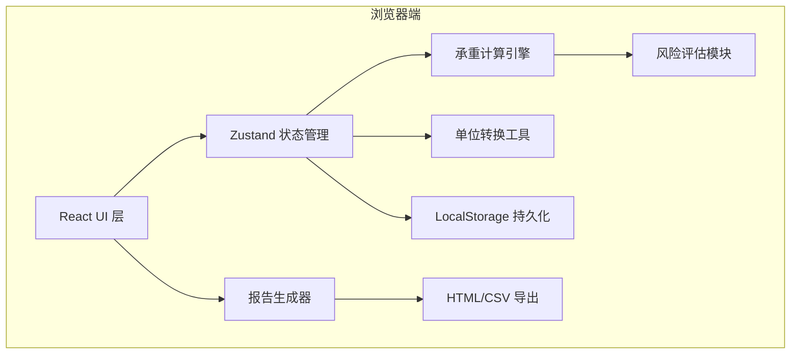
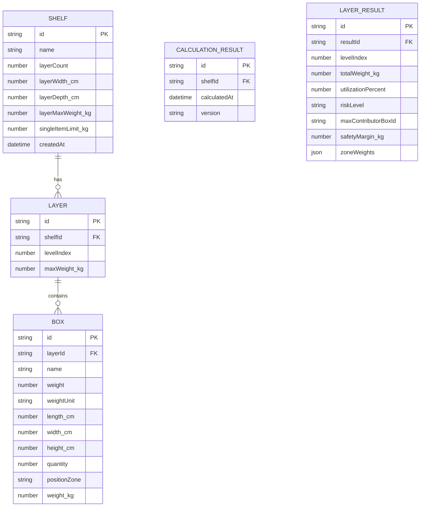

## 1. 架构设计

纯前端单页应用，无后端依赖。使用浏览器 LocalStorage 持久化货架配置和最近一次计算结果，支持报告导出为本地文件。



## 2. 技术描述
- **前端框架**：React@18 + TypeScript + Vite
- **样式方案**：Tailwind CSS@3
- **状态管理**：Zustand（货架/货物/计算结果三个 store 切片）
- **图表可视化**：Recharts（轻量级 React 图表库，用于占比图和进度条）
- **图标库**：lucide-react
- **持久化**：浏览器 LocalStorage（无需后端）
- **报告导出**：原生 Blob + File API，支持 HTML 报告和 CSV 清单

## 3. 路由定义
| 路由 | 用途 |
|------|------|
| `/` | 主工作台（货架配置 + 货物录入 + 实时计算 + 警告区，单页应用主要内容全部在此） |

## 4. 数据模型

### 4.1 数据实体定义



### 4.2 TypeScript 核心类型

```typescript
type WeightUnit = 'kg' | 'jin' | 'lb';
type RiskLevel = 'safe' | 'warning' | 'danger';
type PositionZone = 'tl' | 'tc' | 'tr' | 'ml' | 'mc' | 'mr' | 'bl' | 'bc' | 'br';

interface ShelfConfig {
  id: string;
  name: string;
  layerCount: number;
  layerWidth_cm: number;
  layerDepth_cm: number;
  layerMaxWeight_kg: number;
  singleItemLimit_kg: number;
}

interface BoxItem {
  id: string;
  layerIndex: number;
  name: string;
  weight: number;
  weightUnit: WeightUnit;
  length_cm: number;
  width_cm: number;
  height_cm: number;
  quantity: number;
  positionZone: PositionZone;
}

interface LayerResult {
  layerIndex: number;
  totalWeight_kg: number;
  utilizationPercent: number;
  riskLevel: RiskLevel;
  safetyMargin_kg: number;
  maxContributor: { boxId: string; boxName: string; weight_kg: number; percent: number };
  zoneWeights: Record<PositionZone, number>;
  centerConcentrationRatio: number;
  warnings: string[];
}

interface CalculationReport {
  id: string;
  shelfId: string;
  calculatedAt: string;
  version: number;
  shelfConfig: ShelfConfig;
  boxes: BoxItem[];
  layerResults: LayerResult[];
  globalWarnings: string[];
  totalWeight_kg: number;
}

interface WarningItem {
  type: 'error' | 'warning' | 'info';
  code: string;
  message: string;
  detail?: string;
  layerIndex?: number;
  boxId?: string;
}
```

## 5. 核心计算逻辑

### 5.1 单位转换
```
1 斤 = 0.5 kg
1 磅(lb) = 0.45359237 kg
所有内部计算统一转 kg，展示时按需转回
```

### 5.2 承重计算
- 每层总重 = Σ(每箱重量_kg × 数量)
- 利用率 = 每层总重 / 层板限重 × 100%
- 安全余量 = 层板限重 - 每层总重
- 风险等级：< 80% 安全，80%-100% 警告，≥ 100% 危险

### 5.3 局部集中风险
- 九宫格分区权重：中心(mc)承载权重 × 1.3，四角(tl/tr/bl/br) × 0.9，侧边(tc/bc/ml/mr) × 1.0
- 中心集中度 = 中心区重量 / 该层总重
- 中心集中度 > 60% 触发「重货集中在中间」警告

### 5.4 全局警告规则
| 规则编码 | 触发条件 | 等级 |
|---------|---------|------|
| EMPTY_BOX | 某层箱子数量为 0 | info |
| OVER_SINGLE_LIMIT | 单件重量（换算后）> 建议单件上限 | warning |
| OVER_LAYER_LIMIT | 某层总重 ≥ 层板限重 | danger |
| CENTER_HEAVY | 中心集中度 > 60% | warning |
| MIXED_UNITS | 同一层混用公斤/斤/磅 | info |
| WEIGHT_MISMATCH | 箱子尺寸大但重量异常轻/重 | warning |

### 5.5 最大贡献者识别
- 每层找出单箱重量 × 数量最大的货物，标记为「最大贡献者」
- 计算其占该层总重百分比，报告中突出显示

## 6. 文件结构

```
src/
├── types/
│   └── index.ts              # 所有类型定义
├── store/
│   └── useAppStore.ts        # Zustand store（shelf/boxes/report 切片）
├── utils/
│   ├── unitConverter.ts      # 公斤/斤/磅 转换
│   ├── calculator.ts         # 核心承重计算引擎
│   ├── warningEngine.ts      # 警告规则引擎
│   └── reportExporter.ts     # HTML/CSV 报告生成
├── components/
│   ├── ShelfConfigForm.tsx   # 货架配置表单
│   ├── BoxInputForm.tsx      # 货物录入表单
│   ├── PositionPicker.tsx    # 九宫格位置选择器
│   ├── UnitSelect.tsx        # 单位切换选择器
│   ├── LayerVisualization.tsx# 层板侧视图+进度条
│   ├── HeatmapView.tsx       # 局部热力图
│   ├── WarningList.tsx       # 警告通知列表
│   ├── ReportModal.tsx       # 报告弹窗（摆货清单/计算依据）
│   └── ContributorChart.tsx  # 贡献占比环形图
├── pages/
│   └── Workbench.tsx         # 主工作台页面
├── App.tsx
├── main.tsx
└── index.css
```
