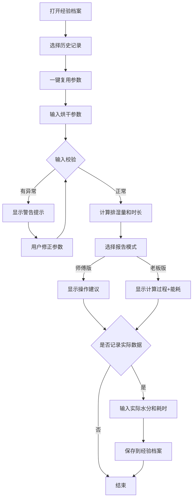

## 1. 产品概述

烘干房排湿估算工具，帮助小加工厂的师傅和老板快速估算烘干红薯片、果干等物料的排湿水量和烘干时长，解决雨天湿度高时凭经验调温不准的问题。同时支持经验数据留档，让同类物料的烘干参数可复用。

**核心目标用户：**
- 烘干师傅：需要简洁的操作建议
- 工厂老板：需要完整的计算过程和能耗数据

## 2. 核心功能

### 2.1 用户角色

| 角色 | 使用场景 | 核心需求 |
|------|----------|----------|
| 烘干师傅 | 日常烘干作业 | 快速得到操作建议，看懂就行 |
| 工厂老板 | 成本核算、生产计划 | 完整计算过程、能耗估算、数据存档 |

### 2.2 功能模块

1. **参数输入模块**：物料重量、初始含水率、目标含水率、烘房温度、风量、环境湿度
2. **智能校验模块**：输入格式校验、异常值提示（百分比小数混写、目标水分高于初始、风量缺失、温度过高）
3. **排湿计算模块**：排出水量计算、烘干时长估算、能耗估算
4. **双模式报告**：师傅版（简洁操作建议）、老板版（完整计算过程+能耗）
5. **经验档案模块**：记录实际烘干数据、按物料分类存档、一键复用历史参数

### 2.3 页面详情

| 页面名称 | 模块名称 | 功能描述 |
|-----------|-------------|---------------------|
| 首页（估算器） | 参数输入区 | 6个输入项：物料名称、重量、初始含水率、目标含水率、烘房温度、风量、环境湿度 |
| 首页（估算器） | 校验提示区 | 实时显示输入警告，红/黄/绿三色提示 |
| 首页（估算器） | 报告切换区 | 师傅版/老板版切换按钮 |
| 首页（估算器） | 结果展示区 | 根据模式展示不同详细程度的计算结果 |
| 首页（估算器） | 记录实际数据区 | 输入实际水分和耗时，保存到经验库 |
| 经验档案页 | 物料分类列表 | 按物料名称分组展示历史记录 |
| 经验档案页 | 记录详情 | 查看某条记录的完整参数和实际数据 |
| 经验档案页 | 一键复用 | 将历史参数回填到估算器 |

## 3. 核心流程

## 4. 用户界面设计

### 4.1 设计风格

**整体风格：工业实用风 + 温暖质感**
- 呼应烘干、温暖的工作场景
- 数据清晰易读，适合车间环境使用
- 操作简单直观，师傅上手快

**色彩方案：**
- 主色：暖橙色 `#E67E22`（代表温暖、烘干、活力）
- 辅助色：深棕色 `#8B4513`（代表红薯、果干的自然色调）
- 中性色：暖灰色系，米白色背景
- 警告色：红色 `#E74C3C`、黄色 `#F39C12`、成功绿 `#27AE60`

**字体：**
- 标题：思源黑体 / Noto Sans SC Bold，稳重有力
- 正文：思源黑体 / Noto Sans SC Regular，清晰易读
- 数字数据：等宽字体，方便对齐对比

**布局：**
- 卡片式布局，输入区与结果区分区明确
- 左侧输入、右侧结果的双栏布局（桌面端）
- 移动端上下堆叠
- 圆角卡片 + 柔和阴影，温暖不刺眼

### 4.2 页面设计概览

| 页面名称 | 模块名称 | UI元素 |
|-----------|-------------|-------------|
| 首页 | 参数输入卡片 | 暖橙色标题栏、6组带标签的输入框、图标辅助 |
| 首页 | 校验提示区 | 带图标的警告条，红/黄/绿三色 |
| 首页 | 模式切换 | 分段切换控件，师傅版/老板版 |
| 首页 | 结果卡片 | 大数字展示排湿量和时长，操作建议列表 |
| 首页 | 记录区 | 折叠面板，输入实际数据后保存 |
| 经验档案页 | 分类列表 | 按物料名称分组的卡片列表 |
| 经验档案页 | 记录项 | 物料名称、日期、初始/目标水分、实际耗时 |
| 经验档案页 | 复用按钮 | 橙色主按钮，一键回填 |

### 4.3 响应式

- 桌面端（≥1024px）：左右双栏布局，输入区在左，结果区在右
- 平板端（768-1023px）：上下堆叠，全宽卡片
- 移动端（<768px）：紧凑布局，大按钮方便触摸操作

### 4.4 交互动效

- 输入校验实时反馈，输入框边框变色提示
- 结果数字滚动动画，增加专业感
- 模式切换时平滑过渡
- 卡片悬停微上浮效果
- 保存成功的toast提示
