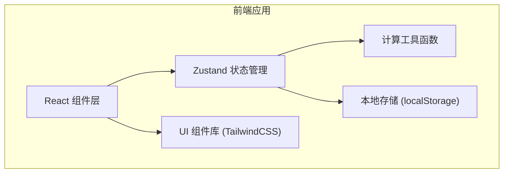

## 1. 架构设计



**纯前端应用，无需后端**：数据全部存储在浏览器 localStorage 中，适合车间离线使用。

## 2. 技术描述

- **前端框架**：React@18 + TypeScript
- **构建工具**：Vite
- **样式方案**：TailwindCSS@3
- **状态管理**：Zustand
- **路由**：react-router-dom
- **图标**：lucide-react
- **数据存储**：localStorage
- **初始化工具**：vite-init

## 3. 路由定义

| 路由 | 页面 | 用途 |
|-------|------|------|
| / | 估算器首页 | 参数输入、计算、结果展示 |
| /history | 经验档案页 | 历史记录查看、复用 |

## 4. 核心数据模型

### 4.1 烘干参数 (DryingParams)

```typescript
interface DryingParams {
  materialName: string;      // 物料名称
  weight: number;            // 物料重量 (kg)
  initialMoisture: number;   // 初始含水率 (百分比，如 60 表示 60%)
  targetMoisture: number;    // 目标含水率 (百分比)
  temperature: number;       // 烘房温度 (°C)
  airFlow: number;           // 风量 (m³/h)
  ambientHumidity: number;   // 环境湿度 (百分比)
}
```

### 4.2 计算结果 (DryingResult)

```typescript
interface DryingResult {
  waterToRemove: number;     // 需要排出的水量 (kg)
  estimatedTime: number;     // 估算烘干时长 (小时)
  energyConsumption: number; // 能耗估算 (kWh)
  hourlyDehumidification: number; // 每小时排湿量 (kg/h)
  dryMatterWeight: number;   // 干物质重量 (kg)
}
```

### 4.3 校验警告 (ValidationWarning)

```typescript
interface ValidationWarning {
  type: 'error' | 'warning' | 'info';
  field: string;
  message: string;
}
```

### 4.4 经验记录 (DryingRecord)

```typescript
interface DryingRecord {
  id: string;
  date: string;              // 记录日期
  params: DryingParams;      // 烘干参数
  result: DryingResult;      // 计算结果
  actualMoisture: number;    // 实际最终含水率
  actualTime: number;        // 实际耗时 (小时)
  notes: string;             // 备注
}
```

## 5. 核心计算逻辑

### 5.1 排湿量计算

```
干物质重量 = 物料重量 × (1 - 初始含水率/100)
最终总重量 = 干物质重量 / (1 - 目标含水率/100)
需要排出的水量 = 物料重量 - 最终总重量
```

### 5.2 烘干时长估算

基于经验公式，综合考虑温度、风量、环境湿度：

```
基础排湿速率 = f(温度, 风量)
湿度修正系数 = g(环境湿度)
每小时排湿量 = 基础排湿速率 × 湿度修正系数
估算时长 = 需要排出的水量 / 每小时排湿量
```

### 5.3 能耗估算

```
能耗 = 烘干时长 × 单位时间能耗
单位时间能耗 = 基础加热功率 + 风机功率
```

## 6. 文件结构

```
src/
├── components/          # 通用组件
│   ├── InputCard.tsx    # 输入卡片
│   ├── ResultCard.tsx   # 结果卡片
│   ├── WarningList.tsx  # 警告提示列表
│   ├── ModeSwitch.tsx   # 模式切换
│   └── RecordForm.tsx   # 记录实际数据表单
├── pages/               # 页面
│   ├── Calculator.tsx   # 估算器首页
│   └── History.tsx      # 经验档案页
├── store/               # 状态管理
│   └── useDryingStore.ts
├── utils/               # 工具函数
│   ├── calculator.ts    # 核心计算逻辑
│   ├── validation.ts    # 输入校验
│   └── storage.ts       # 本地存储
├── types/               # 类型定义
│   └── index.ts
├── App.tsx
├── main.tsx
└── index.css
```
