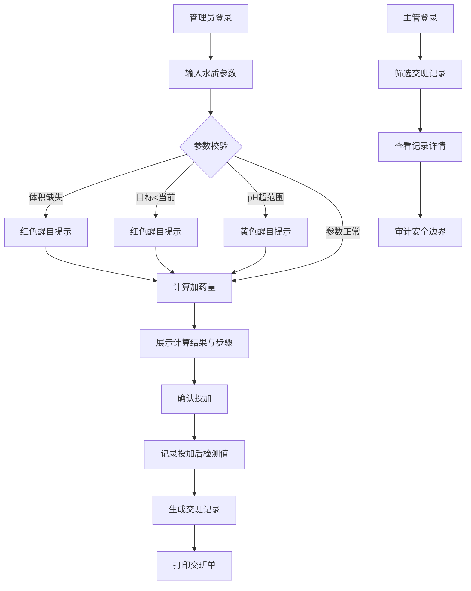

## 1. 产品概述

泳池加药量复核系统，面向泳池晚班管理员和主管，用于根据水质检测值精确计算药剂投加量，避免新人多加或少加，同时记录交班信息供主管留档抽查。

- 核心用户：泳池晚班管理员（执行加药）、主管（审核留档）
- 解决问题：单位换算复杂、新人容易加错药量、交班记录不完整、安全边界不可追溯
- 产品价值：降低加药错误风险、规范交班流程、实现安全审计追溯

## 2. 核心功能

### 2.1 用户角色

| 角色 | 登录方式 | 核心权限 |
|------|----------|----------|
| 管理员 | 姓名工号选择 | 加药量计算、创建交班记录、打印交班单 |
| 主管 | 姓名工号选择 | 查看全部交班记录、抽查审计、查看安全边界越界记录 |

### 2.2 功能模块

1. **加药量计算页**：输入池体参数和水质指标，计算建议加药量并展示关键步骤
2. **交班记录页**：查看交班列表、创建新交班记录、打印交班单
3. **主管抽查页**：按时间/人员筛选记录、查看原始输入、审计安全边界

### 2.3 页面详情

| 页面名称 | 模块名称 | 功能描述 |
|----------|----------|----------|
| 加药量计算页 | 参数输入区 | 池体体积、当前余氯、目标余氯、pH、药剂类型、药剂浓度、浓度单位、投加方式 |
| 加药量计算页 | 醒目提示区 | 目标低于当前（红色警告）、体积缺失（红色警告）、pH超范围（黄色警告） |
| 加药量计算页 | 计算结果区 | 建议加药量、单位换算过程、关键步骤解释、安全边界提示 |
| 加药量计算页 | 快捷操作区 | 保存到交班记录、打印计算单 |
| 交班记录页 | 记录列表区 | 按日期倒序展示交班记录，显示值班人、投加前后指标、是否越界 |
| 交班记录页 | 记录详情区 | 完整原始输入、计算过程、投加后复测值、签名确认 |
| 交班记录页 | 打印功能 | 生成可打印交班单格式 |
| 主管抽查页 | 筛选查询区 | 按时间范围、值班人员、是否越界筛选 |
| 主管抽查页 | 审计详情区 | 谁计算的、谁投的、原始输入、越界原因、处理措施 |

## 3. 核心流程

管理员使用流程：
管理员选择身份 → 输入池体体积和水质指标 → 系统实时校验并提示异常 → 系统计算建议加药量并展示步骤 → 管理员确认并执行投加 → 记录投加后复测值 → 生成交班记录 → 打印交班单

主管抽查流程：
主管选择身份 → 进入抽查页面 → 按条件筛选交班记录 → 查看记录详情（原始输入、计算过程、越界情况） → 确认或批注

## 4. 用户界面设计

### 4.1 设计风格

- 主色调：深海蓝（#0C4A6E），代表水和专业感
- 辅助色：警示红（#DC2626）用于危险提示，警戒黄（#CA8A04）用于警告，安全绿（#16A34A）用于正常状态
- 按钮风格：圆角矩形，主按钮有轻微立体阴影，危险按钮红色醒目
- 字体：使用 Noto Sans SC 中文衬线字体，数字使用等宽字体增强可读性
- 布局风格：卡片式布局，顶部导航栏，左侧角色信息区
- 图标风格：使用线性图标，简洁专业

### 4.2 页面设计概述

| 页面名称 | 模块名称 | UI 元素 |
|----------|----------|---------|
| 加药量计算页 | 参数输入区 | 两列表单布局，下拉选择器，数字输入框带单位选择 |
| 加药量计算页 | 醒目提示区 | 顶部横幅式提示，红色背景闪烁动画，黄色背景呼吸动画 |
| 加药量计算页 | 计算结果区 | 大号数字展示结果，步骤卡片式排列，关键数值高亮 |
| 加药量计算页 | 快捷操作区 | 底部固定操作栏，主按钮突出 |
| 交班记录页 | 记录列表区 | 表格布局，斑马纹，越界记录红色标记 |
| 主管抽查页 | 审计详情区 | 时间线布局展示操作流程，操作人信息卡片 |

### 4.3 响应性

- 桌面端优先设计（1280px 以上）
- 平板端自适应（768px-1279px）：表单变为单列
- 移动端适配（768px 以下）：导航折叠，卡片堆叠
- 打印样式优化：隐藏导航和操作按钮，只保留核心内容

### 4.4 动效建议

- 醒目提示出现时有滑入动画和轻微震动效果
- 计算结果数字有递增动画
- 页面切换有淡入淡出过渡
- 按钮点击有按压反馈效果
