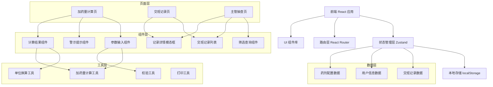
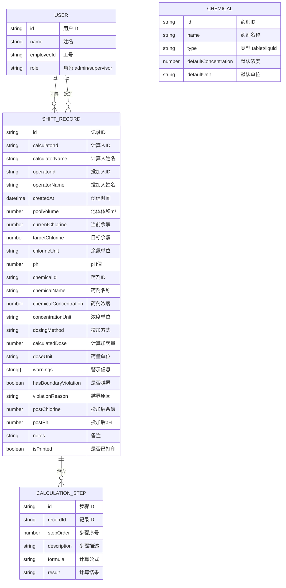

## 1. 架构设计



## 2. 技术描述

- 前端：React@18 + TypeScript + Vite
- 状态管理：Zustand
- 路由：react-router-dom@6
- 样式：TailwindCSS@3
- 图标：lucide-react
- 数据持久化：localStorage
- 打印：浏览器原生打印 API + 打印样式
- 初始化工具：vite-init

## 3. 路由定义

| 路由路径 | 页面名称 | 说明 |
|---------|----------|------|
| / | 重定向到计算页 | 默认入口 |
| /calculator | 加药量计算页 | 核心计算功能 |
| /records | 交班记录页 | 交班记录列表与详情 |
| /audit | 主管抽查页 | 审计与抽查功能 |

## 4. 数据模型

### 4.1 数据模型定义



### 4.2 类型定义

```typescript
// 用户类型
interface User {
  id: string;
  name: string;
  employeeId: string;
  role: 'admin' | 'supervisor';
}

// 药剂类型
interface Chemical {
  id: string;
  name: string;
  type: 'tablet' | 'liquid';
  defaultConcentration: number;
  defaultUnit: 'percent' | 'mgL' | 'ppm';
}

// 计算参数
interface CalculationParams {
  poolVolume: number | null;
  currentChlorine: number | null;
  targetChlorine: number | null;
  chlorineUnit: 'mgL' | 'ppm';
  ph: number | null;
  chemicalId: string;
  chemicalConcentration: number | null;
  concentrationUnit: 'percent' | 'mgL' | 'ppm';
  dosingMethod: 'direct' | 'diluted' | 'feeder';
}

// 警示信息
interface Warning {
  type: 'danger' | 'warning' | 'info';
  message: string;
  code: string;
}

// 计算步骤
interface CalculationStep {
  stepOrder: number;
  description: string;
  formula: string;
  result: string;
}

// 计算结果
interface CalculationResult {
  dose: number;
  doseUnit: 'g' | 'kg' | 'mL' | 'L';
  steps: CalculationStep[];
  warnings: Warning[];
  hasBoundaryViolation: boolean;
  violationReason?: string;
}

// 交班记录
interface ShiftRecord {
  id: string;
  calculatorId: string;
  calculatorName: string;
  operatorId: string;
  operatorName: string;
  createdAt: string;
  poolVolume: number | null;
  currentChlorine: number | null;
  targetChlorine: number | null;
  chlorineUnit: 'mgL' | 'ppm';
  ph: number | null;
  chemicalId: string;
  chemicalName: string;
  chemicalConcentration: number | null;
  concentrationUnit: 'percent' | 'mgL' | 'ppm';
  dosingMethod: 'direct' | 'diluted' | 'feeder';
  calculatedDose: number;
  doseUnit: 'g' | 'kg' | 'mL' | 'L';
  warnings: Warning[];
  hasBoundaryViolation: boolean;
  violationReason?: string;
  postChlorine: number | null;
  postPh: number | null;
  notes: string;
  isPrinted: boolean;
  steps: CalculationStep[];
}
```

## 5. 核心算法

### 5.1 加药量计算公式

片剂有效氯投加量计算公式：

```
所需有效氯量 (g) = 池体体积 (m³) × 1000 × (目标余氯 - 当前余氯) (mg/L)

药剂投加量 = 所需有效氯量 ÷ 药剂有效氯浓度
```

### 5.2 单位换算

- 1 ppm = 1 mg/L（余氯换算）
- 百分浓度 → mg/L：百分比 × 10000
- mg/L → 百分浓度：mg/L ÷ 10000
- ppm → 百分浓度：ppm ÷ 10000

### 5.3 安全边界规则

- pH 正常范围：7.2 - 7.8
- 余氯正常范围：0.3 - 5.0 mg/L
- 目标余氯低于当前余氯：不建议投加
- 池体体积缺失：无法计算，必须填写
- 单次投加量超过日常用量3倍：警示提示
