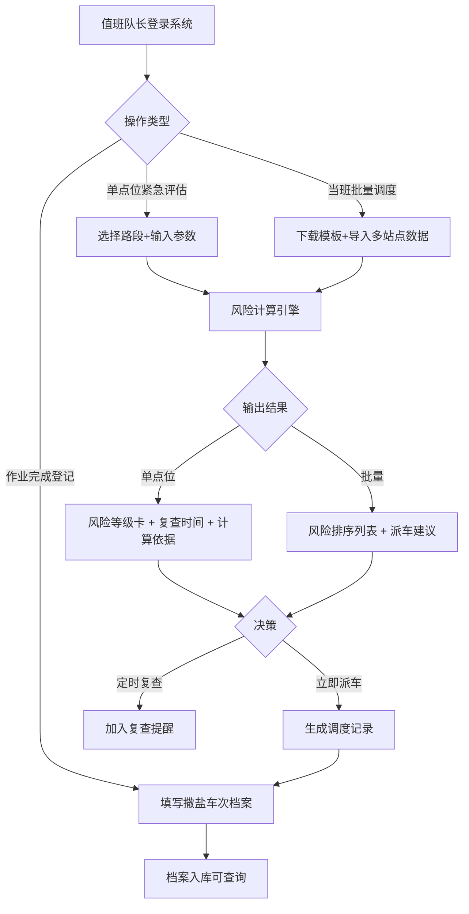

## 1. 产品概述

桥面结冰风险估算系统，面向冬季道路养护队值班队长，整合气象站气温、巡查车路表温度、撒盐记录等多源数据，对桥面结冰风险进行实时等级评估与复查时间建议，支持批量点位调度与撒盐车次留档管理。

- **核心目标**：解决桥面先于路面结冰的养护痛点，通过量化风险模型辅助巡查决策，降低冬季桥面结冰导致的交通事故
- **目标用户**：冬季养护队值班队长、巡查调度员、养护作业记录员

---

## 2. 核心功能

### 2.1 用户角色

| 角色 | 使用场景 | 核心权限 |
|------|----------|----------|
| 值班队长 | 当班期间评估桥面风险、调度撒盐车 | 单点位评估、批量计算、风险排序、调度安排、查看历史 |
| 巡查调度员 | 录入巡查数据、执行调度 | 录入气温/路表温度、批量导入点位、查看风险报告 |
| 记录员 | 撒盐作业后登记 | 撒盐车次录入、留档查询 |

### 2.2 功能模块

1. **单点位风险评估页（队长视图）**：输入路段与气象参数，即时输出风险等级、复查建议、计算依据
2. **批量调度页**：导入多个桥面点位数据，按风险等级排序，生成撒盐车辆调度建议
3. **撒盐档案页**：记录撒盐车次信息（车辆、路段、时间、撒盐量、执行人），支持按条件查询留档
4. **阈值说明页（留档版）**：展示结冰风险计算阈值表、公式推导依据、单位转换规则

### 2.3 页面详情

| 页面名称 | 模块名称 | 功能描述 |
|-----------|----------|----------|
| 单点位评估 | 参数输入区 | 路段名称/编号、气温（℃/℉）、路表温度（可缺）、湿度%、风速（m/s/kmh/mph）、降水类型、撒盐量(g/㎡) |
| 单点位评估 | 风险结果卡 | 4色风险等级徽章（绿/黄/橙/红）、建议复查时间倒计时提示、关键影响因子高亮 |
| 单点位评估 | 特殊说明区 | 缺路表温度时的替代算法提示、撒盐后仍降温的风险修正提示、单位转换说明 |
| 单点位评估 | 计算依据 | 展开显示本次计算使用的阈值、权重、中间分数，可复制留档 |
| 批量调度 | 点位导入区 | CSV/JSON模板下载、拖拽上传、表格手动批量录入 |
| 批量调度 | 风险排序表 | 按风险等级+紧急度双维度排序、优先巡查路段Top榜、可勾选分派撒盐车 |
| 批量调度 | 调度输出 | 生成撒盐车分派清单（含优先级、建议路线、预估耗时），一键导出 |
| 撒盐档案 | 车次登记表 | 车牌、路段、出发/到达时间、撒盐量(kg)、环境气温、执行人签字、备注 |
| 撒盐档案 | 档案查询 | 按日期/路段/车牌组合筛选、导出Excel留档、记录详情查看 |
| 阈值说明 | 风险阈值表 | 各等级温度区间、湿度加成、风速风寒修正、降水权重、撒盐抵消系数 |
| 阈值说明 | 算法文档 | 风险评分公式、单位转换公式、缺值处理逻辑、撒盐后持续降温的补偿算法 |

---

## 3. 核心流程

### 3.1 单点位评估流程
值班队长接报某桥面异常 → 选择路段 → 录入当前气温/湿度/风速/降水 → 若有巡查车数据填入路表温度，无则标记缺失 → 填入最近一次撒盐量 → 系统计算风险等级 → 输出复查时间建议 → 队长决定是否立即派车或列入复查清单 → 可展开查看计算依据复制留档

### 3.2 批量调度流程
值班队长当班开始 → 下载点位模板 → 整理各桥面气象/路表数据 → 上传或批量录入 → 系统批量计算并按风险排序 → 生成优先巡查Top榜 → 勾选高风险路段分派撒盐车 → 导出调度清单 → 完成作业后在档案页登记

### 3.3 Mermaid 流程图

---

## 4. 用户界面设计

### 4.1 设计风格

- **风格定位**：工业风 + 冷色调（契合冬季/冰雪/养护场景），高可读性、信息密度适中
- **主色**：深冰蓝 `#1B4A6B`（信任/专业），辅色：警示橙 `#F59E0B`、危险红 `#EF4444`、安全绿 `#10B981`
- **按钮风格**：直角略圆（4px）、扁平带细描边、主按钮带发光边缘动画
- **字体**：标题用方正工业感无衬线字体「JetBrains Mono」或「Oswald」，正文用「Noto Sans SC」确保中文可读性
- **布局**：顶部导航条 + 左侧功能菜单 + 右侧主内容区（卡片化），卡片带细边框与微妙冷色渐变背景
- **图标**：使用 Lucide 图标库，统一线性风格，危险状态切换为实心填充
- **视觉细节**：风险等级卡片加「结冰纹理」噪点背景、数据输入框加「温度计/雪花」微图标

### 4.2 页面设计概览

| 页面名称 | 模块名称 | UI 元素 |
|-----------|----------|---------|
| 单点位评估 | 参数输入区 | 两列栅格表单、下拉选择路段、数字输入带单位切换Tab、开关式降水选择、大数字步控撒盐量 |
| 单点位评估 | 风险结果卡 | 全屏宽度醒目卡片、左侧4色等级圆形徽章带脉冲动画、中部大号复查时间、右侧关键因子进度条 |
| 单点位评估 | 特殊说明 | 黄色/红色提示条幅（可折叠）、代码块式计算依据展开面板 |
| 批量调度 | 导入区 | 虚线拖拽框+模板下载按钮、数据预览表格（编辑态） |
| 批量调度 | 排序列表 | 斑马线表格、风险列用彩色Tag、操作列复选框+派车按钮、Top3加奖牌图标 |
| 批量调度 | 调度面板 | 右侧抽屉式派车单、自动填入最优车辆、导出按钮 |
| 撒盐档案 | 登记表 | 分组表单（基本信息/作业数据/环境/签字）、日期时间选择器、文件上传（现场照片可选） |
| 撒盐档案 | 查询列表 | 带筛选条件的高级搜索、数据表格带分页、详情侧边抽屉 |
| 阈值说明 | 阈值表 | 4色分级表格行、鼠标悬停显示该等级详细说明 |
| 阈值说明 | 算法区 | 数学公式用KaTeX渲染、代码块展示伪代码、可一键打印 |

### 4.3 响应式设计

- **桌面优先**：1440px基准设计，栅格系统适配到1024px
- **平板适配**：1024px以下左侧菜单折叠为汉堡图标，表格进入横向滚动模式
- **手机适配**：640px以下卡片全宽堆叠、表单改为单列、批量功能简化展示
- **触控优化**：按钮最小44px×44px、表格行加触控反馈高亮、下拉优化为原生选择器

---
