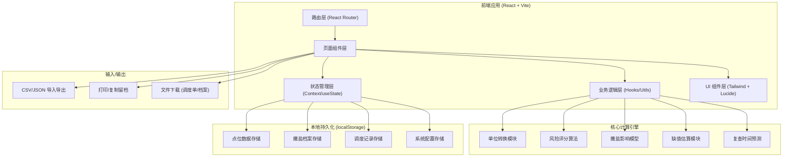

## 1. 架构设计



---

## 2. 技术选型说明

| 层级 | 技术栈 | 选型理由 |
|------|--------|----------|
| 构建工具 | Vite@5 | 启动快、HMR流畅、支持TS，适合中小型应用 |
| 前端框架 | React@18 | 组件化生态成熟、开发效率高 |
| 路由 | React Router@6 | 多页面路由、嵌套路由支持好 |
| 样式方案 | Tailwind CSS@3 | 原子化样式、快速开发UI、工业风易实现 |
| 图标库 | Lucide React | 线性风格图标、体积小、中文场景兼容性好 |
| 语言 | TypeScript@5 | 类型安全、减少运行时bug，适合算法密集型逻辑 |
| 数据持久化 | localStorage + 自定义封装 | 无后端需求、纯前端可用、数据轻量不超5MB限制 |
| CSV 解析 | Papaparse@5 | 成熟的CSV解析库、支持大文件、错误处理完善 |
| 文件导出 | 原生 Blob + FileSaver 轻实现 | 避免不必要依赖、满足导出需求 |

---

## 3. 路由定义

| 路由路径 | 页面名称 | 加载方式 | 说明 |
|----------|----------|----------|------|
| `/` | 单点位风险评估（首页） | 懒加载 | 默认首页，队长视图，优先呈现 |
| `/batch` | 批量调度中心 | 懒加载 | 多点位导入、风险排序、派车调度 |
| `/archive` | 撒盐档案管理 | 懒加载 | 车次登记、历史查询、导出留档 |
| `/thresholds` | 阈值与算法说明 | 懒加载 | 留档版文档页、含计算依据与阈值表 |
| `*` | 404 重定向 | - | 重定向回首页 |

---

## 4. 核心模块接口定义（TypeScript）

```typescript
// ===== 输入参数 =====
export interface RiskInput {
  bridgeId: string;          // 路段/桥面编号
  bridgeName: string;        // 路段名称
  airTemp: number;           // 气温数值
  airTempUnit: 'C' | 'F';    // 气温单位
  roadTemp?: number | null;  // 路表温度（可空）
  roadTempUnit?: 'C' | 'F';  // 路表温度单位
  humidity: number;          // 相对湿度 % 0-100
  windSpeed: number;         // 风速数值
  windUnit: 'm/s' | 'km/h' | 'mph'; // 风速单位
  precipitation: PrecipType; // 降水类型
  saltAmount: number;        // 撒盐量 g/㎡ 0-200
  lastSaltHours?: number;    // 距离上次撒盐小时数（用于仍降温修正）
}

export type PrecipType = 'none' | 'drizzle' | 'rain' | 'sleet' | 'snow' | 'freezing_rain';

// ===== 输出结果 =====
export interface RiskResult {
  level: RiskLevel;          // 风险等级
  score: number;             // 原始风险分 0-100
  reviewMinutes: number;     // 建议复查时间（分钟）
  urgent: boolean;           // 是否紧急（需立即派车）
  keyFactors: FactorItem[];  // 关键影响因子
  warnings: WarningItem[];   // 特殊说明/警告
  calcTrace: CalcTrace;      // 计算依据留档
  timestamp: number;         // 计算时间戳
}

export type RiskLevel = 'safe' | 'caution' | 'warning' | 'danger'; // 绿/黄/橙/红

export interface FactorItem {
  name: string;       // 因子名称（气温、风速等）
  weight: number;     // 权重占比
  contribution: number; // 对最终得分的贡献
  highlight: boolean; // 是否为主要风险源
}

export interface WarningItem {
  type: 'info' | 'warning' | 'danger';
  code: string;       // 警告编码（如 MISSING_ROAD_TEMP）
  message: string;    // 中文描述
  suggestion?: string;// 建议动作
}

export interface CalcTrace {
  formulaVersion: string;     // 算法版本号
  normalizedParams: Record<string, number>; // 标准化后的参数
  intermediateScores: Record<string, number>; // 中间分项得分
  thresholdsUsed: Record<string, any>;       // 使用的阈值快照
  saltCorrectionApplied: boolean;
  missingDataFallback: string | null;
}

// ===== 撒盐档案 =====
export interface SaltRecord {
  id: string;
  vehiclePlate: string;      // 车牌号
  bridgeId: string;
  bridgeName: string;
  startTime: string;         // ISO 时间
  endTime: string;
  saltKg: number;            // 实际撒盐量 kg
  saltPerSqm: number;        // 折合 g/㎡
  airTempAtSite: number;     // 现场气温
  operator: string;          // 执行人
  weatherNote?: string;
  photos?: string[];         // base64 缩略图（可选）
  createdAt: number;
}

// ===== 调度记录 =====
export interface DispatchItem {
  id: string;
  bridgeId: string;
  bridgeName: string;
  riskLevel: RiskLevel;
  priority: number;          // 调度优先级 1-10
  assignedVehicle?: string;
  status: 'pending' | 'dispatched' | 'completed';
  createdAt: number;
}
```

---

## 5. 风险算法核心流程（伪代码）

```
函数 calculateRisk(input):
    // Step 1: 单位标准化（统一转换到 ℃、m/s）
    params = normalizeUnits(input)

    // Step 2: 缺失路表温度处理
    if params.roadTemp 为空:
        params.roadTemp = estimateRoadTemp(params.airTemp, params.windSpeed, params.humidity)
        记录警告：MISSING_ROAD_TEMP + 估算方法说明

    // Step 3: 计算各因子得分 (每项 0-25 分，总分 0-100)
    tempScore      = calcTempScore(params.airTemp, params.roadTemp)      // 25%
    humidityScore  = calcHumidityScore(params.humidity)                   // 20%
    windScore      = calcWindScore(params.windSpeed, params.airTemp)      // 20%
    precipScore    = calcPrecipScore(params.precipitation)                // 20%
    saltScore      = calcSaltMitigation(params.saltAmount, params.lastSaltHours, params.airTemp) // -15%抵消

    // Step 4: 撒盐后仍降温修正
    if params.lastSaltHours > 0 且 气温趋势下降:
        saltScore *= 降温衰减系数
        记录警告：SALT_DECAYING

    // Step 5: 总分计算与等级映射
    rawScore = tempScore + humidityScore + windScore + precipScore - saltScore
    finalScore = clamp(rawScore, 0, 100)

    level = 映射规则:
        0-25   → safe (绿)
        26-50  → caution (黄)
        51-75  → warning (橙)
        76-100 → danger (红)

    // Step 6: 复查时间计算（基于等级与趋势）
    reviewMinutes = 根据 level + 风速 + 降水 计算:
        safe    → 120-180 分钟
        caution → 60-90 分钟
        warning → 20-45 分钟
        danger  → 0-10 分钟（立即处理）

    // Step 7: 关键因子提取
    keyFactors = 取贡献度 Top3 的因子高亮

    返回 RiskResult
```

---

## 6. 数据持久化方案

### 6.1 存储 Key 定义

| Key 名称 | 数据结构 | 容量上限 | 清理策略 |
|----------|----------|----------|----------|
| `ice-risk:bridges` | BridgePoint[] | 桥面点位预设（50条内） | 手动维护 |
| `ice-risk:salt-records` | SaltRecord[] | 最近 2000 条撒盐记录 | 超过上限删除最早 500 条 |
| `ice-risk:dispatches` | DispatchItem[] | 最近 500 条调度 | 按月归档 |
| `ice-risk:config` | SystemConfig | 阈值配置、单位偏好 | 不清理 |

### 6.2 封装接口

```typescript
// storage.ts
export const Storage = {
  getSaltRecords(): SaltRecord[];
  saveSaltRecord(rec: SaltRecord): void;
  querySaltRecords(filters: QueryFilters): SaltRecord[];
  getDispatches(): DispatchItem[];
  saveDispatch(item: DispatchItem): void;
  exportData(type: 'salt' | 'dispatch'): Blob; // 导出 JSON/CSV
};
```

---

## 7. 项目目录结构

```
src/
├── main.tsx                  # 入口
├── App.tsx                   # 路由配置
├── index.css                 # Tailwind 入口 + 自定义主题
├── router/
│   └── index.tsx
├── pages/                    # 页面组件
│   ├── SingleEvaluate/       # 单点位评估
│   ├── BatchDispatch/        # 批量调度
│   ├── SaltArchive/          # 撒盐档案
│   └── ThresholdDocs/        # 阈值说明
├── components/               # 通用组件
│   ├── layout/               # 导航布局
│   ├── RiskBadge.tsx         # 风险等级徽章
│   ├── UnitInput.tsx         # 带单位切换的数字输入
│   ├── CalcTracePanel.tsx    # 计算依据展开面板
│   └── DataTable.tsx         # 通用数据表格
├── engine/                   # 核心计算引擎
│   ├── types.ts              # 类型定义
│   ├── unitConversions.ts    # 单位转换
│   ├── riskCalculator.ts     # 风险算法主函数
│   ├── thresholds.ts         # 阈值常量（可配置）
│   └── reviewPredictor.ts    # 复查时间预测
├── hooks/
│   ├── useLocalStorage.ts    # 持久化 Hook
│   └── useRiskCalc.ts        # 风险计算封装 Hook
├── utils/
│   ├── csv.ts                # CSV 导入导出
│   ├── export.ts             # 打印/下载工具
│   └── formatters.ts         # 时间/数字格式化
├── data/
│   ├── mockBridges.ts        # 预设桥面点位
│   └── mockRecords.ts        # 示例撒盐记录
└── assets/
    └── icons/                # 自定义图标
```

---
