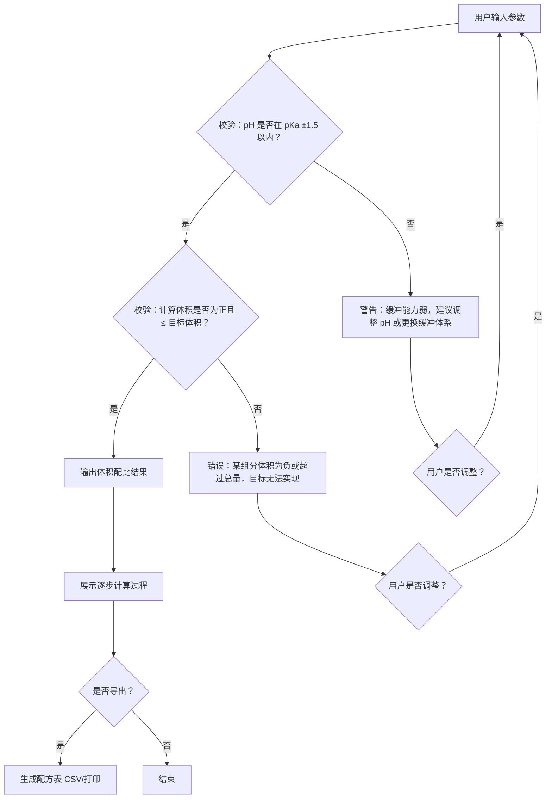

## 1. 产品概述

缓冲液 pH 配比助手是一款面向化学实验室的在线计算工具，帮助学生和实验员根据 Henderson-Hasselbalch 方程快速、准确地估算缓冲液配制方案。核心解决三大痛点：用错公式、忘记定容、目标 pH 不可行时输出荒谬结果而不提示。

- 目标用户：高校化学/生物实验室学生、实验员、指导教师
- 核心价值：输入即出结果，校验先行，每步可溯源，杜绝"负体积""超量"等荒谬输出

## 2. 核心功能

### 2.1 用户角色

| 角色 | 使用场景 | 核心需求 |
|------|----------|----------|
| 学生 | 配液前跑一遍校验 | 直观结果 + 错误提示 |
| 实验员 | 批量导出配方表 | 导出 CSV/打印 |
| 教师 | 检查学生计算过程 | 每步计算展示 |

### 2.2 功能模块

1. **参数输入页**：酸碱组分名、pKa、酸/碱母液浓度与单位、目标 pH、目标体积与单位
2. **计算结果页**：体积配比、校验结果、逐步计算过程
3. **配方导出**：生成配方表并支持导出

### 2.3 页面详情

| 页面名称 | 模块名称 | 功能描述 |
|----------|----------|----------|
| 配比计算器 | 参数输入面板 | 输入酸/碱组分名称、pKa、母液浓度（支持 mM / mol/L 切换）、目标 pH、目标体积（支持 mL / L 切换） |
| 配比计算器 | 实时校验栏 | 输入时即时检查：pH 偏离 pKa 超过 ±1.5 提示、负体积警告、超量警告、单位不一致提示 |
| 配比计算器 | 计算结果卡片 | 显示酸/碱母液各需加多少 mL，加水定容至目标体积，缓冲容量估算 |
| 配比计算器 | 逐步计算面板 | 用自然语言 + 公式展示每一步 Henderson-Hasselbalch 推导过程 |
| 配比计算器 | 配方导出 | 一键导出配方表（含所有参数、计算步骤、最终体积），支持 CSV 下载与浏览器打印 |

## 3. 核心流程

用户打开页面 → 填写酸碱组分信息（名称、pKa、母液浓度及单位）→ 输入目标 pH 和目标体积 → 点击"计算" → 系统先执行校验（pH 范围、体积合法性）→ 若校验不通过，显示具体原因和调整建议 → 若校验通过，显示体积配比结果和逐步计算过程 → 用户可选择导出配方表

## 4. 用户界面设计

### 4.1 设计风格

- 主色调：深青蓝 (#0D4F4F) + 亮琥珀色 (#F5A623) 作为强调色，呼应实验室化学试剂瓶的视觉意象
- 辅助色：浅灰白背景 (#F7F8FA)，卡片白 (#FFFFFF)，警告红 (#E74C3C)，安全绿 (#27AE60)
- 按钮风格：圆角 8px，主按钮实心琥珀色，次按钮描边
- 字体：标题用 DM Serif Display（学术感），正文用 Source Sans 3（清晰易读），公式用 JetBrains Mono（等宽对齐）
- 布局：单页应用，上方输入区，下方结果区，卡片式分区
- 图标：线性风格（Phosphor Icons），配合化学实验主题

### 4.2 页面设计概览

| 页面名称 | 模块名称 | UI 元素 |
|----------|----------|---------|
| 配比计算器 | 参数输入面板 | 两列卡片布局（酸/碱各一列），每列含文本输入 + 下拉单位选择器，底部横跨目标 pH 和体积输入 |
| 配比计算器 | 实时校验栏 | 输入面板下方，水平排列的标签式提示（绿/黄/红三色状态） |
| 配比计算器 | 计算结果卡片 | 居中大卡片，酸/碱体积用大号数字展示，定容水体积单独标注，缓冲容量条形图 |
| 配比计算器 | 逐步计算面板 | 可折叠面板，每步一个编号块，公式用等宽字体高亮，变量值用强调色 |
| 配比计算器 | 配方导出 | 结果卡片右上角图标按钮，点击弹出浮层预览 + 下载/打印按钮 |

### 4.3 响应式设计

- 桌面优先（1280px+）：两列输入并排，结果区宽展示
- 平板（768-1280px）：输入区保持两列，结果区略窄
- 手机（<768px）：输入区改为单列堆叠，结果卡片全宽

### 4.4 动效

- 输入校验：标签状态切换时平滑过渡（300ms ease）
- 结果出现：卡片从下方淡入滑入（400ms）
- 错误提示：抖动动画（shake）引起注意
- 展开计算步骤：手风琴式展开（300ms）
