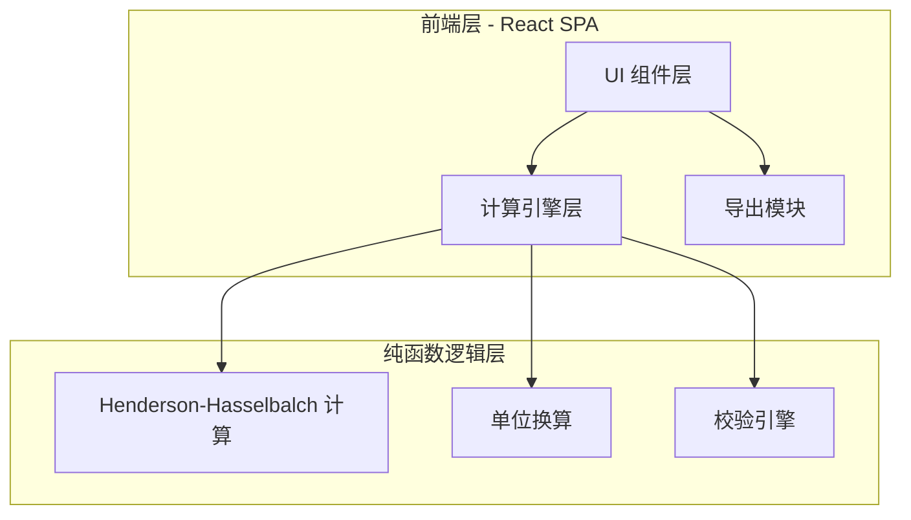

## 1. 架构设计



纯前端单页应用，无后端依赖。所有计算在浏览器本地完成，保证离线可用。

## 2. 技术说明

- 前端：React 18 + TypeScript + Tailwind CSS 3 + Vite
- 初始化工具：Vite（react-ts 模板）
- 后端：无
- 数据库：无（纯客户端计算）
- 依赖库：
  - 无额外计算库（Henderson-Hasselbalch 为简单数学运算）
  - 导出：原生 Blob + URL.createObjectURL 实现 CSV 下载
  - 打印：window.print() + @media print 样式

## 3. 路由定义

| 路由 | 用途 |
|------|------|
| / | 配比计算器主页面（唯一页面，单页应用） |

## 4. 核心计算逻辑

### 4.1 Henderson-Hasselbalch 方程

```
pH = pKa + log([A⁻] / [HA])
```

由此推导体积比：

```
[A⁻] / [HA] = 10^(pH - pKa)  →  记为 R
```

设酸母液浓度为 C_acid (mol/L)，碱母液浓度为 C_base (mol/L)，目标体积为 V_total (L)：

```
V_base = V_total × R × C_acid / (C_base + R × C_acid)
V_acid = V_total × C_base / (C_base + R × C_acid)
V_water = V_total - V_acid - V_base
```

其中 V_acid 和 V_base 需为正且 V_water ≥ 0。

### 4.2 单位换算

| 输入单位 | 换算到 | 系数 |
|----------|--------|------|
| mM → mol/L | mol/L | ÷ 1000 |
| mL → L | L | ÷ 1000 |

### 4.3 校验规则

| 规则 | 条件 | 级别 | 提示 |
|------|------|------|------|
| pH 偏离警告 | |pH - pKa| > 1.5 | 警告（黄） | 缓冲能力弱，建议调整 pH 或更换缓冲体系 |
| pH 偏离严重 | |pH - pKa| > 2.5 | 错误（红） | 目标 pH 超出有效缓冲范围，无法配制有效缓冲液 |
| 负体积 | V_acid < 0 或 V_base < 0 | 错误（红） | 计算结果出现负体积，目标 pH 无法实现 |
| 超量 | V_acid + V_base > V_total | 错误（红） | 酸碱母液体积之和超过目标体积，无法配制 |
| 定容水为负 | V_water < 0 | 错误（红） | 无需加水已超量，请检查母液浓度 |
| 浓度为零 | C_acid = 0 或 C_base = 0 | 错误（红） | 母液浓度不能为零 |

## 5. 数据模型

### 5.1 输入参数

```typescript
interface BufferInput {
  acidName: string;
  baseName: string;
  pKa: number;
  acidConcentration: number;
  acidConcentrationUnit: 'mM' | 'mol/L';
  baseConcentration: number;
  baseConcentrationUnit: 'mM' | 'mol/L';
  targetPH: number;
  targetVolume: number;
  targetVolumeUnit: 'mL' | 'L';
}
```

### 5.2 计算结果

```typescript
interface BufferResult {
  ratio: number;
  acidVolume_mL: number;
  baseVolume_mL: number;
  waterVolume_mL: number;
  bufferCapacity: number;
  warnings: ValidationMessage[];
  steps: CalculationStep[];
}

interface ValidationMessage {
  level: 'info' | 'warning' | 'error';
  rule: string;
  message: string;
  suggestion: string;
}

interface CalculationStep {
  step: number;
  title: string;
  formula: string;
  substitution: string;
  result: string;
}
```

## 6. 项目文件结构

```
src/
├── components/
│   ├── InputPanel.tsx        # 参数输入面板
│   ├── ValidationBar.tsx     # 实时校验栏
│   ├── ResultCard.tsx        # 计算结果卡片
│   ├── StepByStep.tsx        # 逐步计算面板
│   └── ExportButton.tsx      # 导出按钮
├── engine/
│   ├── calculate.ts          # Henderson-Hasselbalch 核心计算
│   ├── convert.ts            # 单位换算
│   ├── validate.ts           # 校验引擎
│   └── steps.ts              # 逐步计算文本生成
├── types/
│   └── index.ts              # TypeScript 类型定义
├── App.tsx
├── main.tsx
└── index.css
```
