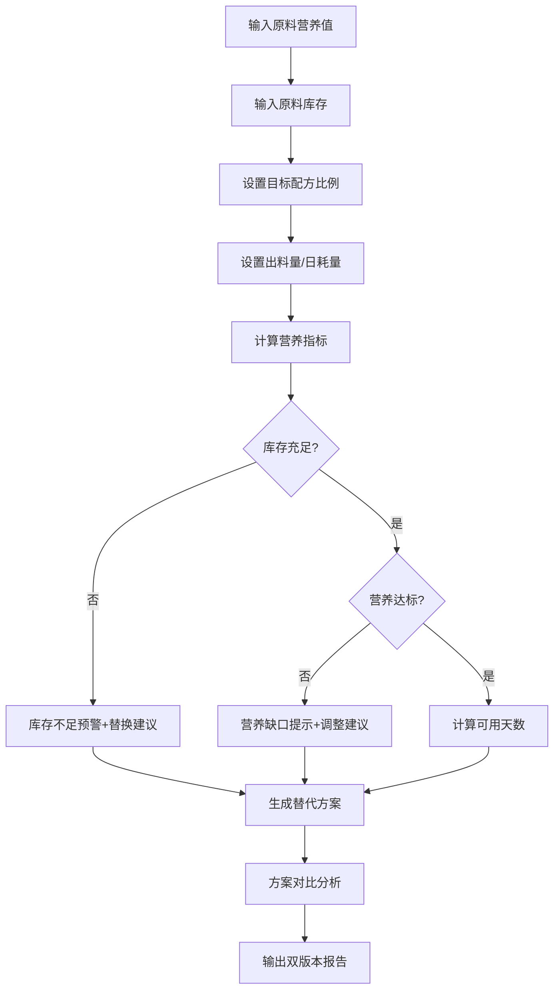

## 1. 产品概述

饲料营养折算器是面向小型养殖场的实用工具，帮助老板在原料价格波动时，利用现有库存调配饲料，同时保证营养指标达标。解决"想用库存顶几天，又怕蛋白不够"的实际痛点。

- **核心目标**：输入原料营养值、库存、目标配方，自动计算营养指标缺口，给出替代方案和调整建议
- **目标用户**：养殖场老板、饲料技术员
- **市场价值**：降低饲料成本、减少库存积压、保证畜禽营养均衡

## 2. 核心功能

### 2.1 用户角色

| 角色 | 使用场景 | 核心需求 |
|------|----------|----------|
| 养殖场老板 | 日常配料决策 | 简单直观、看可用天数、省钱方案 |
| 饲料技术员 | 精确配方调整 | 详细计算过程、营养指标验证 |

### 2.2 功能模块

1. **原料管理**：营养成分录入（蛋白、代谢能、钙、磷、赖氨酸等）、价格备注
2. **库存管理**：原料库存数量、单位自动换算
3. **配方计算**：目标比例、出料量、营养折算、缺口预警
4. **方案比较**：2-3套替代方案并列对比
5. **双版本报告**：养殖户版（通俗）+ 技术员版（专业）
6. **替换影响分析**：原料替换时自动说明营养变化

### 2.3 页面详情

| 页面名称 | 模块名称 | 功能描述 |
|---------|----------|----------|
| 主页面 | 原料输入区 | 豆粕、玉米、预混料等原料的营养值和库存输入，价格变动备注 |
| 主页面 | 配方设置区 | 目标配方比例、每日饲喂量、出料量设置 |
| 主页面 | 方案管理区 | 添加/删除对比方案，每套方案独立配置 |
| 主页面 | 营养计算区 | 实时计算蛋白、能量、钙磷等指标，显示达标/缺口状态 |
| 主页面 | 报告输出区 | 养殖户版/技术员版切换，导出/打印报告 |
| 主页面 | 替换影响说明 | 原料替换时自动弹出营养变化对比和影响说明 |

## 3. 核心流程

用户从输入原料和库存开始，设置目标配方，系统自动计算营养指标，发现缺口或库存不足时给出警告，支持生成多套替代方案进行对比，最后输出双版本报告。

## 4. 用户界面设计

### 4.1 设计风格

- **主色调**：麦田绿 (#4CAF50) + 土地棕 (#8B4513)，体现农业养殖特色
- **辅助色**：警告红 (#f44336) 用于缺口预警，通过绿 (#4CAF50) 用于达标，提醒橙 (#FF9800) 用于库存偏低
- **按钮风格**：圆角矩形，微阴影，hover时有轻微上浮效果
- **字体**：标题用"思源黑体 Bold"，正文用"思源宋体"，数字用等宽字体便于比对
- **布局风格**：卡片式分区，左侧输入区，右侧结果区，底部报告区
- **图标风格**：emoji图标配合简约线条图标，如🌾玉米、🫘豆粕、📊指标、📋报告

### 4.2 页面设计概览

| 页面 | 模块 | UI元素 |
|------|------|--------|
| 主页面 | 原料输入卡 | 每组原料一个卡片，包含名称、营养指标输入框、库存输入框、价格备注 |
| 主页面 | 配方设置卡 | 比例滑块/输入框、日耗量输入、出料量输入 |
| 主页面 | 营养仪表盘 | 进度条式显示各营养指标达成率，颜色区分状态 |
| 主页面 | 方案对比卡 | 2-3列并排布局，每列显示一套方案的关键指标和消耗库存情况 |
| 主页面 | 报告切换区 | Tab切换"养殖户版"/"技术员版"，打印/导出按钮 |

### 4.3 响应式设计

- 桌面端：左右分栏布局，左侧输入，右侧实时结果
- 平板端：上下堆叠，输入区在上，结果区在下
- 移动端：单列流式布局，可折叠卡片减少滚动
- 触摸优化：输入框增大点击区域，滑块便于拖动

### 4.4 动效设计

- 营养指标计算完成时，进度条有填充动画
- 切换报告版本时，内容淡入淡出过渡
- 库存不足或营养缺口时，警告卡片有轻微脉冲动画提醒
- 方案对比时，最优方案有高亮边框动画
