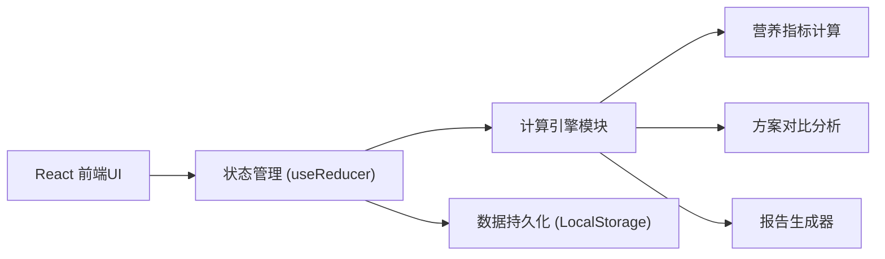
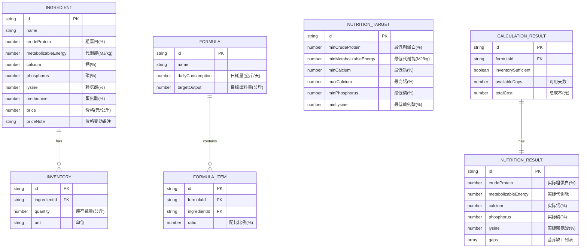

## 1. 架构设计

本应用为纯前端单页应用，无需后端服务，所有数据和计算逻辑均在浏览器端完成。数据存储使用LocalStorage实现本地持久化。



## 2. 技术选型

- **前端框架**：React@18 + TypeScript
- **构建工具**：Vite@5
- **样式方案**：TailwindCSS@3
- **状态管理**：React useReducer + Context
- **数据持久化**：LocalStorage
- **图表展示**：Recharts（营养指标可视化）
- **图标**：Lucide React

## 3. 目录结构

```
src/
├── types/              # TypeScript类型定义
│   └── index.ts
├── data/               # 预设数据和常量
│   ├── defaultIngredients.ts  # 默认原料营养值
│   └── standards.ts    # 畜禽营养标准参考
├── engine/             # 计算引擎
│   ├── nutrition.ts    # 营养指标计算
│   ├── inventory.ts    # 库存管理与换算
│   ├── comparison.ts   # 方案对比分析
│   └── report.ts       # 报告生成逻辑
├── components/         # React组件
│   ├── IngredientCard.tsx
│   ├── FormulaPanel.tsx
│   ├── NutritionGauge.tsx
│   ├── PlanComparison.tsx
│   ├── ReportPanel.tsx
│   └── ReplaceImpact.tsx
├── hooks/              # 自定义Hooks
│   ├── useCalculator.ts
│   └── useLocalStorage.ts
├── App.tsx
└── main.tsx
```

## 4. 数据模型



## 5. 核心计算逻辑

### 5.1 营养指标折算公式

```
某营养成分实际值 = Σ(原料配比比例 × 原料该营养成分含量)

例：粗蛋白(%) = 豆粕比例×豆粕蛋白 + 玉米比例×玉米蛋白 + 预混料比例×预混料蛋白
```

### 5.2 库存与可用天数计算

```
某原料需求量 = 目标出料量 × 该原料配比比例
库存充足性 = 库存数量 ≥ 需求量
可用天数 = MIN(各原料库存数量 / (日耗量 × 该原料配比比例))
```

### 5.3 方案评分算法

方案综合评分 = 营养达标度(40%) + 库存消耗率(30%) + 成本优势(30%)

## 6. 路由定义

| 路由 | 页面 | 说明 |
|------|------|------|
| / | 主页面 | 原料输入、配方设置、计算、方案对比、报告输出 |

单页应用，所有功能在同一页面通过Tab和卡片切换实现。

## 7. 核心接口（类型定义）

```typescript
// 原料定义
interface Ingredient {
  id: string;
  name: string;
  emoji: string;
  crudeProtein: number;      // %
  metabolizableEnergy: number; // MJ/kg
  calcium: number;           // %
  phosphorus: number;        // %
  lysine: number;            // %
  methionine: number;        // %
  price: number;             // 元/公斤
  priceNote: string;
  inventory: number;         // 公斤
}

// 配方项
interface FormulaItem {
  ingredientId: string;
  ratio: number;             // %
  replacedBy?: string;       // 被替换的原料ID
}

// 配方
interface Formula {
  id: string;
  name: string;
  items: FormulaItem[];
  dailyConsumption: number;  // 公斤/天
  targetOutput: number;      // 公斤
}

// 营养标准
interface NutritionStandard {
  name: string;
  minCrudeProtein: number;
  minMetabolizableEnergy: number;
  minCalcium: number;
  maxCalcium: number;
  minPhosphorus: number;
  minLysine: number;
}

// 计算结果
interface CalculationResult {
  nutrition: {
    crudeProtein: { actual: number; target: number; gap: number; status: 'pass' | 'warn' | 'fail' };
    metabolizableEnergy: { actual: number; target: number; gap: number; status: 'pass' | 'warn' | 'fail' };
    calcium: { actual: number; min: number; max: number; status: 'pass' | 'warn' | 'fail' };
    phosphorus: { actual: number; target: number; gap: number; status: 'pass' | 'warn' | 'fail' };
    lysine: { actual: number; target: number; gap: number; status: 'pass' | 'warn' | 'fail' };
  };
  inventory: {
    [ingredientId: string]: { required: number; available: number; sufficient: boolean; shortage: number };
  };
  availableDays: number;
  totalCost: number;
  costPerKg: number;
  score: number;
}

// 替换影响
interface ReplacementImpact {
  original: string;
  replacement: string;
  nutritionChanges: {
    nutrient: string;
    before: number;
    after: number;
    impact: 'increase' | 'decrease' | 'neutral';
    description: string;
  }[];
  costChange: number;
  inventoryChange: number;
}
```
