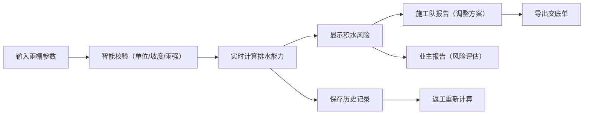

## 1. 产品概述

雨棚排水坡度核算工具，解决商铺雨棚改造后大雨积水问题。施工员输入雨棚尺寸、坡度、设计雨强、排水口参数后，系统自动估算排水能力和积水风险，提供双版本报告：施工队版含具体调整方案，业主版仅展示风险评估。支持交底单导出和历史记录留存，返工方案可重新计算。

- 目标用户：施工员、施工队、业主
- 核心价值：量化排水风险，有据可查，减少返工纠纷

## 2. 核心功能

### 2.1 用户角色
| 角色 | 访问方式 | 核心权限 |
|------|----------|----------|
| 施工员 | 直接使用 | 完整计算、参数调整、导出交底单 |
| 施工队 | 施工员分享报告 | 查看施工调整方案 |
| 业主 | 施工员分享报告 | 查看积水风险评估 |

### 2.2 功能模块
1. **计算主页**：参数输入表单、实时计算、智能提示
2. **施工队报告**：坡度调整建议、排水口优化方案、详细计算过程
3. **业主报告**：简洁风险评估、结论展示
4. **历史记录**：localStorage 持久化、返工方案重新计算
5. **交底单导出**：记录雨强和口径参数，生成可下载文档

### 2.3 页面详情
| 页面名称 | 模块名称 | 功能描述 |
|----------|----------|----------|
| 计算主页 | 参数输入区 | 雨棚尺寸（支持 mm/cm/m 单位切换）、坡度、雨强、排水口数量/口径/位置 |
| 计算主页 | 智能提示区 | 坡度为零警告、排水口遮挡提示、雨强超出范围提示、单位混用提示 |
| 计算主页 | 实时结果区 | 积水风险等级、排水能力对比、快速查看报告入口 |
| 施工队报告 | 计算详情 | 雨水量、排水能力、积水系数的详细计算过程 |
| 施工队报告 | 调整方案 | 坡度调整建议、坡向建议、排水口位置优化、口径调整建议 |
| 业主报告 | 风险评估 | 积水风险等级（安全/临界/危险）、简单说明、时间戳 |
| 历史记录 | 记录列表 | 历次计算记录、一键重新计算、删除记录 |
| 交底单导出 | 导出功能 | 生成包含计算参数和结果的交底单 PDF/文本 |

## 3. 核心流程
用户在计算主页输入参数 → 系统实时计算并显示智能提示 → 用户查看施工队报告或业主报告 → 施工员导出交底单 → 记录自动保存到历史记录 → 如需返工可从历史记录重新计算调整方案。

## 4. 用户界面设计

### 4.1 设计风格
- 主色调：工程蓝 `#1e40af`，代表专业可靠
- 辅助色：安全绿 `#059669`、警告橙 `#d97706`、危险红 `#dc2626`
- 中性色：锌灰色系 `zinc`
- 按钮风格：方角、2px 边框、hover 时轻微上浮阴影
- 字体：标题用 "Noto Sans SC"，正文用系统无衬线字体
- 布局风格：卡片式布局，清晰的分组边框，工业风
- 图标风格：lucide-react 线性图标

### 4.2 页面设计概述
| 页面名称 | 模块名称 | UI 元素 |
|----------|----------|---------|
| 计算主页 | 参数输入区 | 两列网格表单，每组参数带标题边框，下拉选择单位，输入框带验证状态边框 |
| 计算主页 | 智能提示区 | 彩色警告卡片，带图标和动画，实时显示/隐藏 |
| 计算主页 | 实时结果区 | 大尺寸风险等级指示器，进度条展示积水系数 |
| 施工队报告 | 计算详情 | 公式展示区域，步骤编号，结果高亮 |
| 施工队报告 | 调整方案 | 列表式建议，每项带优先级标签，可展开详情 |
| 业主报告 | 风险评估 | 大号图标 + 文字结论，简洁明了，时间戳和编号 |
| 历史记录 | 记录列表 | 卡片列表，带时间戳和风险等级标签，操作按钮组 |

### 4.3 响应式
- 桌面端：两列表单布局，报告并排展示
- 移动端：单列布局，表单分组折叠，Tab 切换报告
- 触摸优化：输入框和按钮最小 48px 触摸区域

### 4.4 动画效果
- 页面加载：渐入 + 轻微上移
- 智能提示出现：滑入 + 边框脉冲动画
- 风险等级变化：数值滚动动画
- 按钮点击：缩放反馈
- 卡片悬浮：轻微上浮 + 阴影加深
