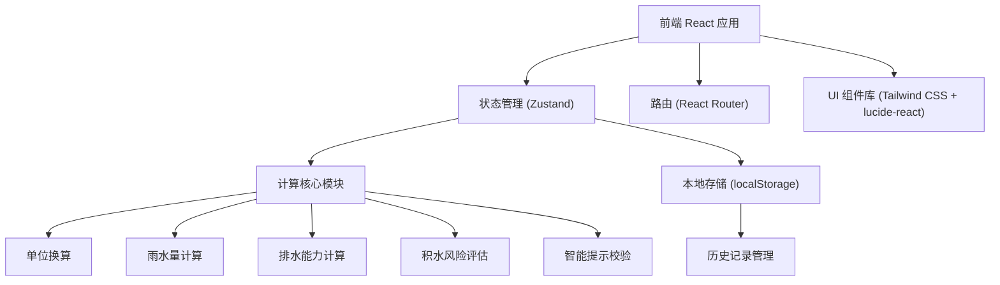

## 1. 架构设计



## 2. 技术描述
- 前端：React@18 + TypeScript + Vite
- 样式：Tailwind CSS@3
- 状态管理：Zustand
- 路由：React Router DOM@6
- 图标：lucide-react
- 后端：无（纯前端应用）
- 数据存储：localStorage（浏览器本地存储）

## 3. 路由定义
| 路由 | 用途 |
|------|------|
| / | 计算主页 - 参数输入和实时计算结果 |
| /report/contractor | 施工队报告 - 详细计算和调整方案 |
| /report/owner | 业主报告 - 简洁风险评估 |
| /history | 历史记录 - 计算记录管理和返工重算 |

## 4. 数据模型

### 4.1 数据模型定义

```mermaid
erDiagram
    CALCULATION_RECORD {
        string id PK "记录ID"
        number length "雨棚长度(米)"
        number width "雨棚宽度(米)"
        string lengthUnit "长度单位"
        string widthUnit "宽度单位"
        number slope "坡度(‰)"
        number rainfallIntensity "设计雨强(mm/min)"
        string rainfallUnit "雨强单位"
        number drainCount "排水口数量"
        number drainDiameter "排水口口径(mm)"
        boolean drainBlocked "排水口是否遮挡"
        string drainPositions "排水口位置(JSON)"
        string riskLevel "风险等级"
        number积水系数 "积水系数"
        number rainwaterVolume "雨水量(L/s)"
        number drainCapacity "排水能力(L/s)"
        string contractorReport "施工队报告内容"
        string ownerReport "业主报告内容"
        string createdAt "创建时间"
        string updatedAt "更新时间"
        string parentId "父记录ID(返工关联)"
    }
```

### 4.2 类型定义

```typescript
// 输入参数类型
interface DrainageInput {
  length: number;
  lengthUnit: 'mm' | 'cm' | 'm';
  width: number;
  widthUnit: 'mm' | 'cm' | 'm';
  slope: number;
  rainfallIntensity: number;
  rainfallUnit: 'mm/min' | 'mm/h';
  drainCount: number;
  drainDiameter: number;
  drainBlocked: boolean;
  drainPositions: DrainPosition[];
}

interface DrainPosition {
  x: number;
  y: number;
}

// 计算结果类型
interface DrainageResult {
  rainwaterVolume: number;
  drainCapacity: number;
 积水系数: number;
  riskLevel: 'safe' | 'warning' | 'danger';
  slopeStatus: 'excellent' | 'good' | 'poor' | 'zero';
  warnings: Warning[];
}

interface Warning {
  type: 'slope' | 'rainfall' | 'drain' | 'unit';
  level: 'info' | 'warning' | 'danger';
  message: string;
}

// 历史记录类型
interface CalculationRecord extends DrainageInput {
  id: string;
  result: DrainageResult;
  contractorReport: string;
  ownerReport: string;
  createdAt: string;
  updatedAt: string;
  parentId?: string;
}

// 交底单类型
interface DisclosureForm {
  recordId: string;
  projectName: string;
  rainfallIntensity: number;
  drainDiameter: number;
  slope: number;
  calculationResult: DrainageResult;
  createdAt: string;
}
```

## 5. 核心计算模块

### 5.1 单位换算模块
```typescript
// 长度单位换算为米
function toMeters(value: number, unit: 'mm' | 'cm' | 'm'): number {
  switch (unit) {
    case 'mm': return value / 1000;
    case 'cm': return value / 100;
    case 'm': return value;
  }
}

// 雨强单位换算为 mm/min
function toMmPerMin(value: number, unit: 'mm/min' | 'mm/h'): number {
  return unit === 'mm/h' ? value / 60 : value;
}
```

### 5.2 雨水量计算
```typescript
// Q_rain = 雨强(mm/min) × 面积(m²) × 径流系数(0.9) / 60 → L/s
function calculateRainwater(
  rainfallMmMin: number,
  areaM2: number,
  runoffCoefficient = 0.9
): number {
  return (rainfallMmMin * areaM2 * runoffCoefficient) / 60;
}
```

### 5.3 排水能力计算
```typescript
// 单口排水能力（基于口径）
function getSingleDrainCapacity(diameterMm: number): number {
  const capacities: Record<number, number> = {
    75: 1.0,
    100: 2.0,
    125: 3.2,
    150: 4.5,
    200: 8.0,
    250: 12.5,
    300: 18.0,
  };
  // 线性插值
  const diameters = Object.keys(capacities).map(Number).sort((a, b) => a - b);
  if (diameterMm <= diameters[0]) return capacities[diameters[0]];
  if (diameterMm >= diameters[diameters.length - 1]) return capacities[diameters[diameters.length - 1]];
  
  for (let i = 0; i < diameters.length - 1; i++) {
    if (diameterMm >= diameters[i] && diameterMm <= diameters[i + 1]) {
      const ratio = (diameterMm - diameters[i]) / (diameters[i + 1] - diameters[i]);
      return capacities[diameters[i]] + ratio * (capacities[diameters[i + 1]] - capacities[diameters[i]]);
    }
  }
  return 2.0; // 默认 100mm
}

// 总排水能力 = 单口能力 × 数量 × 遮挡系数
function calculateDrainCapacity(
  drainCount: number,
  drainDiameter: number,
  blocked: boolean
): number {
  const singleCapacity = getSingleDrainCapacity(drainDiameter);
  const blockFactor = blocked ? 0.5 : 1.0;
  return singleCapacity * drainCount * blockFactor;
}
```

### 5.4 积水风险评估
```typescript
// 积水系数 = 雨水量 / 排水能力
function assessRisk(rainwater: number, drainCapacity: number): {
  积水系数: number;
  riskLevel: 'safe' | 'warning' | 'danger';
} {
  if (drainCapacity <= 0) {
    return { 积水系数: Infinity, riskLevel: 'danger' };
  }
  const 积水系数 = rainwater / drainCapacity;
  let riskLevel: 'safe' | 'warning' | 'danger';
  if (积水系数 < 0.8) riskLevel = 'safe';
  else if (积水系数 < 1.0) riskLevel = 'warning';
  else riskLevel = 'danger';
  return { 积水系数, riskLevel };
}

// 坡度评估
function assessSlope(slope: number): 'excellent' | 'good' | 'poor' | 'zero' {
  if (slope <= 0) return 'zero';
  if (slope >= 5) return 'excellent';
  if (slope >= 3) return 'good';
  return 'poor';
}
```

### 5.5 智能提示校验
```typescript
function validateInput(input: DrainageInput): Warning[] {
  const warnings: Warning[] = [];
  
  // 坡度为零
  if (input.slope <= 0) {
    warnings.push({
      type: 'slope',
      level: 'danger',
      message: '坡度为零或负数，雨水无法自然排放，必须调整坡度！'
    });
  } else if (input.slope < 3) {
    warnings.push({
      type: 'slope',
      level: 'warning',
      message: `当前坡度${input.slope}‰小于推荐最小值3‰，排水不畅风险较高。`
    });
  }
  
  // 雨强超出常用范围（0.5 - 5 mm/min 或 30 - 300 mm/h）
  const rainfallMmMin = toMmPerMin(input.rainfallIntensity, input.rainfallUnit);
  if (rainfallMmMin < 0.5) {
    warnings.push({
      type: 'rainfall',
      level: 'info',
      message: '雨强偏小，请确认当地设计暴雨强度是否正确。'
    });
  } else if (rainfallMmMin > 5) {
    warnings.push({
      type: 'rainfall',
      level: 'warning',
      message: '雨强超出常用范围（0.5-5 mm/min），请核实数据准确性。'
    });
  }
  
  // 排水口遮挡
  if (input.drainBlocked) {
    warnings.push({
      type: 'drain',
      level: 'danger',
      message: '排水口被遮挡，排水能力降低50%，建议清理或增设排水口。'
    });
  }
  
  // 单位混用提示
  if (input.lengthUnit !== input.widthUnit) {
    warnings.push({
      type: 'unit',
      level: 'info',
      message: `长度单位(${input.lengthUnit})与宽度单位(${input.widthUnit})不一致，系统已自动换算。`
    });
  }
  
  return warnings;
}
```

## 6. 目录结构

```
src/
├── components/
│   ├── layout/
│   │   ├── Header.tsx
│   │   └── NavTabs.tsx
│   ├── form/
│   │   ├── LengthInput.tsx
│   │   ├── SlopeInput.tsx
│   │   ├── RainfallInput.tsx
│   │   ├── DrainInput.tsx
│   │   └── UnitSelector.tsx
│   ├── display/
│   │   ├── RiskIndicator.tsx
│   │   ├── WarningCard.tsx
│   │   ├── ResultSummary.tsx
│   │   └── FormulaDisplay.tsx
│   └── report/
│       ├── ContractorReport.tsx
│       └── OwnerReport.tsx
├── hooks/
│   ├── useDrainageCalculation.ts
│   └── useHistory.ts
├── store/
│   └── useCalculationStore.ts
├── utils/
│   ├── unitConversion.ts
│   ├── calculation.ts
│   ├── validation.ts
│   └── export.ts
├── types/
│   └── index.ts
├── pages/
│   ├── Calculator.tsx
│   ├── ContractorReportPage.tsx
│   ├── OwnerReportPage.tsx
│   └── History.tsx
├── App.tsx
├── main.tsx
└── index.css
```
